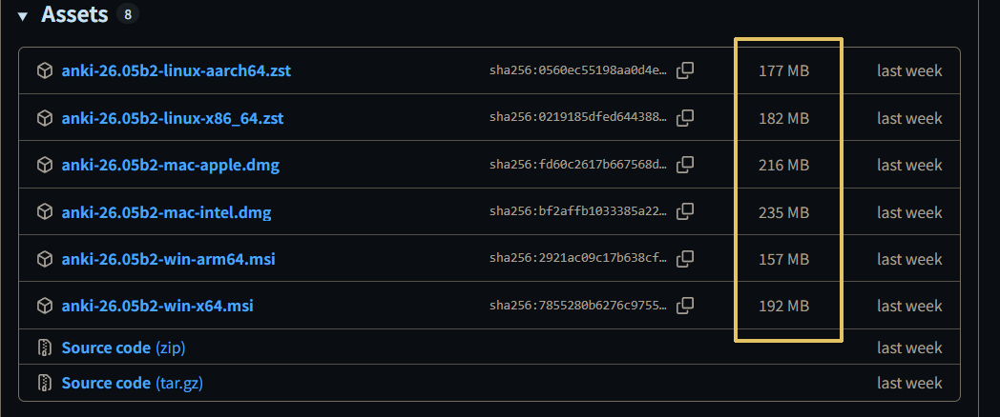
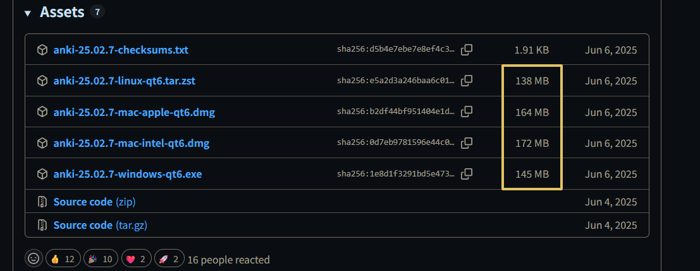

# 00-单词背诵软件推荐.md
> 本文章的推荐**背诵单词的相关软件**及其个人用 AI 编写的工具

## [不背单词](https://bbdc.cn/index)
> 这是单词背诵前期用的
- **优点：** 不需要配置繁琐的内容，不需要安装相关的插件
- **缺点：** 不能个性化配置服务，在PC上使用需要配合模拟器，我是用雷电模拟器的
- **工具：** 
  - 单词导出（手机上使用，模拟器版本不够）：
    - 进入软件，点击中间的图标，随便选择一本词书，点击导出，**一定要选择 A4 默写 这个格式**
    - 进入 [项目地址](https://github.com/wunamor/bbdc-pdf-import)，按照配置说明使用，即可提取出 pdf 单词及其意思

## [Anki](https://bbdc.cn/index)
> 这是单词背诵后期用的
- **优点：** 个性化配置服务，可以在PC上直接使用
- **缺点：** 需要配置繁琐的内容，需要安装相关的插件
- **下载：** 
  - [下载地址](https://github.com/ankitects/anki/releases)
  - 找到**大于100MB**的文件经行下载，如果是10MB左右的，那么就是没有UI界面 
  

