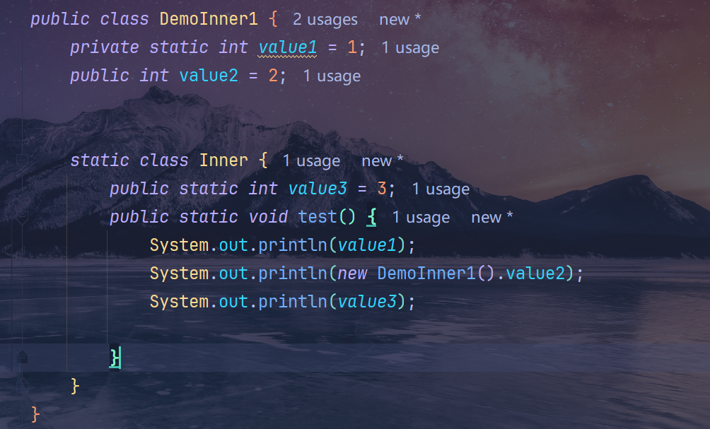
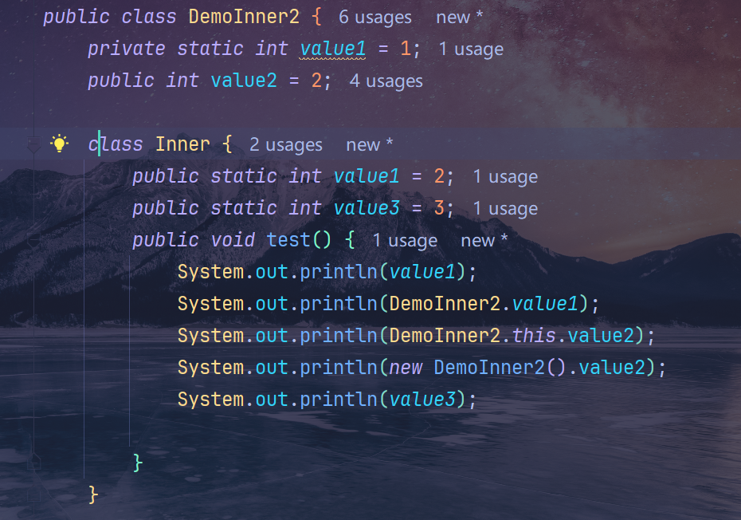
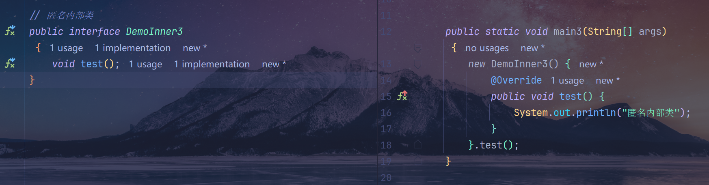
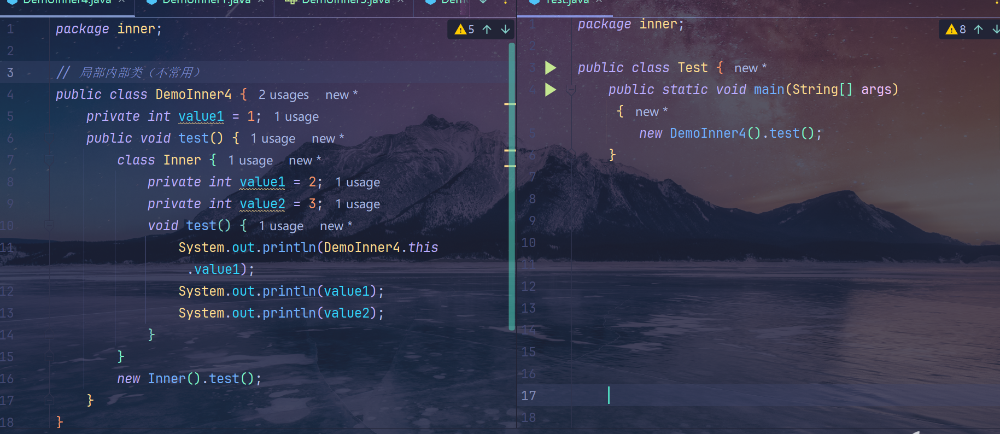

# 2025-07-10-接口--内部类
|    类型    |         特点         |                                           用途                                           |                   演示图例                   |
| :--------: | :------------------: | :--------------------------------------------------------------------------------------: | :------------------------------------------: |
| 静态内部类 | 静态，用 static 修饰 | 当内部类不需要访问外部实例，如果不用，可能会有内存隐式泄漏，因为此时内部类是依赖与外部类 |  |
| 实例内部类 |    不需要其他修饰    |                          需要依赖与外部类，比如集合类中的迭代器                          |  |
| 匿名内部类 |       没有类名       |                        可以配合接口使用，一般缩写为 Lambda 表达式                        |  |
| 局部内部类 |    在方法内部创建    |                                         基本没有                                         |  |

[代码链接](https://gitee.com/wunameor/bite-code/tree/master/Java118/JavaSE/J20250710/src/inner)