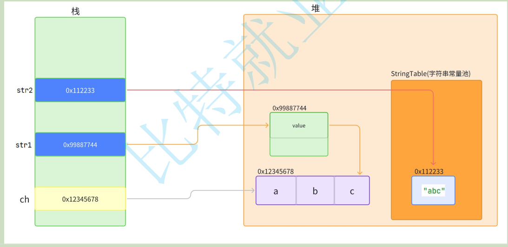
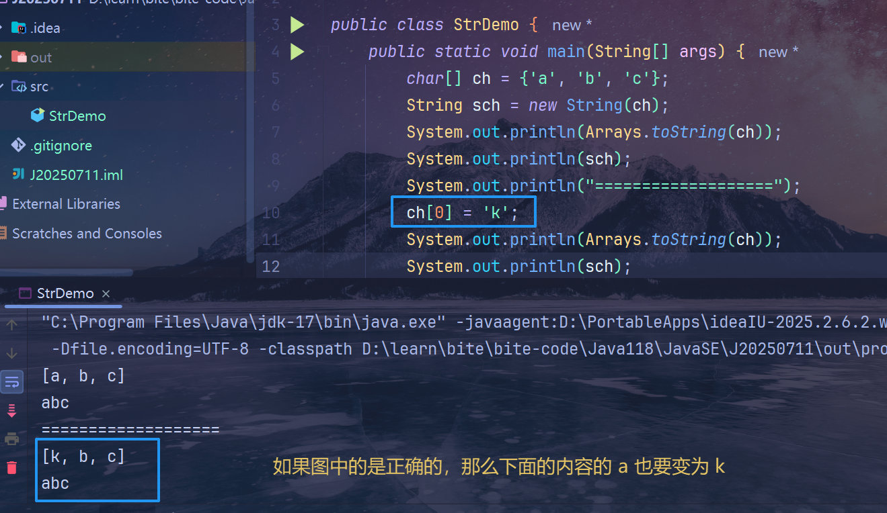
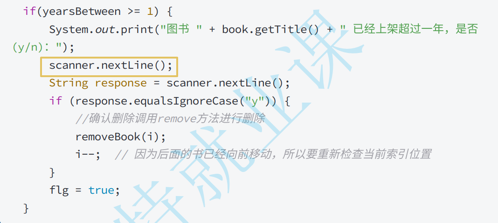

# 课件错误内容（JavaSE 基础语法）
## 14.字符串-String类
|   位置    |                                 错误内容                                  |                                  正确情况/证据                                  |
| :-------: | :-----------------------------------------------------------------------: | :-----------------------------------------------------------------------------: |
| intern⽅法 |  str1 的 value 指向地址错误 |  **深拷贝**，应该新开辟一块区间 |

## 21.图书系统项⽬（五）

|         位置          |                                                             错误内容                                                             |                                                                 正确情况/证据                                                                  |
| :-------------------: | :------------------------------------------------------------------------------------------------------------------------------: | :--------------------------------------------------------------------------------------------------------------------------------------------: |
| 移除上架超过1年的书籍 |  `scanner.nextLine()` 在 **2025-07-16-118Java-图书** 直播课的时候出现bug | 他输入y的时候，原本没有 `y` 内容  `scanner.nextLine()` 就会获取 `y`，而此时他按下两次回车，导致了 `response` 获取到的是 `\n`  从而没有删除内容 |

