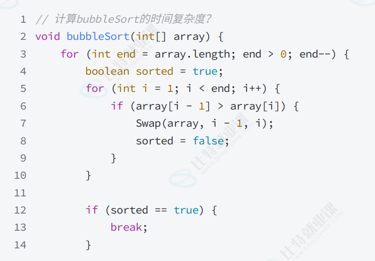

# 2025-07-08-复杂度+包装类+泛型
> 本文章是学习**数据结构前置知识**，需要了解相关概念，
> 学会**计算时间/空间复杂度**

## 复杂度
1. 复杂度计算步骤
   1. 算出总次数
   2. 任何常数次变为 1，然后**保大舍小**
   3. 将最高次系数变为 1
2. 例子：
   - 计算图中冒泡排序的时间复杂度 
      1. 计算总次数：N + N - 1 + ... + 1 -> $\frac{N^2 + N}{2}$
      2. 保大舍小，变为 $\frac{N^2}{2}$
      3. 把系数变为 1，最终就是 $O(N^2)$
3. 概念：
   1. 时间复杂度
   2. 空间复杂度

