# 2025-07-08-复杂度+包装类+泛型
> 本文章是学习**数据结构前置知识**，需要了解相关概念，
> 学会**计算时间/空间复杂度**
>
> [代码链接](https://gitee.com/wunameor/bite-code/tree/master/Java118/Java-Data-Structure/basic/J20250718)

## 复杂度
1. 复杂度计算步骤
   1. 算出总次数
   2. 任何常数次变为 1，然后**保大舍小**
   3. 将最高次系数变为 1
2. 例子：
   - 计算图中冒泡排序的时间复杂度 
      1. 计算总次数：N + N - 1 + ... + 1 -> $\frac{N^2 + N}{2}$
      2. 保大舍小，变为 $\frac{N^2}{2}$
      3. 把系数变为 1，最终就是 $O(N^2)$
   - 计算通过递归的斐波那契的时间复杂度 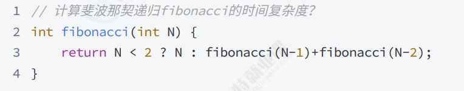
      1. 判断递归深度：N - 1
      2. 判断每次深度**大约**执行的次数：$2 ^ (N - 1)$
      3. 利用等比数列求和公式 $S _ { n } = \frac { a _ { 1 } ( 1 - q ^ { n } ) } { 1 - q } , q \neq 1$ 
      求出总数 $O(2 ^ N)$
      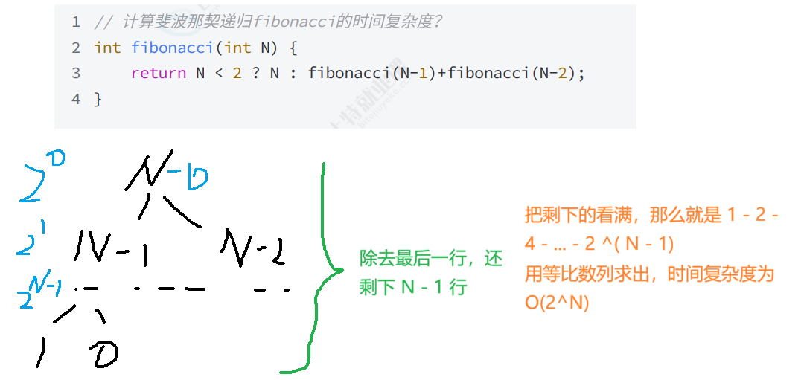
3. 概念：
   1. 时间复杂度：函数运行**最坏的情况**（快排除外）下，代码执行的次数
   2. 空间复杂度：函数**临时**占用的空间，与参数的类型无关

## 泛型
1. 解决问题
   - 没有泛型，用 `Object` 类过于混乱的问题，图片中就是 `value` 的值太过混乱
   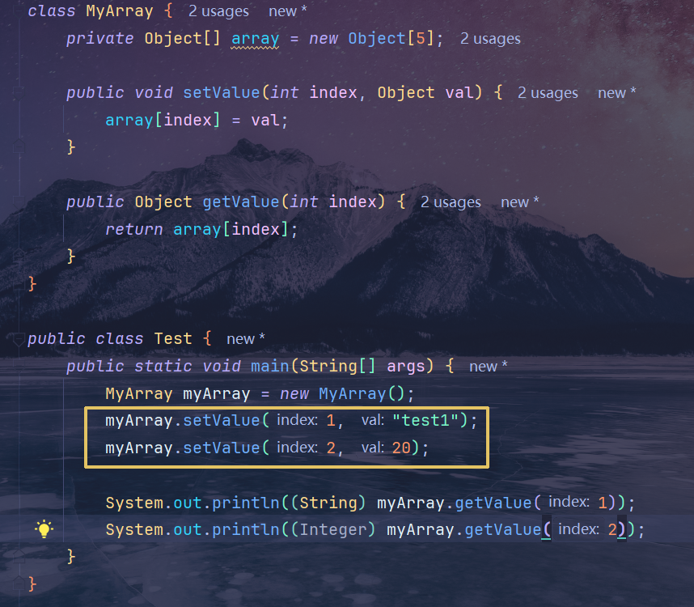

2. 语法规则（2025-07-19的课程）
   1. 泛型方法
      1. 
      -  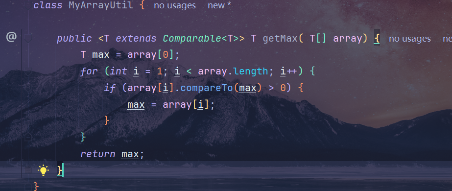
        `<T>` 在里面是起到声明的作用的，不然编译器就不认为 `T` 是泛型，而是单纯的语法错误
   2. 通配符
      - 应用场景：当其他类调用泛型类的时候，为了通用方法，就用通配符 `?` 表示那些不确定的类型
      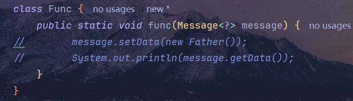
      - 上届：
        - extends 在获取变量的时候使用
        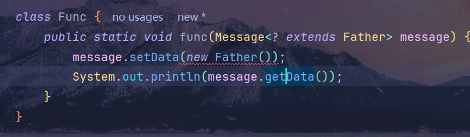
      - 下届：
        - super 往往在存储变量的时候使用
        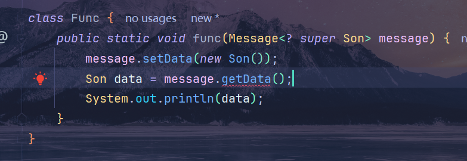
      - 课堂老师代码错误复现（55：30 左右的）
        - 错误代码： 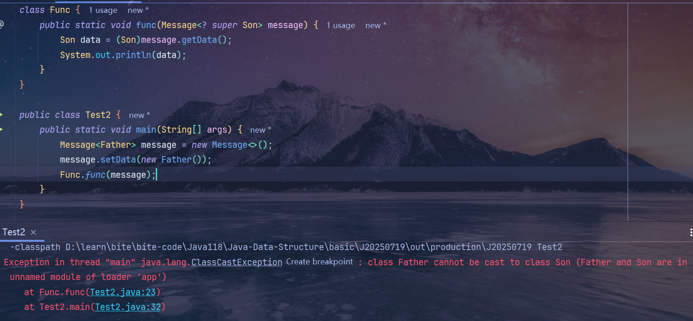
        - 原因：老师传入 `Message` 的是 `Father` 对象， `Father` 对象自然就不能强转为它的子类 `Son`
        - 正确代码：只要把 `Father` 对象变为 `Son` 即可（只要**强转的对象是 `new` 的对象的父类或本身**即可）
        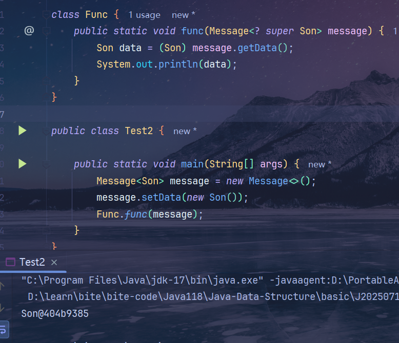
    3. 其他问题：
       |                            问题                             |                                                        解决方法                                                        |                       解决图片                       |
       | :---------------------------------------------------------: | :--------------------------------------------------------------------------------------------------------------------: | :--------------------------------------------------: |
       | 多继承 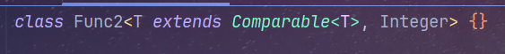 | 把 `T` 变为 `K`, 把 `Integer` 变为 `V` 是不是就很想 `Map` 中的泛型了？ 图中 `Integer` 就是一个关键字而已，叫什么无所谓 | 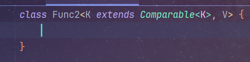 |
