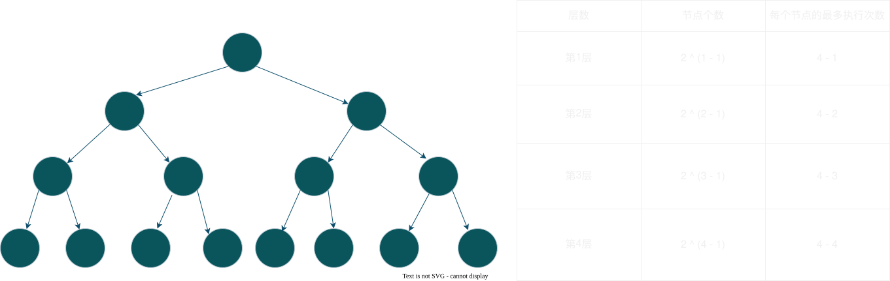

# 2025-07-30-优先级队列

## 概念
1. 它是由**完全二叉树**构成的树，底层是用**线性表来存储**
2. 它分为大根堆与小根堆
   - 大根堆：树中所有的根节点都要比子节点大 
   - 小根堆：树中所有的根节点都要比子节点小


## 模拟实现

### 初始化
> 就以**大根堆**为例
>
> 前置知识：
> 1. [二叉树父节点与子节点位置的关系](./2025-07-27-二叉树.md#重要性质)
> 2. `useSize` 用来表示使用个数
> 3. 结束条件：当 `child >= useSize`（此时下标无效，也就结束了） 或者 `elems[father] >= elems[child]` 的时候
>
> 步骤：
> 1. 通过 `(useSize - 1 - 1) / 2` 获取到 `parent`
> 2. 使用 `siftDown()` 这个方法，向下调整
>    - 先获取到 `child` 下标
>    - 进入循环，循环结束条件就是 `child >= useSize`
>    - 在循环内，先获取到最大的孩子节点的下标（注意下标合法性），然后交换，如果不需要交换，那么就直接退出

```Java
public void createHeap() {
    for (int parent = (useSize - 1 - 1) / 2; parent >= 0; parent--) {
        // 从最后一颗树开始
        siftDown(parent);
    }
}

private void siftDown(int parent, int end) {
    int child = parent * 2 + 1;
    while (child < end) {
        if (child + 1 < end && elems[child] < elems[child + 1]) {
            child++;
        }
        // 此时child 一定指向较大值
        if (elems[child] > elems[parent]) {
            swap(child, parent);
            parent = child;
            child = parent * 2 + 1;
        } else {
            // 说明已经是大根堆了
            return;
        }
    }
}

private void swap(int i, int j) {
    int tmp = elems[i];
    elems[i] = elems[j];
    elems[j] = tmp;
}
```

---

问题：它的时间复杂度是多少呢？ 

解析：
  - 背景：以满二叉树为例，根节点在第 $1$ 层，总层数为 $H$
  - 步骤：
  - 
    
    1. 由这幅图可以看出，第 $k$ 层节点个数为 $2 ^ {k - 1}$，每个节点最多执行的次数是 $H - k$
    2. 所以得出执行的个数 
        $$
        O(N) = 2^{1 - 1} \times (H - 1) + 2^{2 - 1} \times (H - 2) + 2^{3 - 1} \times (H - 3) + \cdots + 2^{H - 2 - 1} \times 2 + 2^{H - 1 - 1} \times 1 
        $$
    3. 利用**错位相减法**，先把 $O(N) \times 2$ 然后相减得出 $O(N)$
       1. 将 $O(N)$ 的原始公式记为 ①，将其左右两边同乘 2 记为 ②：

          $$
          \begin{aligned}
          O(N) &= 2^0(H - 1) + 2^1(H - 2) + 2^2(H - 3) + \cdots + 2^{H-2}(1) \quad \text{--- ①} \\
          2 \times O(N) &= \qquad \qquad \quad \;\; 2^1(H - 1) + 2^2(H - 2) + \cdots + 2^{H-2}(2) + 2^{H-1}(1) \quad \text{--- ②} 
          \end{aligned}
          $$

       2. 使用 ②式 减去 ①式 进行错位相减（将底数相同的项对齐相减）：

          $$
          \begin{aligned}
          2O(N) - O(N) &= -2^0(H - 1) + 2^1(1) + 2^2(1) + \cdots + 2^{H-2}(1) + 2^{H-1}(1) \\
          O(N) &= 1 - H + 2^1 + 2^2 + 2^3 + \cdots + 2^{H-1}
          \end{aligned}
          $$

    4. 后面部分是一个标准的等比数列求和。根据**等比数列求和公式** $S_n = \frac{a_1(1 - q^n)}{1 - q}$ 计算：

        $$
        \begin{aligned}
        O(N) &= 1 - H + \frac{2(1 - 2^{H-1})}{1 - 2} \\
        O(N) &= 1 - H + 2^H - 2 \\
        O(N) &= 2^H - H - 1
        \end{aligned}
        $$

    5. 最后，利用[二叉树的性质](./2025-07-27-二叉树.md#重要性质)，我们将树的高度 $H$ 替换为节点个数 $N$。

        $$
        \begin{aligned}
        O(N) &= (N + 1) - \log_2(N + 1) - 1 \\
        O(N) &= N - \log_2(N + 1)
        \end{aligned}
        $$

      **结论：** 在大 $O$ 渐进表示法中，保留最高阶项，忽略对数项，因此向下调整建堆的时间复杂度为 **$O(N)$**。
         
### 增删查排序
- **增加**：利用**向上调整**，添加元素，如果初始化的元素都用 `offer()` 这个方法， 那么时间复杂度为 $O(N)$
    ```Java
        public void offer(int val) {
        if (isFull()) {
            expand();
        }

        // 先尾插，然后向上调整
        elems[useSize++] = val;
        siftUp(useSize - 1);
    }

    private void siftUp(int child) {
        while (child != 0) {
            int parent = (child - 1) / 2;
            if (elems[child] > elems[parent]) {
                // 交换
                swap(child, parent);
                child = parent;
            } else {
                return;
            }
        }
    }
    ```
- **删除+查询**：删除的是利用向下调整，先将首尾相换，然后 `useSize--`，最后向下调整
    ```Java
    public int poll() {
        // 删除堆顶元素
        if (isEmpty()) {
            return -1;
        }
        int val = elems[0];
        swap(0, useSize - 1);
        // elems[useSize] = null;
        useSize--;
        siftDown(0);
        return val;
    }

    public int peek() {
        // 删除堆顶元素
        if (isEmpty()) {
            return -1;
        }

        return elems[0];
    }
    ```

- **排序**：只需要每次首尾交换，然后调用 `siftDown()` 即可
    ```Java
    public void sort() {
        int end = useSize - 1;
        // 注意边界即可
        while (end > 0) {
            swap(0, end);
            siftDown(0, end);
            end--;
        }
    }
    ```