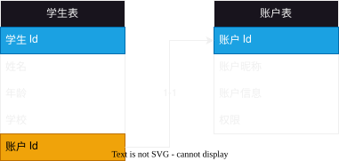
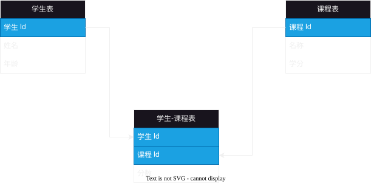

# 2025-10-12-数据库设计
> 虽然题目是 数据库设计 但主要讲的内容是 数据表设计

## 范式

### 第一范式
> **根据业务**，把每个列设计为不可分割的原子数据项

#### 反例

> 如图所示，这个就不满足第一范式，因为 “学院” 这个字段可以分为 “学院地址”，“学院名称” 等字段
> 
> 为什么不能“加入时间”不需要拆分呢？
> 
> 因为**根据业务**“加入时间”一般是整体一起使用的，但是像在“万年历”等业务下面就需要拆分

#### 正确例子

> **把学院表拆分出来**，通过 学院Id 把学生表与学院表关联起来

### 第二范式
> 在满足第一范式的基础上，不存在非关键字段对任意候选键的部分函数依赖。存在于表中定义了复合主键的情况下。

#### 反例

> 像图中这样，有两个主键（存在联合主键），
> 
> 但是 “姓名”，“年龄” 这两个字段依赖于“学生Id”， “课程名称” 依赖于 “课程Id” （部分函数依赖） 
>
> 这样就不满足第二范式

#### 正确例子

> 通过把上诉那张错误的表拆分为学生表、课程表与成绩表即可
>
> 把部分依赖的分别保留在对应的表格中
> （“姓名”，“年龄” 这两个字段保留在 学生表， “课程名称” 保留在 课程表）
>
> 而把“课程成绩”这样的**需要两个主键依赖的**保留在 成绩表 中即可 (M-N)

### 第三范式
> 在满足第二范式的基础上，**不存在**非关键字段，对任一候选键的**传递依赖**。

#### 反例

> 像这样，如果想要找到学院电话，需要如下步骤
> 
> “学生 Id” -> “学院名称” -> “学院电话”
> 
> 出现这样传递依赖，就不满足第三范式

#### 正确例子

> 只需要把它拆分为 学生表 与 学院表 即可
>
> 让单表表达的内容简单明了，**仅仅表示对应对象的属性即可**
>
> 如果有关联，那么通过 id 来关联即可

## 关系的类型

### 一对一关系
- 概念：
  两张表**实体**之间的关系的**一对一**的

- 例子：
  比如在教育系统中， 学生与账号之间的一对一的关系，
  **一个学生只有一个账号，一个账号只能对应一个学生**

  

- 创建表：
  理论上，在一对一关系的表结构中， **学生表内添加 “账户Id”** 或者在 **账户表内添加 “学生Id”** 都可以

  但是实际上，**根据业务**，是建议 **学生表内添加 “账户Id”（如图所示）**，因为**不仅仅有学生-账户这个关系，而且有老师-账户这个关系**

### 一对多关系
- 概念：
  两张表**实体**之间的关系的**一对多**的

- 例子：
  在教育系统中，学生与班级之间的关系，
  **一个学生只能有一个班级，但是一个班级可以有多个学生**

  

- 创建表：
  谁是 `N` 就在那个表内添加关联关系

### 多对多关系
- 概念：
  两张表**实体**之间的关系的**多对多**的

- 例子：
  在教育系统中，学生与课程之间的关系，
  **一个学生可以有多个课程，一个课程也可以有多个学生**

  

- 创建表：
  `N-N` 的关系一般是**创建一个新的表**，里面存储这两张表的主键，
  这个表内存储需要两个主键唯一确定的内容