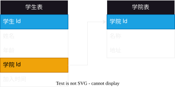
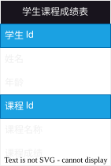
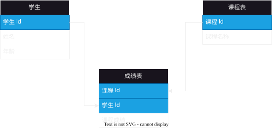
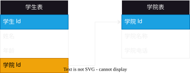

# 2025-10-12-数据库设计
> 虽然题目是 数据库设计 但主要讲的内容是 数据表设计

## 范式

### 第一范式
> **根据业务**，把每个列设计为不可分割的原子数据项

#### 反例

> 如图所示，这个就不满足第一范式，因为 “学院” 这个字段可以分为 “学院地址”，“学院名称” 等字段
> 
> 为什么不能“加入时间”不需要拆分呢？
> 
> 因为**根据业务**“加入时间”一般是整体一起使用的，但是像在“万年历”等业务下面就需要拆分

#### 正确例子

> **把学院表拆分出来**，通过 学院Id 把学生表与学院表关联起来

### 第二范式
> 在满足第一范式的基础上，不存在非关键字段对任意候选键的部分函数依赖。存在于表中定义了复合主键的情况下。

#### 反例

> 像图中这样，有两个主键（存在联合主键），
> 
> 但是 “姓名”，“年龄” 这两个字段依赖于“学生Id”， “课程名称” 依赖于 “课程Id” （部分函数依赖） 
>
> 这样就不满足第二范式

#### 正确例子

> 通过把上诉那张错误的表拆分为学生表、课程表与成绩表即可
>
> 把部分依赖的分别保留在对应的表格中
> （“姓名”，“年龄” 这两个字段保留在 学生表， “课程名称” 保留在 课程表）
>
> 而把“课程成绩”这样的**需要两个主键依赖的**保留在 成绩表 中即可 (M-N)

### 第三范式
> 在满足第二范式的基础上，**不存在**非关键字段，对任一候选键的**传递依赖**。

#### 反例

> 像这样，如果想要找到学院电话，需要如下步骤
> 
> “学生 Id” -> “学院名称” -> “学院电话”
> 
> 出现这样传递依赖，就不满足第三范式

#### 正确例子

> 只需要把它拆分为 学生表 与 学院表 即可
>
> 让单表表达的内容简单明了，**仅仅表示对应对象的属性即可**
>
> 如果有关联，那么通过 id 来关联即可