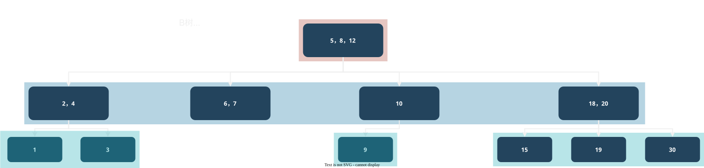
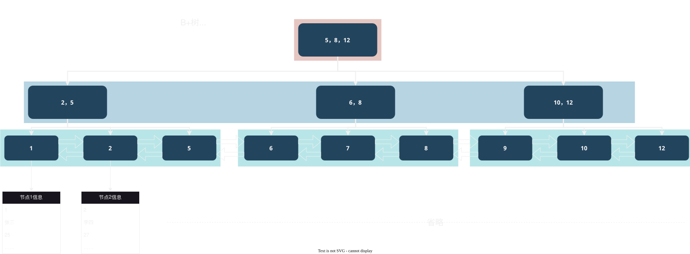

# 2025-10-18-索引

> 索引作用是**加快查询速度**，但是与此同时，会减慢增删改的速度
>
> 但是由于业务上基本是读取为主，所以一般都会构建索引来加快速度
>
> 目标：
> 1. [索引的结构 B+ 树](#b-树-1)
> 2. [索引失效规则](#索引失效)

## 数据结构
### 不合适的数据结构
|        数据结构         |       不合适的原因       |
| :---------------------: | :----------------------: |
| 二叉搜索树/AVL数/红黑树 | 如果值太多，**深度过大** |
|         Hash表          |    **不支持范围查询**    |

### B 树
> `B 树`（也叫做 `B-树`，“-”是连接符）也是不太适合的，
> 具体原因一两句说不完，所以不放在上面了




特点：
1. 节点内存储的都是数据
2. 每个节点存储不止一个数据

### B+ 树
> `B+ 树`是 `MySQL` 内部存储的数据结构



特点：
1. 非叶子节点，存储的索引，叶子节点存储的才是详细内容
2. 最后用双向链表存储，支持范围查询


### B 树与 B+ 树区别
|     内容     |   B 树   |              B+ 树               |
| :----------: | :------: | :------------------------------: |
|  查询稳定性  |  不稳定  | 稳定，每次查询的时间复杂度都一样 |
| 范围查询逻辑 |   复杂   |               简单               |
| 详细信息位置 | 在节点内 |          只在叶子节点内          |


## 页
> 它是每次查询的基本单位，默认是 16KB 
> 详情在数据库进阶部分呈现
>
> 为什么设置它？
> 1. 读取的时候可以减少与磁盘交互次数
> 2. 可以管理数据之间的关系

## 索引使用
### 代码案例
1. 直接在创建表的时候创建索引
    ```SQL
    drop table if exists student;

    create table student (
      id int primary key,
      name varchar(20),
      class_id int,
      index(id) -- index 来创建
    );

    show index from student;
    ```

2. 创建表后创建索引
    ```SQL
    drop table if exists student;

    create table student (
      id int primary key,
      name varchar(20),
      class_id int
    );

    -- create index ... on ... 来创建
    create index student_index_name on student(name);

    show index from student;
    ```

### 问题
针对于**正在使用的大表**，如何构建索引呢？


<Spoiler>

1. 先申请一个新的服务器，把表中的数据拷贝一份在新的服务器上面
2. 在新的服务器上面构建索引
3. 在应用配置那里，更改数据库的配置，将旧数据库地址变为新的数据库地址

tip: 像这样需要大量时间处理的都可以这样处理
</Spoiler>


## 其他概念
### 索引覆盖 vs 回表查询
> 前提：它们都是通过索引查询，不通过索引查询没有这两个行为的

- 索引覆盖
  - 代码案例：
    ```SQL
    -- 索引是 name, 而此时也只查询 name 那么就不需要回表查询，直接返回值即可
    select name from student where name like '张%';
    ```
  - 概念：当查询的内容有且仅有索引的时候，不会触发回表查询，直接返回查询的结果即可
- 回表查询
  - 代码案例：
    ```SQL
    -- 索引是 name, 而此时也查询 id, name 那么就需要回表查询主键
    select id, name from student where name like '张%';
    ```
  - 概念：通过索引查询其他内容的时候，那么就会查询到主键，然后再根据主键这个索引再查询一次数据


### 索引失效
> 可以使用 `explain` 这个来查看索引是否失效
>
> 如果是 `all` 那么就是失效了，不是就是成功了

#### 单个列索引
> 表的创建结构是
> 
> ```SQL
> drop table if exists student;
> 
> create table student (
>   id int primary key auto_increment,
>   name varchar(20),
>   class_id int,
>   gender int default 1,
>   index(name),
>   index(gender)
> );
> 
> insert into student (name, class_id) values ('小明', 1),('小王', 1),('小强', 2);
> ```

1. 查询的结果没有使用索引
   ```SQL
   explain select * from student where class_id = 1; -- all
   ``` 
2. 使用的索引的**值比较单一**
   ```SQL
   -- 虽然不是 type all 但是没有用，因为相关的结果太多了
   explain select * from student where gender = 1; 
   ```  
3. 查询**字符串是通配符在前面**
   ```SQL
   -- 因为字符串是从前往后遍历的，树也是从前往后构建的，
   -- 所以前面的确定了，就可以命中索引
   explain select * from student where name like '%小'; -- all

   explain select * from student where name like '小%'; -- range
   ```  
4. 使用 `or` 而不是 `and`
   ```SQL
   -- 一个有索引列，一个没有
   explain select * from student where id < 7 or name like '小%'; -- all

   explain select * from student where id < 7 and name like '小%'; -- range
   ```  
5. 对索引进行运算
   ```SQL
   explain select * from student where id + 10 < 7; -- all

   explain select * from student where id < 7; -- range
   ```  
6. 使用 `not` 等**表示“非”**这样的关系
   ```SQL
   explain select * from student where name not like '小%'; -- all

   explain select * from student where name like '小%'; -- range
   ```  
7. 两个列表之间字符集不同 比如 一个是 `utf8` 另一个是 `utf8mb4`

#### 复合索引
> 假设这个表构建的复合索引顺序是 `(a, b, c)`
>
> 成功使用索引是：
> 1. a, b, c
> 2. a, b 
> 3. a 
> 4. a, c (这个是虽然会遍历 c 但是依然生效，因为已经排除了一大批值了)
>
> 索引失效：
> 1. b, c 
> 2. c, a 
> 3. b, a 
> 4. c
>
> **总之，复合索引查询顺序是依照构建时候顺序来查询的**