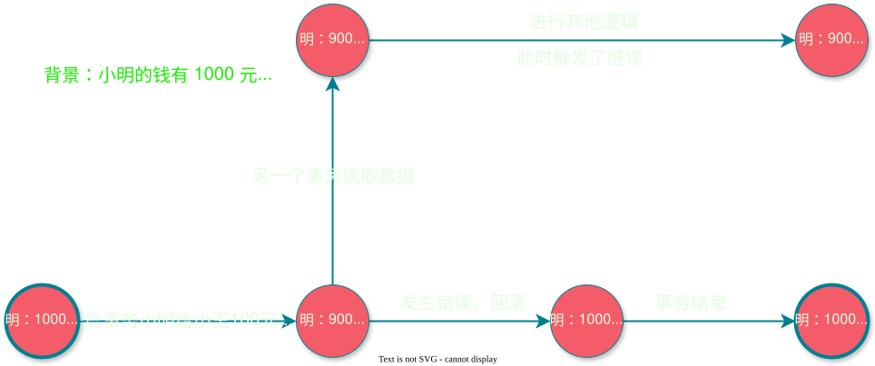
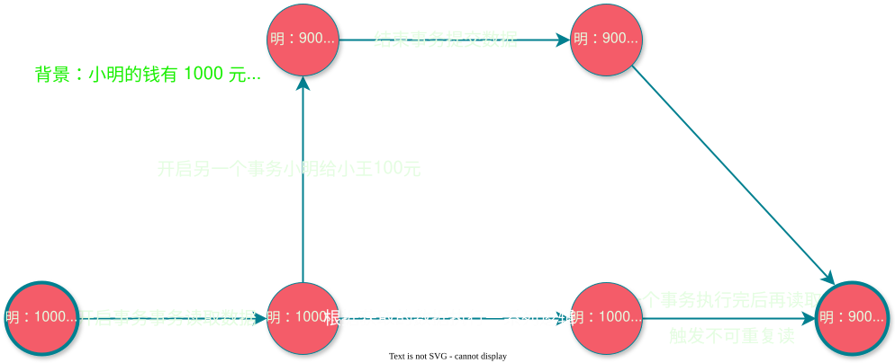
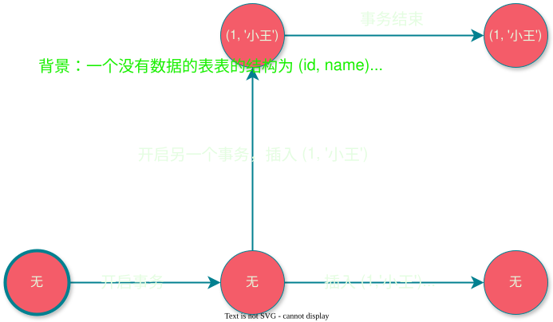

# 2025-10-20-事务

## 事务的 `ACID` 特性
### `A(Atomicity)` 原子性
> 执行的结果要么是成功，要么是失败，里面的逻辑是不可分割的
> 不会存在只执行一半的情况
>
> 如果中途失败了，就会 `回滚(Rollback)`，恢复到之前的状态

### `C(Consistency)` 一致性
> 数据是满足期望，是一致的
>
> 比如转账：
> 
> 背景：小明有1000元，小王有500元。小明需要分两次汇款，每次分别给小王100元
> 
> 步骤：
> 1. 小明减少100, 变为900元
> 2. 小王增加100, 变为600元
> 3. 小明减少100, 变为800元
> 4. 小王增加100, 变为700元
>
> 如果执行第3步的时候，出了问题，那么还是满足一致性的（**但此时不满足原子性**）
> 如果**执行第2步出现问题，那么就不满足一致性了**

### `I(Isolation)` 隔离性（重点）
> 执行不同事务的时候，隔离性可以降低 各个事务之间的数据的影响

|           类型            |                                              情况                                               |                            处理方案                            |
| :-----------------------: | :---------------------------------------------------------------------------------------------: | :------------------------------------------------------------: |
|       [脏读](#脏读)       |                              事务还没有执行完，读取到未保存的数据                               |                   **不能读取到未提交的数据**                   |
| [不可重复读](#不可重复读) |                   事务执行过程中，对**同一个数据**读取两次，获取到不同的结果                    | 数据如果在事务内读取，那么在**这个事务结束前不能修改这个数据** |
|       [幻读](#幻读)       | 开始事务1后，在事务2内执行了插入语句，此时如果事务1也执行插入语句，如果主键一样，那么就会被影响 |              串行化，每个事务之间**一条一条执行**              |

### 脏读

### 不可重复读

### 幻读

### `D(Durability)` 持久性
> 事务修改后的结果支持长久保存（**保存在硬盘上面**）

## 隔离级别

|    级别    |      存在问题      |
| :--------: | :----------------: |
|  读未提交  | 脏读/可重复读/幻读 |
|  读已提交  |   可重复读/幻读    |
| 可以重复度 |        幻读        |
|   串行化   |         -          |