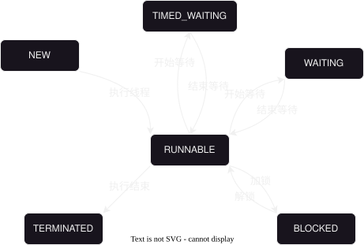
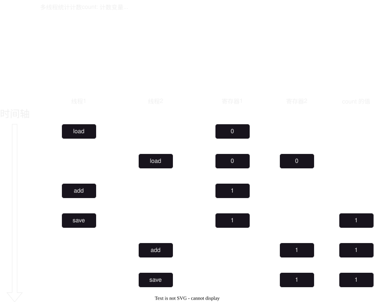

# 2025-11-03-多线程初阶

## 进程与线程之间的关系（高频面试题）
||

1. **进程包含线程**，一个进程可以有多个线程，但不能为 0 个
2. **进程**是**资源分配**的基本单位，**线程**是**调度执行**的基本单位
3. 每个**进程**之间占有自己各自的**独立资源**（比如数据/上下文等），
   而**进程**里面的各个线程是**共用一份资源**
4. **进程与进程之间互不干扰**，一个进程崩溃了一般不会影响另一个进程
   但是**线程与线程之间会相互干扰**，一个线程崩溃了容易导致其他线程也崩溃

||

## `Thread` 常见属性
### 属性
#### `Name`
> 线程的名字，**设置名字可以在调试的时候快速定位相关的线程。**
>
> 如果使用 `JVM` 自己定义的，那么就会导致出现问题时难以定位。

#### `State`
> 线程状态， TODO

#### `Alive`
> 判断线程是否存活，在 **线程开始之前或者线程执行结束后** 是不存活的
>
> 在 **线程执行中** 是存活的


#### `Daemon`
> `Daemon` 的中译为 “守护”，如果把它设为 `true` 那么就是 **守护（后台）线程**
>
> 前台线程与后台线程区别：
> **后台线程一般是服务于前台线程的**，比如负责**垃圾回收机制**的线程就是后台线程
>
> 在**所有的**前台线程执行完后，进程才会结束。
> 这也就意味着一般情况下，所有前台线程结束后后台线程也会自动结束


#### `Interupted` 
> 线程是否中断， TODO


## 线程的使用
### 启动线程
> 启动线程，使用方法 `start`
> 
> 为了方便管理，一个线程对象不能多次调用 `start`

### 中断线程

#### 通过成员变量来中断
> 虽然操作系统里面有强制中断线程的 `API`, 
> 
> 但是由于不能判断当前线程的执行进度，**`Java` 是不支持强制中断线程**
>
> 不过依然**可以通过成员变量来实现“中断线程”这个业务**

```Java
public class Demo1 {
    private static boolean running = true;

    public static void main(String[] args) {
        Thread t = new Thread(() -> {
            while (running) {
                System.out.println("hello thread");
                try {
                    Thread.sleep(1000);
                } catch (InterruptedException e) {
                    throw new RuntimeException(e);
                }
            }
            System.out.println("thread end...");
        });

        t.start();

        Scanner in = new Scanner(System.in);

        in.next(); // 仅仅是为了阻塞主线程
        // 输入任意值后，自动把 running 的值变为 false 从而关闭 t 这个线程
        running = false;
    }
}
```

---
问题：上诉代码是可以实现中断线程，但是把 `running` 这个变量放入 `main` 这个方法里面
（如下代码显示），是否也可以实现中断线程呢？

```Java
public class Demo1 {
//    private static boolean running = true;

    public static void main(String[] args) {
        // 变更在这里 ⬇️
        boolean running = true; // 这样是否可以正常运行呢？
        Thread t = new Thread(() -> {
            while (running) {
                System.out.println("hello thread");
                try {
                    Thread.sleep(1000);
                } catch (InterruptedException e) {
                    throw new RuntimeException(e);
                }
            }
            System.out.println("thread end...");
        });

        t.start();

        Scanner in = new Scanner(System.in);

        in.next(); // 仅仅是为了阻塞主线程
        // 输入任意值后，自动把 running 的值变为 false 从而关闭 t 这个线程
        running = false;
    }
}
```

答案：
||

**不能编译运行通过**，

代码提示：`Variable used in lambda expression should be final or effectively final`

**局部变量如果在匿名内部类中使用的时候是不能修改的**

> 理解：以上诉这例子为例，在多线程的情况下，如果**主线程销毁了，`running` 这个局部变量也会跟着一起销毁，**
> 为了记录 `running` 的值，另一个线程会“复制”一份一样的内容，但是如果会变化的情况，它应不应该同步呢？
> 
> 如果需要同步，那么就需要主线程与其他调用这个变量的线程也需要一起同步，保证值一致，但是这个比较麻烦，
> 所以就一刀切，把语法设置为不能同步就没有这个问题了

||

#### 通过 `Interupt` 来中断（推荐）
> [上诉过程](#通过成员变量来中断)有一个巨大的问题，那就是如果设置**阻塞的时间太久**，
> **把 `running` 这个变量修改为 `false` 不能立即终止，要阻塞结束后才能终止**
>
> 所以通过 `Interupt` 这个变量来解决这个问题


### 等待线程
> 使用 `join()` 来解决，
> 但是**一般情况下，里面都会添加一个等待时间**，防止“死等”

## 线程的状态

|     状态      |                   意思                   |
| :-----------: | :--------------------------------------: |
|      NEW      |       新创建还**没有执行过**的线程       |
|   RUNNABLE    |            **正在运行**的线程            |
| TIMED_WAITING | **阻塞等待**的线程，等待时间是**有限**的 |
|    WAITING    | **阻塞等待**的线程，等待时间是**无限**的 |
|  TERMINATED   |            **执行完毕**的线程            |
|    BLOCKED    |             被**锁住**的线程             |



## 线程安全（重点）
> 如果代码在**单线程下执行没有问题**，但是**多线程下执行却有问题**，那么这个代码就**有线程安全的问题**
>
> 如果代码在单线程与多线程下执行都没有问题，那么就没有线程安全问题

例子：针对于 `count` 进行计数

```Java
public class Demo2 {
    private static int count;

    public static void main(String[] args) throws InterruptedException {
        Thread t1 = new Thread(() -> {
            for (int i = 0; i < 50000; i++) {
                count++;
            }
        });

        Thread t2 = new Thread(() -> {
            for (int i = 0; i < 50000; i++) {
                count++;
            }
        });

        t1.start();
        t2.start();
        t1.join();
        t2.join();

        System.out.println("count = " + count);
    }
}
```

### 问题出现原因
1. `CPU` 调度是随机的（根本原因，无法修改）
2. **同一个变量**在**同一时间**内进行**修改**
3. 一个语句中会有多个指令，操作不是原子的
   > 语句是在像 `Java` 这样的高级语言中，比如 `count++` 就是一条语句
   > 
   > 指令是在机器语言中，比如 `count++` 这个语句就包含三条指令
   > - `load`: 把数据从内存中加载在寄存器中
   > - `add`: 把数据加 1
   > - `save`: 保存数据

4. 内存可见性
5. 指令重排序




### 解决方法

1. 针对“**同一个变量**在**同一时间**内进行**修改**”
   1. 使用两个变量
   2. 有先后执行顺序
   3. 不修改，只读取
2. 针对“操作不是原子的”：使用 `synchronized` 这个关键字来解决
   > 注意点：
   > 1. `synchronized` 需要会读并且会拼写
   > 2. `synchronized` 里面需要包含**同一个对象**
   > 3. 两个循环**都要使用** `synchronized`


### 死锁
> 一般是在**两个极其以上的线程**在执行过程中由于争抢资源而**互相等待**的情况

#### 死锁的发生场景
1. 在一个线程内针对**不可重入锁连续加锁两次**
2. 两个线程两把锁
   1. 线程A 加锁 锁B，线程B 加锁 锁A
   2. **执行完1后**，线程A 加锁 锁A，线程B 加锁 锁B
    ```Java
    public class Demo2 {
        public static void main(String[] args) {
            Object lockA = new Object();
            Object lockB = new Object();
            Thread t1 = new Thread(() -> {
                synchronized (lockB) {
                    try {
                        Thread.sleep(1000);
                    } catch (InterruptedException e) {
                        throw new RuntimeException(e);
                    }
                    synchronized (lockA) {
                        System.out.println("t1");
                    }
                }
            });

            Thread t2 = new Thread(() -> {
                synchronized (lockA) {
                    try {
                        Thread.sleep(1000);
                    } catch (InterruptedException e) {
                        throw new RuntimeException(e);
                    }
                    synchronized (lockB) {
                        System.out.println("t2");
                    }
                }
            });

            t1.start();
            t2.start();
        }
    }
    ```
3. N个线程M把锁
    > 可以通过[哲学家就餐](https://zh.wikipedia.org/zh-cn/%E5%93%B2%E5%AD%A6%E5%AE%B6%E5%B0%B1%E9%A4%90%E9%97%AE%E9%A2%98)
    > 这个哲学问题来理解
    > 
    > 


#### 死锁发生的必要条件
1. `互斥`：线程A 持有锁A, 如果此时线程B 也要持有锁A, 那么就会**阻塞等待**
2. `不可抢占`：线程A 持有锁A，其他线程如果想要持有锁A, 是不能抢夺线程A对锁A的持有权的
3. `保持再请求`：线程A在**持有锁A**的情况下想要**再次持有锁B**
    ```Java
    public class Demo2 {
        public static void main(String[] args) {
            Object lockA = new Object();
            Object lockB = new Object();
            Thread t1 = new Thread(() -> {
                synchronized (lockB) {
                    try {
                        Thread.sleep(1000);
                    } catch (InterruptedException e) {
                        throw new RuntimeException(e);
                    }
                    synchronized (lockA) {
                        System.out.println("t1");
                    }
                }
            });

            Thread t2 = new Thread(() -> {
                synchronized (lockA) {
                    try {
                        Thread.sleep(1000);
                    } catch (InterruptedException e) {
                        throw new RuntimeException(e);
                    }
                    synchronized (lockB) {
                        System.out.println("t2");
                    }
                }
            });

            t1.start();
            t2.start();
        }
    }
    ``` 
4. `循环等待`：与 **N个线程M把锁** 这个问题情况类似


#### 死锁的解决方法
> 在 `Java` 中 `synchronized` 这个关键字是天然有`互斥`与`不可抢占`这两个属性，
> 所以解决方法是针对与 `保持再请求` 和 `循环等待`

1. `保持再请求`：**取消嵌套调用锁**或者**只设置一把锁**即可
2. `循环等待`：对**每把锁进行从小到大编号**，加锁的循序只要是按照**从大到小/从小到大**即可


### `Java` 中线程安全的集合类
> `Java` 中集合类绝大部分都是线程不安全的。
> 
> 线程安全是相对的，**加了 `synchronized` 的也不一定线程安全，不加 `synchronized` 也不一定是线程不安全的**
>
> 由于**加锁**后，一般会**阻塞等待**，所以加锁的一般是**告别高性能**了，
> 
> 而**不加锁的集合类**是可以由程序员决定是否加锁来保障线程安全（**自由度更高**），**加锁的**是不能取消锁（**自由度低**）
> 
> 因此线程安全的集合类很多是不常用的
> 
>
> 线程安全：
> - `Vector`(不推荐使用)
> - `HashTable`(不推荐使用)
> - `ConcurrentHashMap`
> - `StringBuffer`

