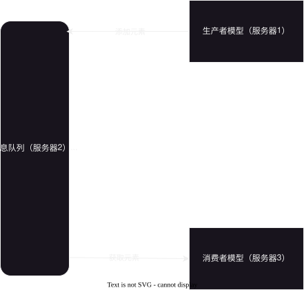
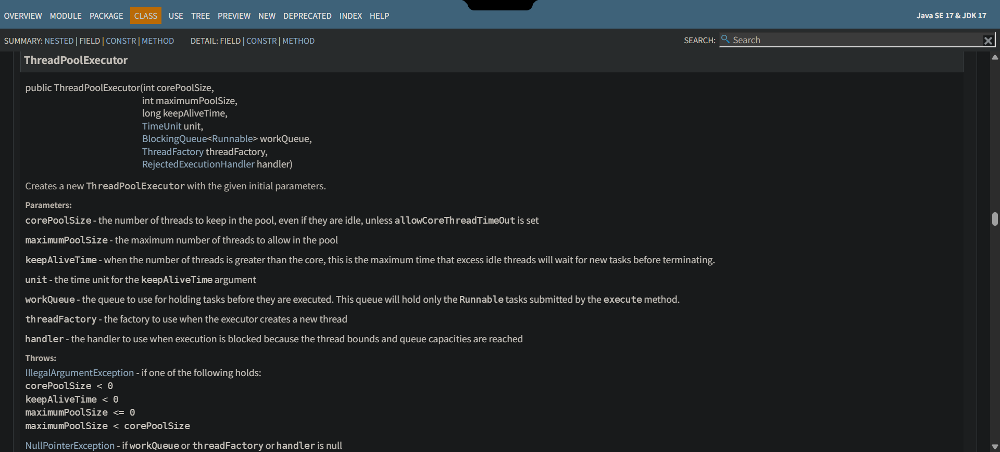

# 2025-11-03-多线程初阶

## 进程与线程之间的关系（高频面试题）
||

1. **进程包含线程**，一个进程可以有多个线程，但不能为 0 个
2. **进程**是**资源分配**的基本单位，**线程**是**调度执行**的基本单位
3. 每个**进程**之间占有自己各自的**独立资源**（比如数据/上下文等），
   而**进程**里面的各个线程是**共用一份资源**
4. **进程与进程之间互不干扰**，一个进程崩溃了一般不会影响另一个进程
   但是**线程与线程之间会相互干扰**，一个线程崩溃了容易导致其他线程也崩溃

||

## `Thread` 常见属性
### 属性
#### `Name`
> 线程的名字，**设置名字可以在调试的时候快速定位相关的线程。**
>
> 如果使用 `JVM` 自己定义的，那么就会导致出现问题时难以定位。

#### `State`
> 线程状态 
> |     状态      |                   意思                   |
> | :-----------: | :--------------------------------------: |
> |      NEW      |       新创建还**没有执行过**的线程       |
> |   RUNNABLE    |            **正在运行**的线程            |
> | TIMED_WAITING | **阻塞等待**的线程，等待时间是**有限**的 |
> |    WAITING    | **阻塞等待**的线程，等待时间是**无限**的 |
> |  TERMINATED   |            **执行完毕**的线程            |
> |    BLOCKED    |             被**锁住**的线程             |
> 
> 

#### `Alive`
> 判断线程是否存活，在 **线程开始之前或者线程执行结束后** 是不存活的
>
> 在 **线程执行中** 是存活的


#### `Daemon`
> `Daemon` 的中译为 “守护”，如果把它设为 `true` 那么就是 **守护（后台）线程**
>
> 前台线程与后台线程区别：
> **后台线程一般是服务于前台线程的**，比如负责**垃圾回收机制**的线程就是后台线程
>
> 在**所有的**前台线程执行完后，进程才会结束。
> 这也就意味着一般情况下，所有前台线程结束后后台线程也会自动结束


## 线程的使用
### 启动线程
> 启动线程，使用方法 `start`
> 
> 为了方便管理，一个线程对象不能多次调用 `start`

### 中断线程

#### 通过成员变量来中断
> 虽然操作系统里面有强制中断线程的 `API`, 
> 
> 但是由于不能判断当前线程的执行进度，**`Java` 是不支持强制中断线程**
>
> 不过依然**可以通过成员变量来实现“中断线程”这个业务**

```Java
public class Demo1 {
    private static boolean running = true;

    public static void main(String[] args) {
        Thread t = new Thread(() -> {
            while (running) {
                System.out.println("hello thread");
                try {
                    Thread.sleep(1000);
                } catch (InterruptedException e) {
                    throw new RuntimeException(e);
                }
            }
            System.out.println("thread end...");
        });

        t.start();

        Scanner in = new Scanner(System.in);

        in.next(); // 仅仅是为了阻塞主线程
        // 输入任意值后，自动把 running 的值变为 false 从而关闭 t 这个线程
        running = false;
    }
}
```

---
问题：上诉代码是可以实现中断线程，但是把 `running` 这个变量放入 `main` 这个方法里面
（如下代码显示），是否也可以实现中断线程呢？

```Java
public class Demo1 {
//    private static boolean running = true;

    public static void main(String[] args) {
        // 变更在这里 ⬇️
        boolean running = true; // 这样是否可以正常运行呢？
        Thread t = new Thread(() -> {
            while (running) {
                System.out.println("hello thread");
                try {
                    Thread.sleep(1000);
                } catch (InterruptedException e) {
                    throw new RuntimeException(e);
                }
            }
            System.out.println("thread end...");
        });

        t.start();

        Scanner in = new Scanner(System.in);

        in.next(); // 仅仅是为了阻塞主线程
        // 输入任意值后，自动把 running 的值变为 false 从而关闭 t 这个线程
        running = false;
    }
}
```

答案：
||

**不能编译运行通过**，

代码提示：`Variable used in lambda expression should be final or effectively final`

**局部变量如果在匿名内部类中使用的时候是不能修改的**

> 理解：以上诉这例子为例，在多线程的情况下，如果**主线程销毁了，`running` 这个局部变量也会跟着一起销毁，**
> 为了记录 `running` 的值，另一个线程会“复制”一份一样的内容，但是如果会变化的情况，它应不应该同步呢？
> 
> 如果需要同步，那么就需要主线程与其他调用这个变量的线程也需要一起同步，保证值一致，但是这个比较麻烦，
> 所以就一刀切，把语法设置为不能同步就没有这个问题了

||

#### 通过 `Interupt` 来中断（推荐）
> [上诉过程](#通过成员变量来中断)有一个巨大的问题，那就是如果设置**阻塞的时间太久**，
> **把 `running` 这个变量修改为 `false` 不能立即终止，要阻塞结束后才能终止**
>
> 所以通过 `Interupt` 这个变量来解决这个问题


### 等待线程
> 使用 `join()` 来解决，
> 但是**一般情况下，里面都会添加一个等待时间**，防止“死等”


## 线程安全（重点）
> 如果代码在**单线程下执行没有问题**，但是**多线程下执行却有问题**，那么这个代码就**有线程安全的问题**
>
> 如果代码在单线程与多线程下执行都没有问题，那么就没有线程安全问题

例子：针对于 `count` 进行计数

```Java
public class Demo2 {
    private static int count;

    public static void main(String[] args) throws InterruptedException {
        Thread t1 = new Thread(() -> {
            for (int i = 0; i < 50000; i++) {
                count++;
            }
        });

        Thread t2 = new Thread(() -> {
            for (int i = 0; i < 50000; i++) {
                count++;
            }
        });

        t1.start();
        t2.start();
        t1.join();
        t2.join();

        System.out.println("count = " + count);
    }
}
```

### 问题出现原因
1. `CPU` 调度是随机的（根本原因，无法修改）
2. **同一个变量**在**同一时间**内进行**修改**
3. 一个语句中会有多个指令，操作不是原子的
   > 语句是在像 `Java` 这样的高级语言中，比如 `count++` 就是一条语句
   > 
   > 指令是在机器语言中，比如 `count++` 这个语句就包含三条指令
   > - `load`: 把数据从内存中加载在寄存器中
   > - `add`: 把数据加 1
   > - `save`: 保存数据

4. 内存可见性
    > 它是由编译器代码优化而导致的问题，
    > 
    > 就以如下代码为例
    ```Java
    public class Demo1 {
        private static boolean flag = true;
        
        public static void main(String[] args) {
            Thread t1 = new Thread(() -> {
                while (flag) {
                    // 什么也不做，确保 load 是占时间消耗的大头
                }

                System.out.println("t1 end");
            });

            Thread t2 = new Thread(() -> {
                Scanner in = new Scanner(System.in);
                in.next();
                flag = false;
                System.out.println("t2 end, flag = " + flag);
            });

            t1.start();
            t2.start();
        }
    }

    ``` 
    
    上诉代码内存可见性出现原因：
    ||
    
    > `t1` 主要的时间都用于 `load`（加载）`flag` 这个数据
    >
    > **由于 `load` 这个操作是从内存中获取的，所以它的时间开销是占大头的**，
    >
    > 而在长时间内，`flag` 都是为 `true`，所以编译器就会优化，**把 `flag` 的值放入CPU的寄存器中**，
    > 
    > 之后 `t2` 线程修改了 `flag`，它是修改内存中的数据，因此 `t1` 中寄存器中的数据是没有被修改，也就结束不了 `t1`
    
    ||

5. 指令重排序
   > 它也是由编译器优化导致的问题，比如实例化并赋值对象的时候会有这几步
   > 1. 开辟空间
   > 2. 初始化
   > 3. 赋值
   >
   > 如果触发指令重排序，那么就步骤就会变为 `1-3-2`。相关的案例在 单例模式 中会讲述


### 解决方法

1. 针对“**同一个变量**在**同一时间**内进行**修改**”
   1. 使用两个变量
   2. 有先后执行顺序
   3. 不修改，只读取
2. 针对“操作不是原子的”：使用 `synchronized` 这个关键字来解决
   > 注意点：
   > ||
   >
   > 1. `synchronized` 需要会读并且会拼写
   > 2. `synchronized` 里面需要包含**同一个对象**
   > 3. 两个循环**都要使用** `synchronized`
   > ||
3. 针对“内存可见性”：使用 `volatile` 即可
   > 注意点：
   > ||
   >
   > 1. `volatile` 需要会读并且会拼写
   > 2. `volatile` 通常用于**一个线程只读变量 A 的，另一个线程修改 A 的情况**
   > ||

### 死锁
> 一般是在**两个极其以上的线程**在执行过程中由于争抢资源而**互相等待**的情况

#### 死锁的发生场景
1. 在一个线程内针对**不可重入锁连续加锁两次**
2. 两个线程两把锁
   1. 线程A 加锁 锁B，线程B 加锁 锁A
   2. **执行完1后**，线程A 加锁 锁A，线程B 加锁 锁B
    ```Java
    public class Demo2 {
        public static void main(String[] args) {
            Object lockA = new Object();
            Object lockB = new Object();
            Thread t1 = new Thread(() -> {
                synchronized (lockB) {
                    try {
                        Thread.sleep(1000);
                    } catch (InterruptedException e) {
                        throw new RuntimeException(e);
                    }
                    synchronized (lockA) {
                        System.out.println("t1");
                    }
                }
            });

            Thread t2 = new Thread(() -> {
                synchronized (lockA) {
                    try {
                        Thread.sleep(1000);
                    } catch (InterruptedException e) {
                        throw new RuntimeException(e);
                    }
                    synchronized (lockB) {
                        System.out.println("t2");
                    }
                }
            });

            t1.start();
            t2.start();
        }
    }
    ```
3. N个线程M把锁
    > 可以通过[哲学家就餐](https://zh.wikipedia.org/zh-cn/%E5%93%B2%E5%AD%A6%E5%AE%B6%E5%B0%B1%E9%A4%90%E9%97%AE%E9%A2%98)
    > 这个哲学问题来理解
    > 
    > 


#### 死锁发生的必要条件
1. `互斥`：线程A 持有锁A, 如果此时线程B 也要持有锁A, 那么就会**阻塞等待**
2. `不可抢占`：线程A 持有锁A，其他线程如果想要持有锁A, 是不能抢夺线程A对锁A的持有权的
3. `保持再请求`：线程A在**持有锁A**的情况下想要**再次持有锁B**
    ```Java
    public class Demo2 {
        public static void main(String[] args) {
            Object lockA = new Object();
            Object lockB = new Object();
            Thread t1 = new Thread(() -> {
                synchronized (lockB) {
                    try {
                        Thread.sleep(1000);
                    } catch (InterruptedException e) {
                        throw new RuntimeException(e);
                    }
                    synchronized (lockA) {
                        System.out.println("t1");
                    }
                }
            });

            Thread t2 = new Thread(() -> {
                synchronized (lockA) {
                    try {
                        Thread.sleep(1000);
                    } catch (InterruptedException e) {
                        throw new RuntimeException(e);
                    }
                    synchronized (lockB) {
                        System.out.println("t2");
                    }
                }
            });

            t1.start();
            t2.start();
        }
    }
    ``` 
4. `循环等待`：与 **N个线程M把锁** 这个问题情况类似


#### 死锁的解决方法
> 在 `Java` 中 `synchronized` 这个关键字是天然有`互斥`与`不可抢占`这两个属性，
> 所以解决方法是针对与 `保持再请求` 和 `循环等待`

1. `保持再请求`：**取消嵌套调用锁**或者**只设置一把锁**即可
2. `循环等待`：对**每把锁进行从小到大编号**，加锁的循序只要是按照**从大到小/从小到大**即可


### `Java` 中线程安全的集合类
> `Java` 中集合类绝大部分都是线程不安全的。
> 
> 线程安全是相对的，**加了 `synchronized` 的也不一定线程安全，不加 `synchronized` 也不一定是线程不安全的**
>
> 由于**加锁**后，一般会**阻塞等待**，所以加锁的一般是**告别高性能**了，
> 
> 而**不加锁的集合类**是可以由程序员决定是否加锁来保障线程安全（**自由度更高**），**加锁的**是不能取消锁（**自由度低**）
> 
> 因此线程安全的集合类很多是不常用的
> 
>
> 线程安全：
> - `Vector`(不推荐使用)
> - `HashTable`(不推荐使用)
> - `ConcurrentHashMap`
> - `StringBuffer`


### `wait` 与 `notify`
> `wait` 是线程等待，`notify` 是随机通知哪个锁解锁
>
> 它们是 `Object` 这个类中的方法，所以所有对象都可以使用这两个功能
>
> 在 `Java` 中，它们都是要放在 `synchronized` 的代码块里面

#### 解决问题
1. 可以保证线程执行的先后顺序
2. 防止“线程饿死”：因为线程阻塞了，不会侵占其他线程的资源
   > 线程饿死是指一个线程长时间占用资源，而导致**其他线程长时间不能获取足够的资源执行**

#### `wait` 与 `join` 区别
|    区别    |                  `wait`                  |         `join`         |
| :--------: | :--------------------------------------: | :--------------------: |
|   所属类   |            `java.lang.Object`            |   `java.lang.Thread`   |
|  设计初衷  |         解决线程之间的同步与通信         |    等待目标线程结束    |
| 是否需要锁 |       需要使用 `synchronized` 加锁       |         不需要         |
| 是否释放锁 |                  会释放                  |          不会          |
|  唤醒机制  | 使用相关实例的 `notify` 或者 `notifyAll` | 线程结束的时候自动唤醒 |

## 多线程案例

### 单例模式
> 详情就不在这里解释了，具体的详细在相关文章里面有解释 ➡️单例模式

### 阻塞队列
> 阻塞队列一般是在生产者消费者模型用使用
>
> 如果满了继续添加元素/空了继续获取元素，它就会阻塞


#### 生产者消费者模型
> 它由**生产者，消息队列，消费者**组成
> - `生产者`：产生元素
> - `消息队列`：临时存储元素
> - `消费者`：消耗元素
>
> 

##### 优缺点

优点：

||

1. 解耦
2. 削峰填谷
3. 减少锁竞争

||

缺点：

||

1. 增加网络通信，降低运行效率
2. 添加模块，提高运维成本

||

疑问：
它确实减轻了生产者与消费者之间的耦合，但是它们分别与消息队列增加了耦合，为什么这个可以解耦？

|| 
因为**消息队列是基本不变**的，与它增加了耦合其实是无伤大雅的
||


### 线程池
> 线程池是用来**解决线程频繁创建/销毁导致开销过大**的问题
>
> 为什么创建/销毁开销相对较大：
> || 线程的创建/销毁涉及到内核的调用，而**内核的调用的时间是无法控制**的 ||

#### `ThreadPoolExecutor`
> [文档地址](https://docs.oracle.com/en/java/javase/17/docs/api/java.base/java/util/concurrent/ThreadPoolExecutor.html)
> 
> 要求：
> - 了解构造方法极其各个参数的含义

##### 构造方法


- `corePoolSize`: **线程的核心个数**，不会轻易释放
- `maximumPoolSize`: **线程的最多个数**
  > Q：线程个数与CPU核心数是有明确的公式关系吗？
  >
  > A：|| 没有明确的关系，要看具体的业务，**通过做实验的方式来测出最佳方案**。
  > 因为有些是 IO 密集型，有些是 CPU 密集型 ||
- `keepAliveTime`: 非核心线程空闲时间时长，超过这个时长后就会释放相关非核心线程
- `unit`: 非核心线程空闲时间时长的**单位**
- `workQueue`: 工作队列，**传入需要线程执行的逻辑**
- `threadFactory`: 线程创建的工程，**可以自定义工厂实现方式，从而满足个性化的需求**
- `handler`: 这个是面试的重点，**工作队列满的时候**，执行的策略
  - `AbortPolicy`: 直接**抛出异常**
  - `CallerRunsPolicy`: 把任务交还给调用线程池的这个线程执行，比如 A 线程调用 `submit` 到线程池中，那么就是 A 来执行
  - `DiscardOldestPolicy`: **丢弃最老**的执行任务
  - `DiscardPolicy`: **丢弃最新**的执行任务

##### 使用
> 由于线程池的参数过多，就用 [`Executors`](https://docs.oracle.com/en/java/javase/17/docs/api/java.base/java/util/concurrent/Executors.html) 这个工厂来简化线程池的创建
>
> 使用的话就是创建的实例调用 `submit` 一下就可以

##### 代码实现
> 这里实现的是最简单的版本，仅仅实现**固定大小的线程池**以及 `submit` 方法

```Java
class MyThreadPool {
    private BlockingQueue<Runnable> workQueue = new LinkedBlockingQueue<>();

    public MyThreadPool(int size) {
        for (int i = 0; i < size; i++) {
            // 创建线程
            Thread t = new Thread(() -> {
                while (true) {
                    try {
                        Runnable take = workQueue.take();
                        take.run();
                    } catch (InterruptedException e) {
                        throw new RuntimeException(e);
                    }
                }
            });

            t.start();
        }
    }

    public void submit(Runnable runnable) throws InterruptedException {
        workQueue.put(runnable);
    }
}
```


### 定时器

#### 定时器的实现
> 仅仅是实现的是核心功能 `schedule` 

|                        问题                        |                                                                  答案                                                                  |
| :------------------------------------------------: | :------------------------------------------------------------------------------------------------------------------------------------: |
|        为什么使用 `wait` 而不是 `continue`         |                                        ||防止忙等导致CPU一直运行，而且可以防止对 `schedule` 的干扰||                                         |
|                为什么有线程安全问题                |                                           ||不同的线程对 `workQueue` 这个队列**有读取与写**操作||                                            |
|    既然要保证线程安全，为什么不建议使用阻塞队列    | ||在有任务的情况下，需要使用 `wait` 来等待，保证在合适的时间点执行这个任务。使用阻塞队列不能实现这个功能，那么就需要管理两把锁，容易死锁|| |
| 判断队列是否为空为什么不使用 `if` 而是使用 `while` |                                           ||多一次判断，防止 `interrupt` 打断阻塞而导致的问题||                                            |

```Java
class MyTimer {
    class MyTimerTask implements Comparable<MyTimerTask>{
        private Runnable task;
        private long time;

        public MyTimerTask(Runnable task, long delay) {
            this.task = task;
            this.time = delay + System.currentTimeMillis();
        }

        public long getTime() {
            return time;
        }

        public void run() {
            task.run();
        }

        @Override
        public int compareTo(MyTimerTask o) {
            return (int) (this.time - o.time);
        }
    }

    // 时间用时间戳来存储，这样就不需要更新
    private PriorityQueue<MyTimerTask> queue = new PriorityQueue<>();

    public MyTimer() {
        // 创建一个线程 需要一直执行
        Thread t = new Thread(() -> {
            while (true) {
                // 由于涉及到 对 queue 的添加与删除，那么需要用锁来保证线程安全
                synchronized (this) {
                    while (queue.isEmpty()) {
                        // 建议使用 while 通过判断两次来判断 wait 是 interrupt 打断的还是通过 notify 来唤醒的
                        // 不要使用 continue ，因为这样会导致忙等，是 CPU 一直运行，而且会干扰到 schedule
                        try {
                            this.wait();
                        } catch (InterruptedException e) {
                            throw new RuntimeException(e);
                        }
                    }

                    MyTimerTask task = queue.peek();
                    long currentTime = System.currentTimeMillis();
                    if (currentTime >= task.getTime()) {
                        // 执行
                        task.run();
                        queue.poll();
                    } else {
                        // 等待，但是是有一定的时间的
                        // 不建议使用阻塞队列，因为这里必须要 wait 那么就需要管理两把锁，容易死锁
                        try {
                            this.wait(task.getTime() - currentTime);
                        } catch (InterruptedException e) {
                            throw new RuntimeException(e);
                        }
                    }
                }
            }
        });

        t.start();
    }

    public void schedule(Runnable task, long delay) {
        // 加锁
        synchronized (this) {
            queue.add(new MyTimerTask(task, delay));
            this.notify();
        }
    }
}

```
