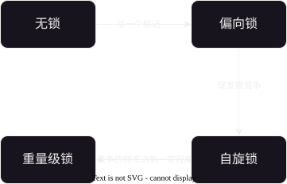
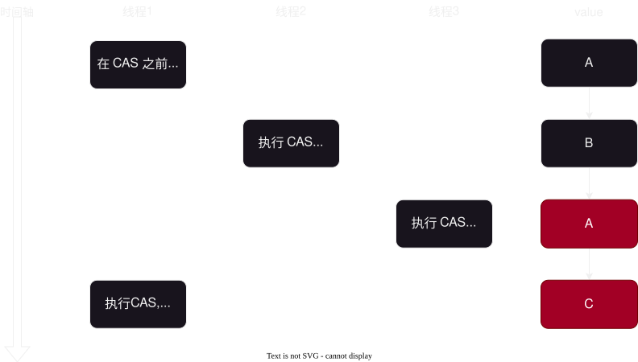

# 2025-12-03-多线程-进阶
> 这里记载的主要是有关**多线程面试常见的八股文**

## 常见的锁策略

### 乐观锁 vs 悲观锁
> `乐观锁`：预测**锁冲突概率比较低**的，
> 
> `悲观锁`：预测**锁冲突概率比较高**的


### 重量级锁 vs 轻量级锁
> `重量级锁`：**锁开销比较大**的
> 
> `轻量级锁`：**锁开销比较小**的
>
> 一般乐观锁就是轻量级锁，悲观锁就是重量级锁

### 挂起等待锁 vs 自旋锁
> `挂起等待锁`：会**阻塞等待**，代价是**不能够及时相应**，但是CPU开销小
> 
> `自旋锁`：CPU自旋，不会阻塞等待，代价是**CPU开销大**，但是能够及时相应

### 公平锁 vs 非公平锁
> 这里的“公平”是指**先来后到**
> 
> `公平锁`：**先来后到**，先阻塞的锁先解锁，后阻塞的锁后解锁
> 
> `非公平锁`：**概率均等**，每个参与锁竞争的线程获取锁的概率是“一样”的


### 可重入锁 vs 不可重入锁
> `可重入锁`：**同一个线程对在一定时间内对同一把锁获取两次，不会阻塞**
> 
> `不可重入锁`：**同一个线程对在一定时间内对同一把锁获取两次，会阻塞**


### 普通互斥锁 vs 读写锁
> 由于**不同线程对同一个变量只读的时候不会有线程安全的问题**（不用加锁），
> 而**一读一写才会有线程安全问题**，读写锁是针对“一读一写”这样的情况进行优化
>
> `普通互斥锁`：只要加锁，就会阻塞
> 
> `读写锁`：
> | 线程1 | 线程2 | 是否加锁 |
> | :---: | :---: | :---: |
> | 读 | 读 | 不加 |
> | 读 | 写 | 加 |
> | 写 | 读 | 加 |


## `synchronized` 原理
> Q: `Java` 中 `synchronized` 是什么类型的锁？
> 
> A: || 即是乐观锁，也是悲观锁；即是重量级锁，也是轻量级锁；即是挂起等待锁，也是自旋锁；
> 它还是**非公平锁，可重入锁，普通互斥锁** ||

### 偏向锁
> **它是给这个锁记一个标记，表明当前这个已经有锁了**，但没有执行一些锁的操作。


### 锁升级
> 1. 进入 `synchronized` 后，就会**标记一下**，从无锁变为偏向锁
> 2. 如果此时**其他线程也获取到这一把锁**，那么就会升级为自旋锁
> 3. 如果**参与锁竞争的线程比较多**，那么就会升级为重量级锁
>
> 在 `Java` 中，**锁升级是单向的，不可逆的**
> 
> 

### 锁消除
> 编译器会根据实际情况，把**一定没有用**的锁给优化掉，省去锁开销

### 锁粗化
> 也是编译器的一种优化方式。
>
> 它会对**频繁**加锁/解锁的过程合并为一个加锁/解锁
>
> 类似与打电话只打一次，把要说的内容全部说完，而不是打多次电话，每次电话只说一小部分
>
> 概念：
> - 粗：`synchronized` 包含的**代码比较多**
> - 细：`synchronized` 包含的**代码比较少**

## `CAS`
> `CAS(Compare And Swap)` 比较和交换: 在 CPU 上是原子的，
> - 如果是期望的值与地址上的值一样，那么就赋值并返回 `true` <-> **没有其他的线程在前面已经修改这个元素（[ABA问题](#aba-问题)除外）**
> - 如果不一样，那么就返回 `false` <-> **有其他的线程在前面已经修改这个元素**
> 
> ```Java
> // 这个是一个伪代码，整个方法体在 CPU 层面是原子执行的
> boolean CAS(address, expectValue, swapValue) {
>     // 获取该地址当前存储的实际值
>     currentValue = valueAt(address);
>     
>     // 比较当前值与期望值是否相等
>     if (currentValue == expectValue) { 
>         // 相等则将新值写入该地址
>         valueAt(address) = swapValue; 
>         return true;
>     }
>     // 不相等则说明值已经被改过（或者预期错误），返回 false
>     return false;
> }
> ```

### 应用
> `CAS` 主要的实现类是各种各样的“原子类”
>
> 原子类常见的应用常见有：统计每天用户访问次数/人数/请求成功率等

--- 
> 例子：多个线程对 `count` 累加

```Java
public class Demo1 {
    private static AtomicInteger safeCount = new AtomicInteger(0);
    private static int unsafeCount = 0;

    public static void main(String[] args) throws InterruptedException {
        Thread t1 = new Thread(() -> {
            for (int i = 0; i < 50000; i++) {
                safeCount.getAndIncrement(); // 等价与 count++
                unsafeCount++;
            }
        });
        Thread t2 = new Thread(() -> {
            for (int i = 0; i < 50000; i++) {
                safeCount.getAndIncrement(); // 等价与 count++
                unsafeCount++;
            }
        });

        t1.start();
        t2.start();
        t1.join();
        t2.join();

        System.out.println("safeCount = " + safeCount.get());
        System.out.println("unsafeCount = " + unsafeCount);
    }
}
```


### ABA 问题
> ABA 问题
> 
> 1. 线程A 执行了 `CAS` 之前，获取到的是 `oldValue` 为 $A_1$
> 2. 然后线程B 执行了 `CAS`, `value` 变为 $B$
> 3. 接着线程C 执行了 `CAS`, `value` 变为 $A_2$ 其中 $A_1 = A_2$
> 4. 最后线程A 执行 `CAS`, 发现值一样，但是此时它们代表的意思是不一样的了

#### 解法
||
> ABA 问题的滋生土壤为：**变量可以变回去，换而言之就是它既可以增加，也可以减少**
>
> 只需要保证值不会变回去即可，比如，设计一个版本号，
> 保证这个版本只能增加，每次操作一下就增加1，这样就可以不会出现 ABA 问题
||
## `JUC` 常见类
> `JUC` 是 `java.util.concurrent`
> 
> 它主要管理有关并发的类

### `Callable`
> `Callable` 是解决 `Runnable` 没有返回值的问题，它通常搭配 `FutureTask` 来使用
>
> 通过 `FutureTask` 中的 `get` 方法获取到 `Callable` 的返回值

```Java
public static void main(String[] args) throws ExecutionException, InterruptedException {
    Callable<Integer> callable = new Callable<Integer>() {
        @Override
        public Integer call() throws Exception {
            int count = 0;
            for (int i = 0; i < 50000; i++) {
                count++;
            }
            return count;
        }
    };

    FutureTask<Integer> futureTask = new FutureTask<>(callable);

    Thread t = new Thread(futureTask);
    t.start();

    System.out.println(futureTask.get());
}
```

### `ReentrantLock`
> 它是可重入锁

#### 面试题
Q: 阐述一下 `ReentrantLock` 与 `synchronized` 的区别
A:
||

1. `ReentrantLock` 有 `tryLock`, 它可以设置最长的阻塞时间，而 `synchronized` 只能死等
2. `ReentrantLock` 内置了公平锁的实现，可以通过构造方法来创建公平锁，而 `synchronized` 是非公平锁
3. `ReentrantLock` 是一个方法，通过 `lock`, `unlock` 来实现加锁解锁操作， `synchronized` 是关键字，通过代码块来实现加锁解锁
4. `ReentrantLock` 要实现等待通知机制需要搭配 `Condition` 这个类
||


### `Semaphore`
> `Semaphore`(信号量) 是**一个计数器，用来统计可用资源的个数**
>
> 用停车场来类比，
> - 有车辆进来停车，可以提供停车的位置就减一 <-> 在信号量中就是 `P操作`，可用资源数量减一
> - 有车辆驶出停车场，可以提供停车的位置就加一 <-> 在信号量中就是 `V操作`，可用资源数量加一

#### 应用场景
- 在请求量激增的情况下，可以**限制资源申请，保证服务不会崩溃**
- 当信号量的**可用资源个数设置为1**的时候，就为**二元信号量**，可以**作为锁来使用**

### `CountDownLatch`
> `CountDownLatch` 通常在**多任务执行的时候使用，当所有子任务执行完后才进行下一步**
>
> 比如 IDM 多线程下载完后，需要把不同文件进行合并，这时候就需要有类似 `CountDownLatch` 的“类”来实现相关功能


### `ConcurrentHashMap`
> `ConcurrentHashMap` 是 `Hashtable` 的上位替代，它针对多线程有很多优化

#### `ConcurrentHashMap` 与 `Hashtable` 有什么区别？（高频面试题）
||

1. `ConcurrentHashMap` 是**对每个 `Hash` 桶来加锁，每一个桶都有对应的一把锁，**
而 `Hashtable` 是只有一把锁，`get/put` 之间都会有锁竞争，效率大大降低
2. `ConcurrentHashMap` 中 **`size` 是使用 [`CAS`](#cas) 来优化**，不会触发锁竞争，
而 `Hashtable` 单纯是使用 `synchronized`, 有极大概率会锁竞争
3. `ConcurrentHashMap` 中需要扩容的时候是**分批次扩容**

||