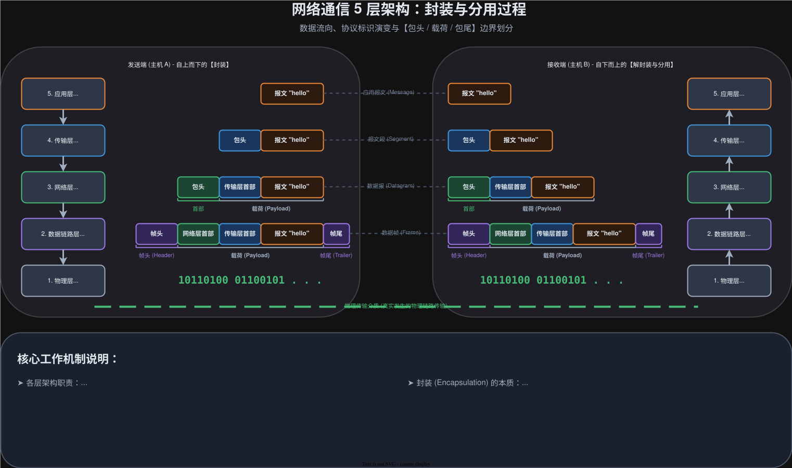

# 2026-01-28-网络原理-初识

## 基础概念

### 硬件
#### 路由器
> 在广域网下，进行数据转发、实现网络互联的设备

#### 交换机
> 在局域网下，进行数据转发、实现网络互联的设备

#### 光纤
> 数据传输的工具

### 软件
#### IP
> 在网络上，标记**机器的地址**

#### 端口
> 标记**同一台机**器不同线程的位置

#### 协议
> 它是一个**约定**，表示不同 bit 的含义，这里主要介绍的是`TCP/IP五层协议`，详细介绍在 网络原理 那里解释
>
> 由于网络是十分复杂/庞大，有许多不同的协议。又由于有许多不同的场景，所以把协议又分为不同的类别
>
> 好处：
> 1. **解耦**，可以比较方便的换不同的协议
> 2. 不需要了解不同协议的细节，**减少学习成本**

##### 封装与分用

- `应用层`：处理各个软件的数据，各个软件的数据是**结构化存储**
- `传输层`：**封装应用层数据包，存储端口号**；分用数据，解析报头中的数据，把**数据传给对应端口号的软件**
- `网络层`：封装传输层数据包，**规划路线，存储`IP`**；分用数据，解析报头中的`IP`
- `数据链路层`：封装网络层数据包，**用于相连两个机器的通信**，有帧头和帧尾
- `物理层`：把数据链路层包转**换为的光信号**；把**光信号转为“0101”**的数据流量包