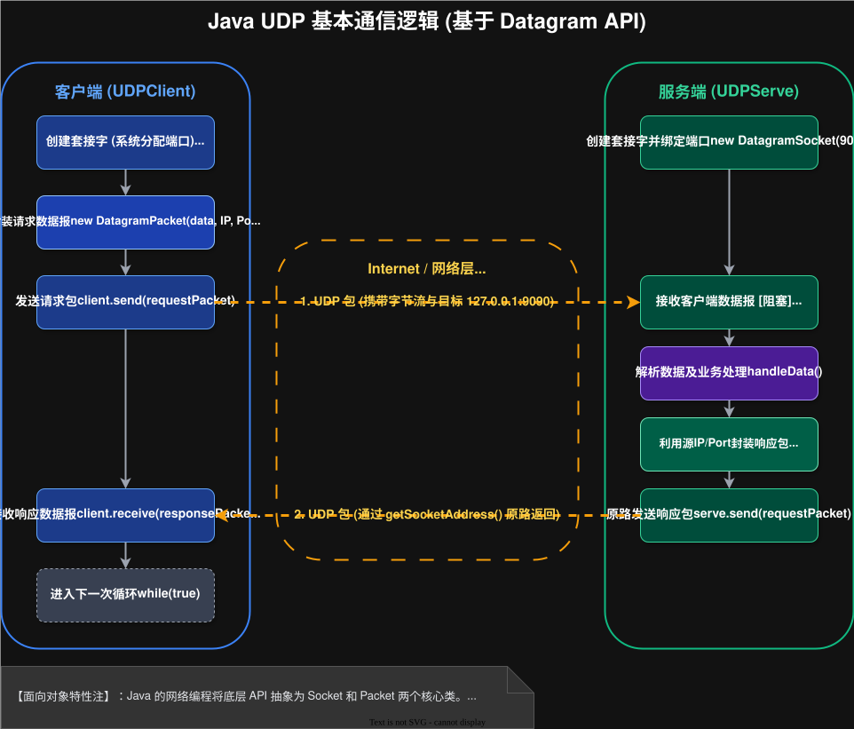

# 2026-01-30-网络嵌套字

## 传输层
> 传输层主要的协议有两个，分别是 `UDP` 和 `TCP`
>
> 特点：
> - `UDP`: **无连接，不可靠传输，面向数据报，全双工**
> - `TCP`: **有连接，可靠传输，面向字节流，全双工**

### 概念

#### 连接
> 传输层中的“连接”是一个抽象的概念，不是像光纤这样能看得见摸得着的
>
> - `有连接`：通信双方会**保存对方的连接数据**，比如 IP, 端口
> - `无连接`：**不会保存对方的连接数据**

#### 传输
> 传输分为可靠传输与不可靠传输
> - `可靠传输`：发送数据后，**会验证一下数据是否成功发送**，如果没成功，那么就会采取一系列的自救措施
> - `不可靠传输`：**只管发送数据，不管是否成功**。

Q: 可靠传输一定是比不可靠传输好吗？

A: ||答案显然是**否定**的，如果一定好，那么所有的都应该是“可靠传输”，而不是一个可靠，一个不可靠。
由于要验证数据，**可靠传输会牺牲一定的效率，而不可靠传输是没有这个问题** ||


#### 传输单位
> 传输单位有数据报与字节流
> - `数据报`：**以数据报为单位的**，必须分装为数据报才能发送
> - `字节流`：**以字节流为单位的**，和文件中的字节流是一样的概念

#### 双工
> 双工分为全双工与半双工
> - `全双工`：**同一时刻**，**同时可以**接收与发送
> - `半双工`：**同一时刻**，**只能**接收或发送

### 代码

#### UDP


- 客户端
```Java
public class UDPClient {
    private DatagramSocket client;
    private String serveAddr;
    private int servePort;

    public UDPClient(String serveAddr, int servePort) throws SocketException {
        client = new DatagramSocket();
        this.serveAddr = serveAddr;
        this.servePort = servePort;
    }

    public void start() throws IOException {
        Scanner in = new Scanner(System.in);
        while (true) {
            // 1. 设置数据报 由于不保存地址，所以在请求的时候就要设置
            System.out.print("-> ");
            String next = in.next();
            DatagramPacket requestPacket = new DatagramPacket(next.getBytes(),
                    next.getBytes().length,
                    InetAddress.getByName(serveAddr), servePort);

            // 2. 发送
            client.send(requestPacket);

            // 3. 接收
            DatagramPacket responsePacket = new DatagramPacket(
                    new byte[1024], 1024,
                    InetAddress.getByName(serveAddr), servePort);
            client.receive(responsePacket);
            System.out.println(new String(responsePacket.getData(), 0, responsePacket.getLength()));
        }
    }

    public static void main(String[] args) throws IOException {
        UDPClient udpClient = new UDPClient("127.0.0.1", 9090);
        udpClient.start();
    }

}
```

- 服务端
```Java
public class UDPServe {
    private DatagramSocket serve;

    public UDPServe(int port) throws SocketException {
        this.serve = new DatagramSocket(port);
    }

    public void start() throws IOException {
        while (true) {
            // 1. 监听
            // 创建数据报
            DatagramPacket responsePacket = new DatagramPacket(new byte[1024], 1024);
            serve.receive(responsePacket);

            // 2. 处理请求
            String data = new String(responsePacket.getData(), 0, responsePacket.getLength());


            System.out.println("["+ responsePacket.getAddress() + ":" + responsePacket.getPort()+"] data: " + data);
            String result = handleData(responsePacket);

            // 3. 返回请求
            DatagramPacket requestPacket = new DatagramPacket(
                    result.getBytes(),
                    result.getBytes().length,
                    responsePacket.getSocketAddress()
            );
            serve.send(requestPacket);
        }
    }

    public String handleData(DatagramPacket requestPacket) {
        return new String(requestPacket.getData(), 0, requestPacket.getLength());
    }

    public static void main(String[] args) throws IOException {
        UDPServe udpServe = new UDPServe(9090);

        udpServe.start();
    }
}
```

问题：
- 在返回构建数据报的时候，长度能不能把 `result.getBytes().length` 换为 `result.length()` ？
  ||
  显然不能，因为前者是字节流数组，后者是字符串。

  **在 `Java` 中字符串是由一个一个字符组成的，而中文只能算一个字符，长度也只能算为一**

  所以如果使用字符串中的长度，那么就会导致长度不匹配
  ||
