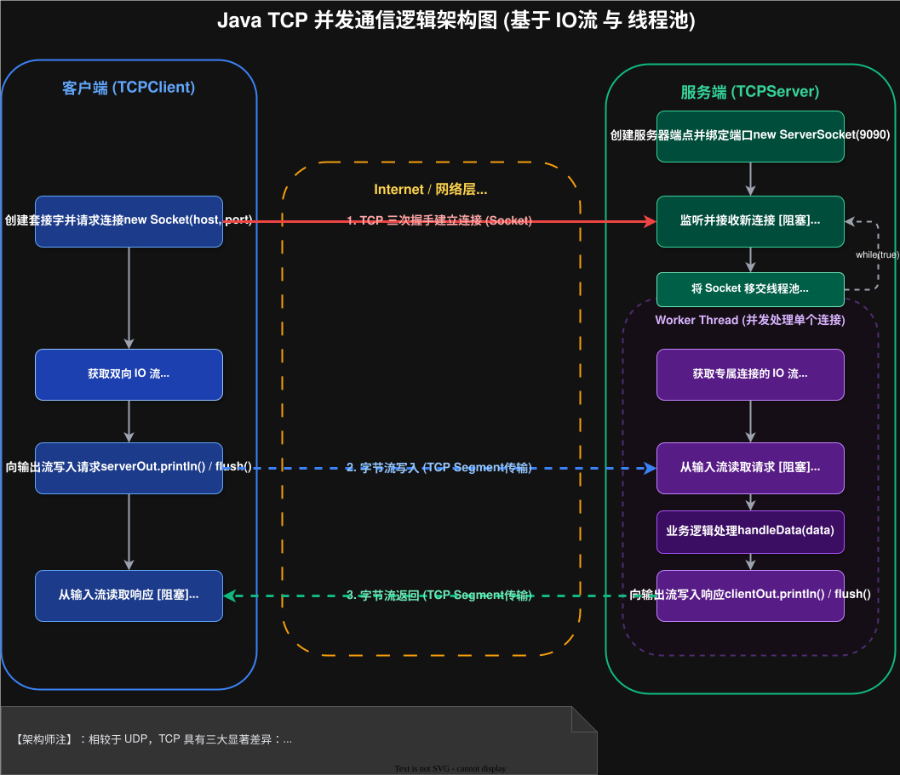

# 2026-01-30-网络嵌套字

## 传输层
> 传输层主要的协议有两个，分别是 `UDP` 和 `TCP`
>
> 特点：
> - `UDP`: **无连接，不可靠传输，面向数据报，全双工**
> - `TCP`: **有连接，可靠传输，面向字节流，全双工**

### 概念

#### 连接
> 传输层中的“连接”是一个抽象的概念，不是像光纤这样能看得见摸得着的
>
> - `有连接`：通信双方会**保存对方的连接数据**，比如 IP, 端口
> - `无连接`：**不会保存对方的连接数据**

#### 传输
> 传输分为可靠传输与不可靠传输
> - `可靠传输`：发送数据后，**会验证一下数据是否成功发送**，如果没成功，那么就会采取一系列的自救措施
> - `不可靠传输`：**只管发送数据，不管是否成功**。

Q: 可靠传输一定是比不可靠传输好吗？

A: ||答案显然是**否定**的，如果一定好，那么所有的都应该是“可靠传输”，而不是一个可靠，一个不可靠。
由于要验证数据，**可靠传输会牺牲一定的效率，而不可靠传输是没有这个问题** ||


#### 传输单位
> 传输单位有数据报与字节流
> - `数据报`：**以数据报为单位的**，必须分装为数据报才能发送
> - `字节流`：**以字节流为单位的**，和文件中的字节流是一样的概念

#### 双工
> 双工分为全双工与半双工
> - `全双工`：**同一时刻**，**同时可以**接收与发送
> - `半双工`：**同一时刻**，**只能**接收或发送

### 代码

#### UDP


- 客户端
```Java
public class UDPClient {
    private DatagramSocket client;
    private String serveAddr;
    private int servePort;

    public UDPClient(String serveAddr, int servePort) throws SocketException {
        client = new DatagramSocket();
        this.serveAddr = serveAddr;
        this.servePort = servePort;
    }

    public void start() throws IOException {
        Scanner in = new Scanner(System.in);
        while (true) {
            // 1. 设置数据报 由于不保存地址，所以在请求的时候就要设置
            System.out.print("-> ");
            String next = in.next();
            DatagramPacket requestPacket = new DatagramPacket(next.getBytes(),
                    next.getBytes().length,
                    InetAddress.getByName(serveAddr), servePort);

            // 2. 发送
            client.send(requestPacket);

            // 3. 接收
            DatagramPacket responsePacket = new DatagramPacket(
                    new byte[1024], 1024,
                    InetAddress.getByName(serveAddr), servePort);
            client.receive(responsePacket);
            System.out.println(new String(responsePacket.getData(), 0, responsePacket.getLength()));
        }
    }

    public static void main(String[] args) throws IOException {
        UDPClient udpClient = new UDPClient("127.0.0.1", 9090);
        udpClient.start();
    }

}
```

- 服务端
```Java
public class UDPServe {
    private DatagramSocket serve;

    public UDPServe(int port) throws SocketException {
        this.serve = new DatagramSocket(port);
    }

    public void start() throws IOException {
        while (true) {
            // 1. 监听
            // 创建数据报
            DatagramPacket responsePacket = new DatagramPacket(new byte[1024], 1024);
            serve.receive(responsePacket);

            // 2. 处理请求
            String data = new String(responsePacket.getData(), 0, responsePacket.getLength());


            System.out.println("["+ responsePacket.getAddress() + ":" + responsePacket.getPort()+"] data: " + data);
            String result = handleData(responsePacket);

            // 3. 返回请求
            DatagramPacket requestPacket = new DatagramPacket(
                    result.getBytes(),
                    result.getBytes().length,
                    responsePacket.getSocketAddress()
            );
            serve.send(requestPacket);
        }
    }

    public String handleData(DatagramPacket requestPacket) {
        return new String(requestPacket.getData(), 0, requestPacket.getLength());
    }

    public static void main(String[] args) throws IOException {
        UDPServe udpServe = new UDPServe(9090);

        udpServe.start();
    }
}
```

问题：
- 在返回构建数据报的时候，长度能不能把 `result.getBytes().length` 换为 `result.length()` ？
  ||
  显然不能，因为前者是字节流数组，后者是字符串。

  **在 `Java` 中字符串是由一个一个字符组成的，而中文只能算一个字符，长度也只能算为一**

  所以如果使用字符串中的长度，那么就会导致长度不匹配
  ||

#### TCP


- 客户端
```Java
public class TCPClient {
    private Socket client;

    public TCPClient(String host, int port) throws IOException {
        this.client = new Socket(host, port);
    }

    public void start() {
        try (InputStream inputStream = client.getInputStream();
             OutputStream outputStream = client.getOutputStream()) {
            // 需要移动到外面，不然每一次循环都会创建一次，这样就会丢失数据
            Scanner clientIn = new Scanner(System.in);
            PrintWriter serverOut = new PrintWriter(outputStream);
            Scanner serverIn = new Scanner(inputStream);
            while (true) {
                // 1. 输入数据
                System.out.print("-> ");
                String clientVal = clientIn.next();

                // 2. 发送数据
                // 分装输入/输出流

                serverOut.println(clientVal); // 这个默认是有 \n
                serverOut.flush();

                // 3. 接收数据
                String serverVal = serverIn.next();
                System.out.println(serverVal);
            }
        } catch (IOException e) {
            throw new RuntimeException(e);
        }

    }

    public static void main(String[] args) throws IOException {
        TCPClient tcpClient = new TCPClient("127.0.0.1", 9090);
        tcpClient.start();
    }
}
```

- 服务端
```Java
public class TCPServer {
    private ServerSocket server;

    public TCPServer(int port) throws IOException {
        this.server = new ServerSocket(port);
    }

    public void start() {
        System.out.println("服务开启");
        ExecutorService service = Executors.newCachedThreadPool();

        while (true) {
            // 建立连接
            try {
                Socket clientSocket = server.accept();
                // 使用线程池 处理客户端的连接
                service.submit(() -> {
                    // 必须在里面 try 不然直接 submit 执行完结束了
                    try (Socket currentSocket = clientSocket) {
                        System.out.printf("[%s:%d] 建立连接\n", currentSocket.getInetAddress().toString(), currentSocket.getPort());

                        processSocket(currentSocket);

                        System.out.printf("[%s:%d] 关闭连接\n", currentSocket.getInetAddress().toString(), currentSocket.getPort());
                    } catch (IOException e) {
                        throw new RuntimeException(e);
                    }
                });
            } catch (IOException e) {
                throw new RuntimeException(e);
            }
        }
    }

    private void processSocket(Socket clientSocket) {

        // 1. 获取输入/输出流
        try (InputStream inputStream = clientSocket.getInputStream();
             OutputStream outputStream = clientSocket.getOutputStream()) {
            // 分装输入/输出流
            Scanner clientIn = new Scanner(inputStream);
            PrintWriter clientOut = new PrintWriter(outputStream);
            while (true) {
                // 2. 处理输入
                if (!clientIn.hasNext()) {
                    // 没有存在下一个，关闭连接
                    break;
                }
                String data = clientIn.next();
                String result = handleData(data);
                System.out.printf("[%s:%d] data: %s, result: %s\n",
                        clientSocket.getInetAddress().toString(), clientSocket.getPort(), data, result);

                // 3. 把结果返回给客户端
                clientOut.println(result);
                clientOut.flush(); // 把数据从缓存中冲刷到客户端

            }
        } catch (IOException e) {
            throw new RuntimeException(e);
        }
    }

    public String handleData(String data) {
        return data;
    }

    public static void main(String[] args) throws IOException {
        TCPServer tcpServer = new TCPServer(9090);
        tcpServer.start();
    }
}
```

问题：
- 为什么使用 `PrintWriter` 中的 `println` 不会发送信息？
  ||
  由于IO操作是一个效率很低的操作，所以为了降低IO次数，开发者设计了[缓冲区](https://zhuanlan.zhihu.com/p/563185831)。
  
  使用 `println` 只会把内容发送在缓冲区里面，只有当使用 `flush` 后，内容才会发送
  ||
- 哪里会有“文件资源溢出”？如何解决？
  ||
  客户端是没有什么问题的，因为**在文件需要释放的时候，客户端进程就已经结束了，会自动释放文件资源**

  **服务端在一次用户访问结束的时候，服务端的进程不能结束，但是用户访问的时候需要占据一定的文件资源**，
  为了防止一直占据资源而不释放的情况，所以需要手动释放文件资源
  ||
- 如何解决“在同一时间只能处理一个客户端”的问题？
  ||
  出现这样的原因是因为**只使用了单线程，单线程的串行执行的**，所以同一时间只能处理一个客户端

  解决方法是**使用多线程**，这样就可以解决这个问题了
  > 多线程一般会**使用到线程池**，从而降低线程创建/销毁的开销
  > 
  > 由于**客户端在多数情况下都是等待的**，如果一个客户端一个线程就会导致这个线程在大多数的情况下都是等待的，
  > 这样会造成大量的资源浪费问题，如果有十几万个客户端，服务器是会崩溃的，因为服务器是不能有十几万个线程的
  > 
  > 解决这样“高并发”的问题，通过[多路复用](https://zh.wikipedia.org/wiki/%E5%A4%9A%E8%B7%AF%E5%A4%8D%E7%94%A8)来解决这样的情景
  ||
