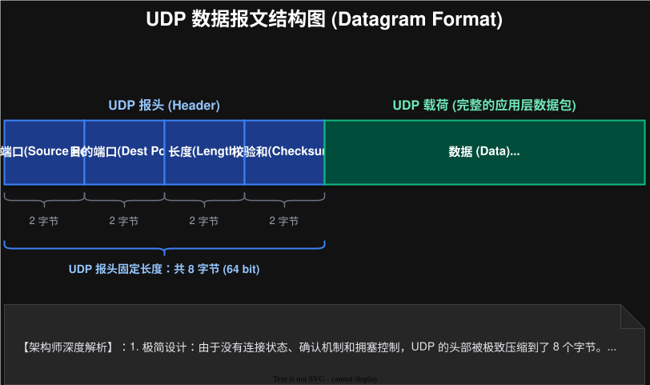
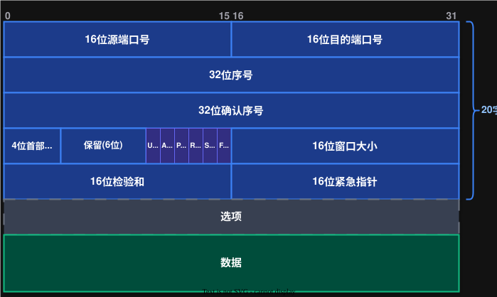
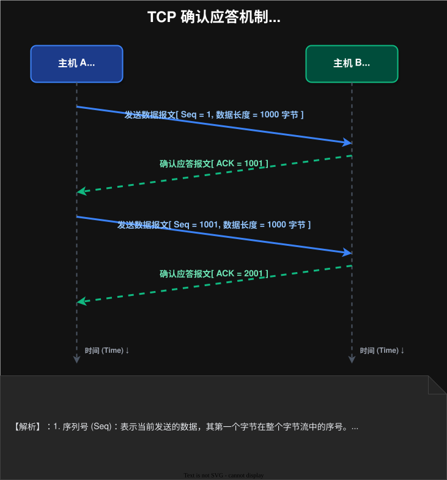
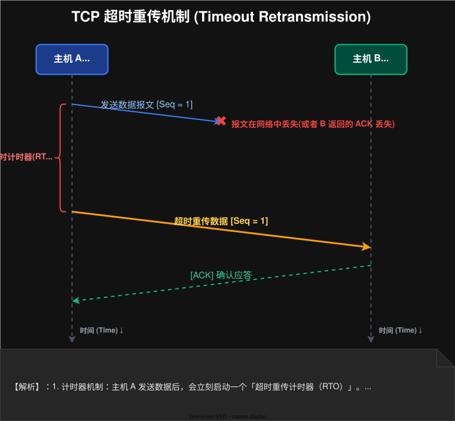
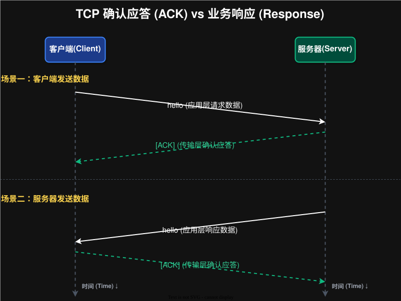

# 2026-02-02-网络原理-TCP_IP

## 应用层
> 虽然有很多已经实现好的协议，但是在实际开发中依然会“自定义协议”来满足业务需求
>
> 一般情况下，是通过 `JSON` 这个结构来传输数据的

### 序列化与反序列化
- `序列化`：把对象变为结构化的字符串
- `反序列化`：把结构化的字符串转为对象

## 网络层
网络层主要内容就是 UDP 与 TCP

### UDP

它是由源端口，目的端口，长度，校验和，载荷（应用层的全部数据）组成的
- `长度`：**占两个字节，最多表示64KB**, 因此使用 `UDP` 协议的时候需要考虑数据量的大小
- `校验和`：校验数据是否正确，**比如被修改或者损坏都会出现丢弃（不通知）**

### TCP

它是由源端口，目的端口，序号，确认序号，6位标志位，首部长度，窗口大小，校验和，应急指针，选项，数据组成的
- `序号`：发送的序号，**用来表明发送的先后顺序**
- `确认序号`：存储的是最后一个序号+1, 比如传入的序号是 1-1000 那么确认序号就是 1001
- `首部长度`：请求头的长度，单位是 4个字节

#### 核心机制

---

##### 确认应答

> 接收端接收到发送端的数据时候，会返回一个数据包用来相应，告诉发送端已经接收到了，
> 此时**标志位 `ACK` 会被设置为 1，当然返回的数据包载荷是空的**
>
> 发送端接收到接收端的 `ACK` 返回的数据，通过“确认序号”，知道接收端接收到了哪个数据

##### 超时重传

> 丢包是客观存在，所以当发生丢包后，就需要重新发送一次或者多次，达到重新传递的效果。
>
> 在一次丢包内，每次重新发送后等待的时间会逐渐变大

如何避免由于发送端没有收到确认应答而导致的数据重复发送问题？
||
通过**阻塞队列**来解决，如果队列中有数据包中的序号（或者是序号所对应的位置已经有数据了），
那么可以直接丢弃来实现去重的效果。

而且把阻塞队列进行按照特定方式（比如时间戳）排序，就可以**解决“后发先至”**的问题
> 后发先至指的是数据由于网络波动等原因，导致**发送端晚一点发送的数据先到接收端**这一个现象
||

### 问题
- 一个进程可以绑定不同端口吗？
  ||
  可以。一般情况下，软件都会有两个端口，一个是提供给普通用户使用的，另一个是给开发团队测试代码使用的
  ||
- 一个端口可以绑定多个进程吗？
  ||
  可以。只有在**源IP，源端口，目的IP，目的端口，协议这五个都一样**才会触发“端口被占用”这个问题
  ||
- `TCP` 中确认应答与响应的区别？
  ||
  
  - **确认应答**是在**传输层**中实现的，而**响应**是在业务（**应用层**）中实现的
  - **只要是`TCP`, 都会确认应答**，但是响应是由业务场景来决定的，如果**不需要可以没有响应**
  ||

