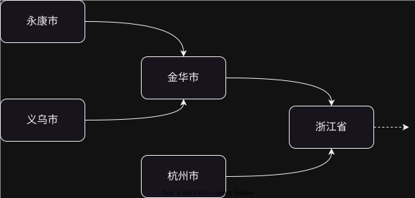
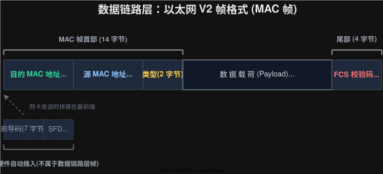

# 2026-02-02-网络原理-TCP_IP

## 应用层
> 虽然有很多已经实现好的协议，但是在实际开发中依然会“自定义协议”来满足业务需求
>
> 一般情况下，是通过 `JSON` 这个结构来传输数据的

### 序列化与反序列化
- `序列化`：把对象变为结构化的字符串
- `反序列化`：把结构化的字符串转为对象

## 传输层
传输层主要内容就是 UDP 与 TCP

### UDP

它是由源端口，目的端口，长度，校验和，载荷（应用层的全部数据）组成的
- `长度`：**占两个字节，最多表示64KB**, 因此使用 `UDP` 协议的时候需要考虑数据量的大小
- `校验和`：校验数据是否正确，**比如被修改或者损坏都会出现丢弃（不通知）**

### TCP

它是由源端口，目的端口，序号，确认序号，6位标志位，首部长度，窗口大小，校验和，应急指针，选项，数据组成的
- `序号`：发送的序号，**用来表明发送的先后顺序**
- `确认序号`：存储的是最后一个序号+1, 比如传入的序号是 1-1000 那么确认序号就是 1001
- `首部长度`：请求头的长度，单位是 4个字节

---

#### 确认应答

> 接收端接收到发送端的数据时候，会返回一个数据报用来相应，告诉发送端已经接收到了，
> 此时**标志位 `ACK` 会被设置为 1，当然返回的数据报载荷是空的**
>
> 发送端接收到接收端的 `ACK` 返回的数据，通过“确认序号”，知道接收端接收到了哪个数据

#### 超时重传

> 丢包是客观存在，所以当发生丢包后，就需要重新发送一次或者多次，达到重新传递的效果。
>
> 在一次丢包内，每次重新发送后等待的时间会逐渐变大

如何避免由于发送端没有收到确认应答而导致的数据重复发送问题？
||
通过**阻塞队列**来解决，如果队列中有数据报中的序号（或者是序号所对应的位置已经有数据了），
那么可以直接丢弃来实现去重的效果。

而且把阻塞队列进行按照特定方式（比如时间戳）排序，就可以**解决“后发先至”**的问题
> 后发先至指的是数据由于网络波动等原因，导致**发送端晚一点发送的数据先到接收端**这一个现象

||

#### 连接管理
连接管理主要是**建立连接（三次握手）**和**断开连接（四次挥手）**
> 握手其实就是“打招呼”，**里面不会传递应用层中“实质性”的数据，**
> 它没有载荷，只是传递双方的基本信息而已，它主要的作用就是给通信双方提供必要的信息

---
##### 三次握手

和线程的生命周期一样，`TCP` 也会有相关的状态转换
- `CLOSED`: 软件未启动
- `LISTEN`: 服务端监听
- `SYN_SENT`: 用户端发送 `ACK`
- `SYN_RCVD`: 服务端收到 `ACK`
- `ESBALIED`: `TCP` 成功建立 

---
问题：
- 为什么需要三次握手呢？
  ||
  1. 可以保证通信**双方中间的通信**没有太大问题
  2. 可以保证**服务端与用户端**发送与接收正常
      > 第一次握手（用户端发送 `SYN`），如果此时服务端收到，这就可以**表明用户端发送与服务端接收正常**
      > 
      > 第二次握手（服务端同时发送 `SYN` 和 `ACK`），如果用户端收到，这就可以**表明服务端发送与用户端接收正常**
      > 
      > 第三次握手（用户端发送 `ACK`），将**双方通信正常的信息同步给服务端**
  3. 可以**传递一些参数，比如双方的序号的起始位置**，方便后续的通信
  ||
- 为什么序号不建议从1开始，而是使用一个“随机数”
  ||
  这是为了防止这样的情况：**有一个TCP数据报，由于网络波动（过了较长时间），等到了服务端，这个端口是另一个连接的了**

  而随机数可以比较好的缓解这个问题：**通过判断数的差异，就可以判断出这个数据报是不是相对应的连接**，如果不是那么就直接丢弃即可
  ||
- TCP 能不能四次握手？两次呢？
  ||
  四次是可以的，两次是不行。

  因为**三次就可以建立连接**了，就算第四次什么也不做，那也是可以建立连接，但是没必要，因为这样网络开销就偏高了

  两次是可以从两个角度出发：
  1. **从理性分析出发**，那些开发的大佬都必须写为三次，如果两次就可以了，就一定会写为两次，而且应该叫“两次握手”而不是三次握手
  2. **从目的出发**，最后一步是要让服务端知道双方可以正常通信，如果没有最后一步，那么就会缺少一步，就正常通信不了
  ||

---
##### 四次挥手

四次挥手不同于三次握手，它的**发起方即可以是服务端也可以是用户端**

同样这也有几个状态，其中 `TIME_WAIT` 和 `CLOSE_WAIT` 是比较重要的
- `CLOSE_WAIT`: 接收方等待关闭，如果**看见有大量的这个状态，那么就需要考虑接收方有没有执行 `close` 来释放资源**
- `TIME_WAIT`: 发起方释放资源之前最后的等待时间

---
问题：
- 四次挥手中，中间的那两步能不能合并为一步？
  ||
  可以合并，但是**一般情况下不会合并**

  因为**接收方需要处理一系列的善后工作**，比如释放资源，记录日志等工作
  ||
- 为什么在最后发起方需要有 `TIME_WAIT` 这个状态，而不是直接变为 `CLOSED` ?
  ||
  如果接收方没有收到 `ACK`, 那它就会发 `FIN`，此时发起方已经释放资源了，
  就自然不会发送 `ACK` 了，这就会导致接收方会一直发 `FIN`, 这显然是不合理的。

  为了照顾到这个情况，`TIME_WAIT` 的存活时间就会设置为两倍的 `MSL`, 这样在绝大部分场景下，都没问题
  > `MSL` 是表示**数据从一段到另一端最大的传输时间**
  
  ||
  

---
####  滑动窗口

它是用来提示传输效率的一个方式，没有它，他就会每次都需要等待 `ACK` 才会发送，这个会大大降低效率

---
那如果数据丢失了怎么办呢？ 
它分为两个情况：**数据段丢失**和 **`ACK` 确认包丢失**

-   `ACK` 丢失，不需要重新传递，因为**通过`确认序号`可以保证它之前的数据都是已经接收到了**，发送端自然就可以不用重新发送
  
- 
  数据段丢失，此时接收方就会接收到多次**确认序号相同**的 `ACK` 数据报，如果达到 3 次，那么就会重新发送一份
    > 为什么是 3 次，而不是 2 次呢？ 这个是实验算出来的。
    > 
    > 比如发送方发送的顺序是 `P1-P2-P3-P4`，那么接收端收到的可能是 `P2-P3-P1-P4`。
    > 如果设置为 2 次，可能就会导致重复发送而造成的宽带浪费，而设置 4 次又会导致等待时间太长，所以选择一个折中的方法，选择 3 次
  
这两个处理措施就是**快速重传**的基础

那么 **确认应答+超时重传** 不就会与 **滑动窗口+快速重传** 有出入了吗？如何理解呢？
||
**它们两组是相互配合，取长补短的。**

**确认应答+超时重传**适合传**输频率比较低**的场景，而**滑动窗口+快速重传**适用于**传输频率较高**的场景
||

---
#### 流量控制

流量控制是**根据接收方的处理能力**来制约发送方的发送效率：
1. 发送方一直发送，如果没有反馈，那么窗口就会越来越大，速度也就越来越快
2. 此时**接收方就处理不过来了**，在 ACK 的确认包里的`窗口大小`这个字段来告诉发送方应该调节的窗口大小
    > 可以通过缓冲区中的 总长度-使用长度 来表示窗口大小

3. 到了极端情况，**接收方的缓冲区已经满了**，那么接收方就会告诉发送方不要在发送了，此时发送方就会停止发送“有效”的数据
4. 为了知道什么时候可以发送数据，**发送方就会定期发送一个只有最基本结构的数据报（窗口探测），用来判断接收方是否可以接收新的数据报**，对方可以接收，那么就会返回一个合适的窗口

---
#### 拥塞控制

拥塞控制是**根据中间线路的堵塞程度**来制约的发送方的发送效率
> 由于中间链路是不能定量的描述，所以会通过**做实验**的方式来描述当前中间流量的流通情况

1. 为了防止过大导致网络堵塞的问题，**刚刚开始发送速度设置一个很小的初始值**
2. 接着在超过 `ssthresh` 这个变量之前，每一次都是以二倍速变快（**指数增长**）
3. 超过了 `ssthresh` 后，**增长速度就会从指数增长变为线性增长**
4. 如果连续三次收到相同的 ACK, 说明网络有丢包，那么就会降低发送速度
	- 方法一：窗口大小减半，然后线性增长
	- 方法二：窗口大小设置为很小的数，把 `ssthresh` 设置为原来窗口一半的大小，然后重复上诉 2/3/4 步骤（已经废弃）
5. 通过上面这几个步骤，窗口大小就可以维持在一个平衡的区间内

问题
- 拥塞控制与流量控制都是控制窗口，那么具体是以哪个为主呢？
  ||
  **以它们的较小值为主**。如果以较大者为主，那一定会有一个不满足，这样都会浪费大量的宽带资源
  ||

---
#### 延迟应答
延迟应答是提升效率的一种方式： `ACK` 返回之前会多等一会，让接收方多处理缓冲区的内容，这样可以使返回的窗口（流量控制）更大，增加效率。

> 由于缓冲区在延迟应答期间会接收发送方的数据，如果发送方发送过快，可能会导致缓冲区满了。又因为延迟应答，会导致在一定时间内都没有制约发送过快的问题，这就会导致效率不升反降的情况。
> 
> 但是**通过实验，发现这样的情况是少数的**（类似与快排中的时间复杂度，是 $\log_{2}n$ ，所以延迟应答还是很有必要的

- 如何配置延迟时间呢？
  ||
  1. 可以配置具体的时间，**但是一定不能超过超时重传的时间**
  2. 还可以是每请求 N 个数据报，只返回一个 `ACK`
  ||

#### 携带应答

携带应答是在延迟应答的基础上，进一步提升效率：由于延迟应答会多等一会，**在等的过程中，如果这个主机发送了一个请求，那么就可以一起，而减少一次网络请求**
> 携带应答就是可以把四次挥手变为 3 次的原因

#### 面向字节流
这里的字节流与文件IO中的字节流是一样的。

问题：**如何解决粘包问题？**（字节流的都有）
||
- 方法1: 使用特殊字符来来分割。注意：**传输的数据是不能有特殊字符**
- 方法2: 使用长度变量来表示当前数据的长度
这两种方法一般都会使用
||

---
#### 异常情况
异常情况分为 进程崩溃，主机关机，主机掉电，网线断开 这几类
如果有其他类，那么就自动推理一下

##### 进程崩溃

虽然进程崩溃听起来唬人，但是**它和正常 `TCP` 断开一样**，都是经历四次挥手后正常断开就可以了

##### 主机关机

主机关机和进程崩溃类似，就是主机关机强制关闭所有线程。但是**最后由于关机了，可能来不及释放资源返回  `ACK` 就结束了。此时另一个主机就会超时重传，如果超过一定次数，那么就会发送 `RST`，此时就会关闭连接**
> `RST` 就是**告诉对方己方要单方面断开连接**，不会管对方是否会收到，这个仅仅是用来通知而已
##### 主机掉电
主机掉电是突然断开电源导致电脑关机，比如使用台式机忽然停电了。
它是**分为发送方断电与接收方断电**

- 
  发送方断电：**由于发送方是忽然断开发送信息，接收方是无法判断对方停止发送了还是断电关机了**，所以需要定时发送一个数据报来检测对方是否“活着”**（心跳包）**，如果返回 `ACK` 那么就无事发生，如果在多次超时重传后依然没有，它就会发送 `RST` 强制关闭连接
  > 这样的类似的“心跳”机制在很多场景下都会有，比如分布式系统
- 
  接收方断电：发送方在一段时间内没收到 `ACK`，就会**超时重传**，如果多次都没有用，那么就会**发送 `RST` 单方面断开连接**

##### 网线断开
网线断开和主机掉电类似，只不过是变为发送方和接收方都断电了，处理过程参考[主机掉电](<#主机掉电>)

### 问题
- 一个进程可以绑定不同端口吗？
  ||
  可以。一般情况下，软件都会有两个端口，一个是提供给普通用户使用的，另一个是给开发团队测试代码使用的
  ||
- 一个端口可以绑定多个进程吗？
  ||
  可以。只有在**源IP，源端口，目的IP，目的端口，协议这五个都一样**才会触发“端口被占用”这个问题
  ||
- `TCP` 中确认应答与响应的区别？
  ||
  
  - **确认应答**是在**传输层**中实现的，而**响应**是在业务（**应用层**）中实现的
  - **只要是`TCP`, 都会确认应答**，但是响应是由业务场景来决定的，如果**不需要可以没有响应**
  ||

## 网络层

网络层中最主要的就是 `IP` 协议，这个是分配具体路径的
### `IP` 协议格式

- `版本`：表明这个 `IP` 的版本号，有 `IPv4` 和 `IPv6`
- `首部长度`：它也与 TCP 一样，是以 4 个字节为单位的，最大为 60 个字节
- `服务类型`：仅仅有四个是有效的，而且这四个只能有一个为1, 其余的必须为 0, 它们的表示意思分别为：最小延时，最大吞吐量，最高可靠性，最小成本。（仅仅了解即可）
- `总长度`：它最大为 64KB，不能变大。那么它是如何处理大于 64KB 的数据呢？
  ||
  它内部有自动的**拆包和分包**，如果大于 64KB 那么就会自动拆包和分包，把大数据分为多分小数据
  ||
- `标识`：用来表示**这个数据包是不是由同一个大数据拆分出来的**，如果来自于同一个，那么它们的表示是一样的
- `标志`：里面有两个主要内容：表示**是否触发拆包组包**和**是否是最后一个包**
- `片偏移`：用来表示数据包的先后顺序的，这个是用来解决后发先至的问题
- `生存时间(TTL)`：用来表示数据包的存活时长，不过里面是**存放的是可以转发的次数**，而不是时间。每经过一次路由器，`TTL` 都会自动减一，如果为 0 了，那么就会自动丢弃。它是用来解决包无限转发而浪费大量宽带资源这样的情况
- `协议`：描述**载荷的协议类似**
- `校验和`：它是**只校验首部**的内容，不校验载荷
- `IP地址`：表示发送端或者接收端

### IP 资源紧缺的解决方案
#### 动态IP
顾名思义，就是每一次上网的IP 不是固定的，当你不上网的时候，就可以释放IP资源，给别人使用。

---
#### `NAT` 技术
NAT 是让多台设备共用一个IP 资源，它极大的缓解了IP资源紧缺的问题。

比如 **A 主动给 B 发送信息**，那 **B 必须为有公网的IP**，不能在局域网下面，**A 应该在局域网内**，因为如果在公网内，就不涉及 NAT 了

步骤：
1. A 发送`(REQUEST)`的数据经过路由器，路由器将数据包中的 IP 改为公网 IP, 并且**将源IP, 源端口，目的IP，目的端口这些数据保留在一张映射表内**
2. B 接收到了数据后，会给他响应`(RESPONSE)`一个数据，然后通过映射表的数据，将数据传给A

问题：
- 为什么B（公网） 给 A（局域网） 发送消息就不可以？
  ||
  因为此时**没有映射表**，数据就不清楚应该发给哪个局域网IP中的哪个端口
  ||
- 如果在同一个局域网内的两个不同的IP使用同一个端口发送给公网中同一个IP中的同一个端口，那如何区分数据呢？
  ||
  可以给另一个IP 分配不同的端口即可
  ||
#### IPv6
**动态IP 和 NAT 只能缓解IP资源紧张的问题**，而不能解决这个问题。而IPv6 是可以有 $2^{128}$ 个IP地址，这个是**可以解决**IP资源紧缺的问题

原因：
1. NAT 管理起来很麻烦，而是由于要处理映射，速度快不起来
2. NAT 在套一层的情况下，顶多翻个 65535 倍，这在目前互联网发展速度来看是有点不够用的

### IP 地址划分
前半部分是网络号，后半部分是主机号

**同一个局域网下，主机号必须不一样；不同局域网，网络号必须也不一样**

像图中这样，子网掩码为 255.255.255.0 的情况下，192.168.0.221 与 192.168.0.221 是在同一个局域网内；192.168.1.221 和 192.168.0.222 是在不同局域网内

#### 特殊IP 地址
特殊IP地址分为 **内网地址，环回地址**
- `内网地址`：192.168.\*, 10.\*, 172.16.\*\~172.31.\*
- `环回地址`：127.\* 

其他：其中 0 是表示整个网段，255表示广播地址

### 路由选择
先要明确一点，由于网络的复杂性，一个路由器是无法获取到当前网络的所有结构，也就不能像地图那样可以获取到最佳路线，而只能获取到一个较佳的路线。

以这图为例。
比如要**从永康市发送给义乌市**，永康市这个路由器就不找到，就会发给金华市，在金华市这个路由器就找到义乌市这个路径，就可以把数据发给义乌市了。
**（实际上，网络是一个很复杂的结构，这个仅仅是用来帮助理解学习）**

路由表创建
- 可以手动创建
- 也可以是通过一些算法自动创建

## 数据链路层

数据链路层是管理数据**在相邻两个机器上是如何通信的**，类比于现实中从杭州到北京去上学，方式可以通过坐飞机，也可以坐高铁，还可以自驾

- `MAC地址`：它是刻录在机器上的，每个机器都有唯一的一个
- `类型`：描述载荷中是什么样的数据类型，比如 `IPv4`, `IPv6`
- `数据载荷`：它最大只能是1500字节 `(MTU)`，因此在网络层还需要拆包，把大的数据拆分为小数据，这样才可以在数据链路层中传输

在数据链路层中，为了知道相邻机器地址，还会有一张“转发表”，它是通过 `ARP` 协议，将 `MAC` 与 `IP` 给联系起来

---
问题：
- MAC 与 IP 区别：
  ||
  1. 个数区别
  2. 在数据链路层传递的时候，**每次**到不同的路由器/交换机上，`MAC` 是都会更新，但是 `IP` 就不会更新（不考虑 `NAT` 情况下）
  ||
- 为什么 `MAC` 没有资源紧缺的问题，而 `IP` 却有？
  ||
  1. **`MAC` 分配高效**，`IP` 分配低效。比如 `IP` 由于地区限制，会导致总有一部分IP是冗余的；或者由于早期 `IP` 不合理的分配，导致大量 `IP` 浪费
  2. **`MAC` 个数较多**，`IP` 个数较少。
  ||
- 数据链路层中除了以太网，还有哪些协议？（面试题）
  ||
  1. Wi-Fi
  2. 蓝牙
  3. 5G
  ||

## 其他内容
#### `DNS`
`DNS` 全称叫作域名解析器，它是用来解决 `IP` 记忆比较抽象的这个问题。
为了方便管理，它是交给13台 `DNS` 根服务器来处理。比如 `www.baidu.com` 就可以比较方便的获取到百度的IP地址
> 这里的 `IP` 地址一般是 `CDN` 的 `IP` 地址，而不是源服务器的 `IP` 地址，这样可以增加安全性

问题：
- 它是如何解决高并发的问题？
  ||
  1. 本地缓存
  2. 分布式集群，比如各个运营商/厂商的镜像构建
  ||
- 它是如何存储的？
  ||
  它是**分级存储**，像 com, org, net, edu, cn, us 等一级域名存储在各个的最顶层服务器，它们里面都存储着各个的一级业务所对应的二级域名的 DNS 服务器地址。
  
  以此类推，二级域名的 DNS 服务器地址存储着三级域名的 DNS 服务器地址，...
  ||