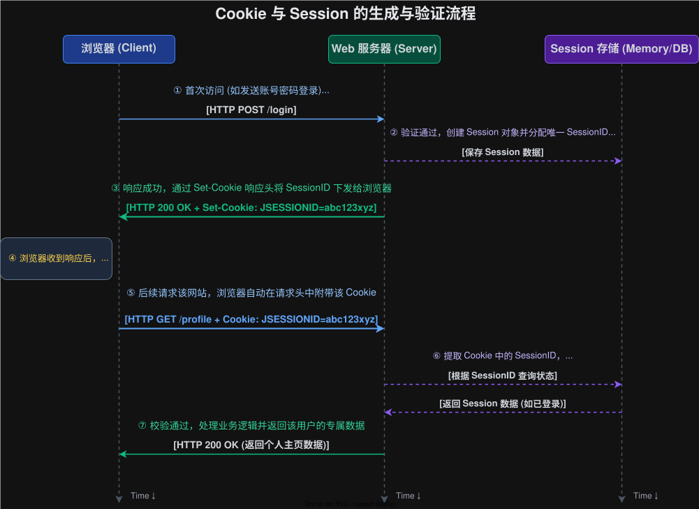

# 2026-02-11-网络原理-HTTP_HTTPS
> HTTP(S) 请求需要使用抓包工具来抓取，入门是可以使用 [Fiddler](https://www.telerik.com/download/fiddler) 来抓取


## HTTP
### 请求
#### URL
##### 结构
就以 `http://www.msftconnecttest.com/connecttest.txt` 为例
- `http://`： 是表示请求协议
- `www.msftconnecttest.com`： 是表示请求地址，**如果是 http 协议请求的是 80  端口或者 https 请求的是 443 端口，这两个情况下端口是可以省略的**
- `/connecttest.txt`： 是表示**资源存储的路径**
- `#`： 是用来表示标志符，用来定位当前页面的位置的，**一般用于文档**（补充）
- `uuid=xxxx&lang=EN`： 这个是请求参数，一般放在请求地址的后面，请求参数与地址用 `?` 隔开，参数与参数直接用 `&` 隔开（补充）


##### `encode`
`encode` 是用来处理中文/特殊字符等情况，防止解析出错的问题。

比如：在 `bing` 上面访问 `c++` 它就会访问 `https://www.bing.com/search?form=QBLH&q=c%2B%2B` 其中 `%2B` 就是 `+` 在 `ASCII` 的16进制表示

#### 结构

```Text
GET http://www.msftconnecttest.com/connecttest.txt HTTP/1.1
Connection: Close
User-Agent: Microsoft NCSI
Host: www.msftconnecttest.com


```
就以这个为例，
- 第一行：GET 表示请求的方法，中间那一长串表示URL地址，最后一个是HTTP请求的版本
- 第二行到空行之前，都是请求头，它们是键值对的方式存储
- 空行它在倒数第二行，它是用来区分请求头和请求体
- 请求体这里是没有的

#### 请求方法

请求方法用到最多的两个就是 `GET` 和 `POST`
- `GET`：表示从服务器上**获取数据**
- `POST`：将**数据推送**给服务器

问题：
- `GET` 和 `POST` 有什么区别？（面试题）
    ||
    实际上它们没有什么太大的区别，因为**相互之间是可以互相转换的**
    
    要是正的说区别，还是有的
    1. `GET` 的请求参数是放在 `URL` 上面的，`POST` 的参数是放在请求体里面的
    2. `GET` 是表示获取数据，`POST` 表示输入数据
    ||

### 报头

#### `HOST`
请求的主机地址，比如 `8.8.8.8`, `blog.774822.xyz` 等，它可以用来和请求的URL 校对
#### `Content-Length`
表示请求体（body）的长度，如果没有，浏览器就会自己猜测，可能会出现问题
#### `Content-Type`
存储请求体的类型和字符集，比如 `text/html; charset=utf-8`
#### `User-Agent(UA)`
表示请求的客户端的类型，可以用来表示浏览器的版本，是PC端还是移动端
#### `Referer`
表示从哪里跳转过来的，如果没有，可以不写。它是可以统计广告的跳转次数
> 在十几年以前（2014年左右），由于当时基本是使用 http 协议，如果路由器/交换机被攻破，就可以修改 Referer，从而影响到广告计费。
> 因此为了**解决像这样类似的安全问题**，就引入 `https` 进行加密，解决这个问题
#### `Cookie`

为了安全，浏览器是不允许直接从硬盘上访问/存储数据，但是是有存储需求，所以设置了 `Cookie` 来管理数据

比如 `Cookie` 可以存储主题模式，也可以存储访问令牌。

问题
- `Cookie` 与 `Session` 有什么区别？
  ||
  - `Cookie` 是一般存储在用户端，而 `Session` 是存储在服务器上。
  - `Cookie` 一般只存储一个 `Id`, `Session` 是存储一些列的用户信息，比如用户名，昵称等
  ||


### 响应

```Text
HTTP/1.1 200 OK
Content-Length: 22
Cache-Control: max-age=30, must-revalidate
Connection: keep-alive
Content-Type: text/plain
Date: Mon, 31 Aug 2026 06:25:59 GMT
Keep-Alive: timeout=60
Proxy-Connection: keep-alive

Microsoft Connect Test
```
- 第一行：第一个是HTTP请求的版本，第二个是响应码，第三个是响应信息
- 第二行到空行之前，都是响应头，它们是键值对的方式存储
- 空行它在倒数第二行，它是用来区分请求头和请求体
- 响应体表示响应的结果信息
