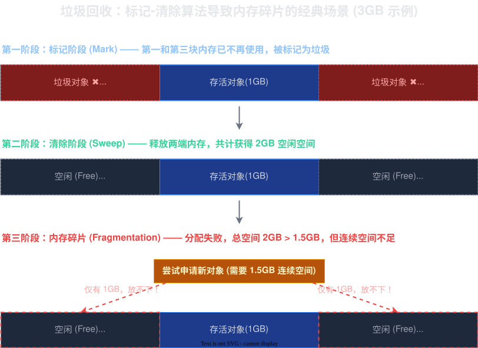
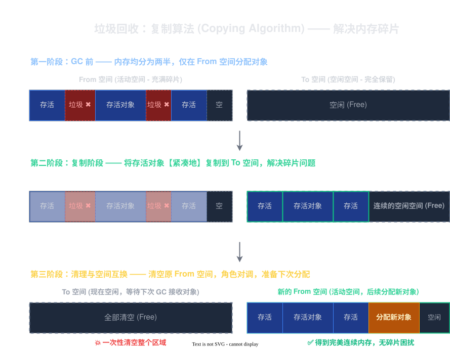
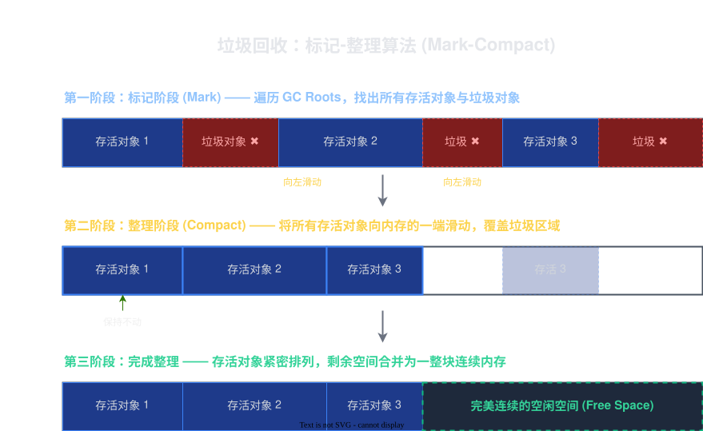
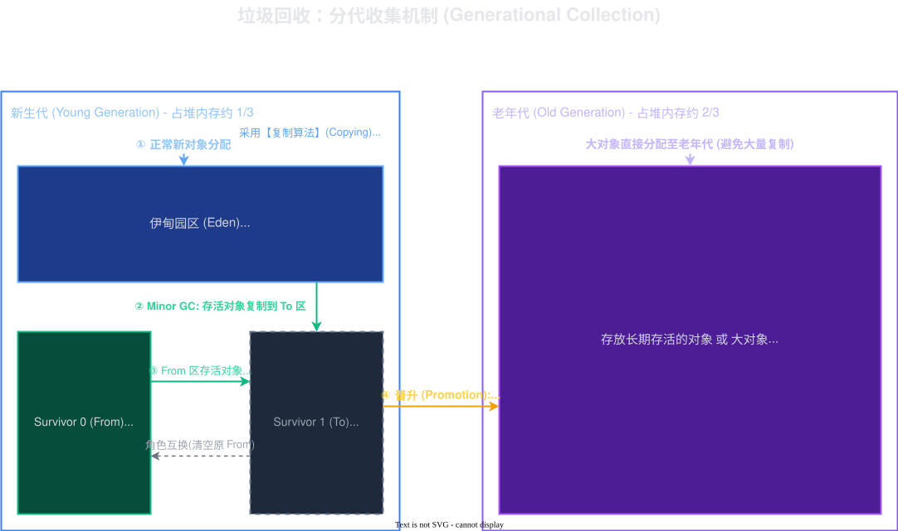

# 2026-02-12-JVM

> 这个章节是八股文，面试之前临时背诵一下就可以了

## JVM内存分布

### 程序计数器
它是用来表示程序下一条执行的字节码指令的位置
### 栈
描述了方法的调用关系。没执行一个方法，都会创建一个栈
### 堆
存储 `new` 出来的对象，是内存占用最大的区域
### 方法区/元数据区
存储类对象，比如 .class 文件。
> 类对象是在反射中有提到过

### 问题
- JVM 内存划分为几个区域，都是干啥的？
  ||
  主要划分为栈，堆，程序计数器和元数据区。
  - 栈：用来表示方法调用的顺序，里面存储局部变量
  - 堆：new 出来的实例对象都存储在这个区域内，它是内存占用最大的一部分
  - 程序计数器：记录下一个方法字节码的位置
  - 元数据区：存储类对象，静态成员变量就是存储在这里的
  ||
- 给你一段代码，问 xxx 变量是存储在哪个区域的？
  ||
  - 局部变量：栈帧的一部分（栈）
  - 成员变量：存储在对象实例中（堆）
  - 静态成员变量：存储在类对象上面（元数据区）
  ||
- 上诉内存区域中，哪些是在一个进程中是存在多份的？
  ||
  程序计数器和栈。在多个线程中，里面是有不同的方法调用，所以要有不同的栈和程序计数器。
  
  而堆和元数据区是多个线程共享一份。
  ||

## JVM 类加载机制
> 除非需要开发框架之类的内容，这个基本上是不需要改变的

### 步骤

1. `加载`：根据全限定类名（包的地址+类名）加载 .class 文件
   > 详细的加载过程见[类加载器](<./2026-03-12-JVM.md#类加载器>)里面会解释
2. `校验`：校验 .class 文件是不是符合相关的规范
3. `准备`：申请一块空间，**这一块空间已经被全部初始化为0**
4. `解析`：处理字面值，把它从符号引用转变为直接引用。
    > - `字面值`：像字符串，类的地址等都是
    > - `符号引用与直接引用`：**由于在加载进内存之前，是没有地址这样的概念的，只有偏移量这样的概念**。比如在硬盘上要表示 hello 的位置，需要说偏移量 n, 但是到了内存，就需要把它转变为 0x0110 这样类似的地址。这个过程就是符号引用转变为直接引用 
5. `初始化`：加载所有的静态类/方法/代码块，把相关的值付给

### 类加载器
类加载器是一个双亲委派模型，它是层层加载，它从儿子开始，在父亲内找相关的类文件，如果父亲没找到，再去儿子那边找。**父亲的优先级是比儿子优先级高**

Java 中，加载器的优先级从高到低分别为 `Bootstrap ClassLoader`, `Extension ClassLoader`, `Applicatoin ClassLoader`，它们分别是负责加载标准库，扩展库（目前已经很少用了），第三方库（自己写的类，Maven 管理的类）。

## 垃圾回收机制
垃圾回收（GC）是主要负责堆的回收，它不会对元数据区，栈，程序计数器这些经行回收。它只会回收 100% 没有用的内容，**遵循“宁放过，不杀错”的原则**。它的处理管理的最小单位是一个类对象，如果这个类对象不使用了，才会释放

### 垃圾辨认
在垃圾辨认过程中，有两个比较流行的方式，它们分别是：**引入计数和可达性分析**
#### 引入计数
它是在每一个实例对象内，分配一小块内存，专门用来统计被引用的次数。但是在Java 中是不使用这个方法的，因为它有两个问题：**消耗存储空间和循环引用**

- 消耗存储空间：假设对象是占据10字节，计数占据2字节，在创建大量占据空间比较小的对象的情况下，就需要添加额外 20% 的空间来运行数据

- 循环引用：
	```Java
	class Test {
		Test k = null;
	}
	
	// new 两个对象
	Test a = new Test();
	Test b = new Test();
	
	// 把对象里面的 k 交叉赋值
	a.k = b;
	b.k = a;
	
	// 把 a 和 b 分别变为 null
	a = null;
	b = null;
	```
	就拿上诉代码举例，在执行在最后，就会发现它最后的计数是不能清除的，所以需要添加额外的措施来解决这个问题

#### 可达性分析
把创建出来的实例对象想象为一棵**树**，它里面的属性是一个一个子节点，那么只需要**每隔一段时间后递归分析**，再和 JVM 中的另一张**负责记录所有 `new` 出来对象**的表经行对照，就可以判断出哪些是需要删除的了
### 垃圾释放
回收垃圾有三个方法：**标记清除，复制算法和标记整理**。

#### 标记清除
它是直接把要删除的内存经行清空，但是它会导致**内存碎片**的问题。


比如目前有 3GB 内存，有三块空间，它们分别各占据 1GB，此时 第一个和最后一个不使用了，释放了 2GB 内存。如果此时需要申请 1.5GB 内存，那么就会申请不了

#### 复制算法


它是把**内存一分为二**，在一次可达性分析后，把还在使用的对象全部移动到另一侧，接着把之前的那一半内存给清空。它可以解决内存碎片的问题

问题：
1. 内存利用率低，开销大
2. 如果在使用的对象还很多，那么复制的开销会比较高


#### 标记整理

它是类似顺序表那样，把不要的对象移除，然后其他有用的对象覆盖上去。这个也会有开销，**适合那些不经常删除的对象**

#### 分代回收
JVM 是采用**分代回收**的机制，它是把**复制算法和标记整理**结合起来。



它主要分为二个区域，分别是**新时代（伊甸区和幸存区）和老生代**
- 伊甸区：它是**刚刚开始 new 出来的对象存放的地方**。在一次可达性分析后，就会把幸存的对象放入幸存区，然后把这里置为空
    > 根据实践，发现**大部分对象是熬不过一次可达性分析**，这样复制的开销就比较低，因此是采用复制算法把内容复制到幸存区内
- 幸存区：这里存储的对象都是至少一次可达性分析，每次经过一次可达性分析后，年龄会增长1, 然后放到更老的幸存区内
- 老生代：经过多次可达性分析后，发现相关的对象依然还存活，就把它放入老生代里面了。**老生代是使用标记整理的方法，而且考察的频次相对于伊甸区和幸存区是偏低的**
  > 根据实践，发现**如果一个对象是长时间都不用回收，那么之后大概率是依然不需要回收**，因此这里可达性分析的频率是偏低