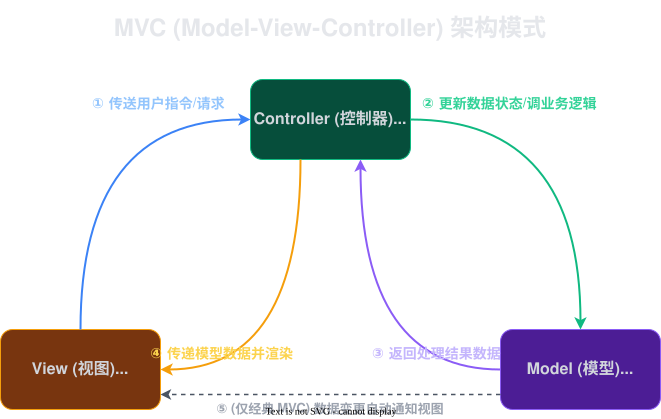

# 2026-03-26-SpringMVC

`MVC` 分别是对应的是 `Model`, `View`, `Controller`.

- `Model`: 它是真正干活的人，处理各种各样的业务逻辑
- `View`: 视图，它是负责渲染 UI 的
  > 个人理解：随着业务的发展，使用了前后端分离，View 逐渐就淡化了，现在一般都是返回类似 JSON 这样的数据，就有点变得像 MD(Data)C 
- `Controller`: 起调度的作用，把 View 的请求传给 Model，把 Model 处理的结果返回给 View