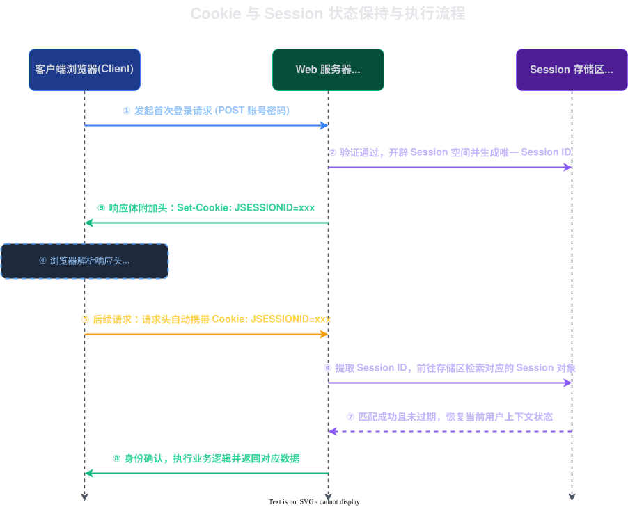

# 2026-03-26-SpringMVC

`MVC` 分别是对应的是 `Model`, `View`, `Controller`.

- `Model`: 它是真正干活的人，处理各种各样的业务逻辑
- `View`: 视图，它是负责渲染 UI 的
  > 个人理解：随着业务的发展，使用了前后端分离，View 逐渐就淡化了，现在一般都是返回类似 JSON 这样的数据，就有点变得像 MD(Data)C 
- `Controller`: 起调度的作用，把 View 的请求传给 Model，把 Model 处理的结果返回给 View

## Cookie 与 Session

执行步骤：
1. 客户端先登录，服务端接收到了用户登录信息，存储登录信息并生成一个 SessionId，并且**把相关的内容存储在内存里面**，便于下次访问
2. 服务端返回 SessionId, **客户端在 Cookie 中存储这个 SessionId**
3. **客户端之后发起的请求都需要携带这个 SessionId**，服务器通过这个 SessionId 来判断客户端的身份并且执行相关命令
> 由于时代的发展，数据是越来越多，最强大的计算机也无法单独处理这么高的并发量，为了解决这个问题，分布式服务就应运而生了
> 
> 分布式是由多台服务器组成的一个集群，如果继续使用 Session，它就会导致不同服务器之间无法共用 Session。
> 为了**降低耦合提高开发效率，它就会使用令牌，把它存储在 Redis 中**，利用 Redis 的机制，可以比较方便地处理这个问题

问题：Cookie 与 Session 有什么区别？
||
1. **Cookie 是存储在客户端的，Session 是存储在服务端的**
2. **Cookie 是里面一般存储是令牌**，令牌里面存储相关的Id，比如：存储学生Id, 教师Id 等；**Session 是存储相关的详情**，比如昵称，联系方式等。Session 是 K-V 结构，K 就是相关的Id, V 就是详细内容。
||