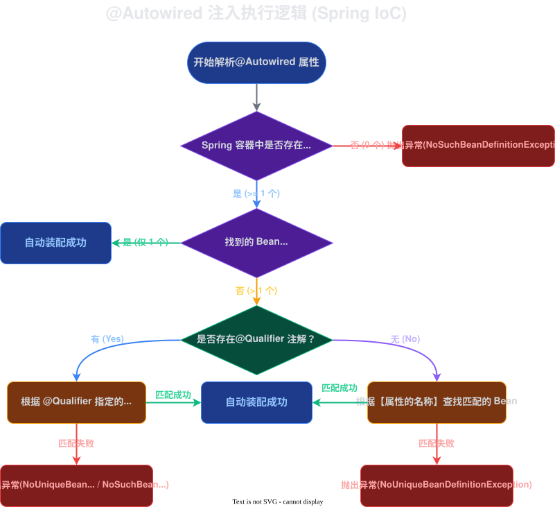

# 2026-04-09-SpringIoC&DI

## `IoC`
`IoC` 是一个设计思想，翻译的名称叫作控制反转。就是把对象创建的控制权交给第三方来实现。**在 `Spring` 中也就是交给 `Spring` 容器来管理。**

### 注解

| 类型              | 意思               |
| --------------- | ---------------- |
| `Controller`    | 表示控制层，其他注解是无法替代的 |
| `Service`       | 表示服务层            |
| `Repository`    | 用来操作数据的          |
| `Component`     | 其他的组件            |
| `Configuration` | 表示这个文件是配置功能      |
| `Bean`          | 这个是一般是用于第三方的对象   |

## `DI`
`DI` 表示注入，第三方把管理好的对象注入给要使用的地方。

### 方式
详情在面试题目里面呈现

### 注解

| 类型          | 意思                                                  |
| ----------- | --------------------------------------------------- |
| `Autowired` | 自动注入，一般是**适用于使用单例模式的对象**                            |
| `Qualifier` | 根据别名注入，要配合 Autowired 这个注解使用， **适用于实例对象不止一个的情况下** |
| `Resource`  | 它是JDK自带的注解， 它是把 Autowired 和 Qualifier 结合起来的      |

### Bean 名称
在使用过程中，除去自定义的名称，Spring 中 Bean 的名称生成条件如下
1. 如果类名**开头是连续多个大写字母，那么就保持类名不变**
2. 一般情况下，类名是大驼峰，那么 Bean 的名称就是小驼峰，**只需要把首字母改为小写即可**

## 常见的面试题

### Spring, SpringMVC, SpringBoot 有什么区别？
||

- `Spring` 是采用了 `IoC` 和 `AOP` 的思想，管理对象的创建与使用，这样是可以降低耦合性，降低管理难度。
- `SpringMVC` 是 `Spring` 下面的一个子框架，是用来开发 `Web` 接口的。它减少了大量中重复的功能：设置编码格式与字符集，获取相关参数，类型转换与空行校验，编写返回的输出流等。虽然 `SpringMVC` 解决了这些重复的功能的开发，但是它依然需要配置大量的配置文件。
- `SpringBoot` 是一个框架，它是对 `Spring` 整个生态经行集成与优化，不是替代某个功能。`SpringBoot` 解决了 `SpringMVC` 中需要编写大量的配置的这一个问题，它只需要使用注解即可完成配置
||

### 三种注入方式的优缺点
||
注入的方式分为三种：属性注入，构造方法注入和 set 方法注入

- 属性：
	- 优点：添加 `Autowired` 这个注解就可以了，**简洁明了，使用方便**
	- 缺点：
		- 但是它是是适用使用单例模式的对象
		- 要注入的对象不能被 `final` 修饰
		- 依赖 `IoC`，如果有空指针异常只有在使用的时候才会出现
- 构造方法（目前 `Spring` 官方推荐的写法）：
	- 优点：
		- 兼容性高，构造方法是 JDK 支持的
		- 可以被 `final` 修饰，注入的对象不会修改
	- 缺点：
		- 写起来比较麻烦。如果有无参构造方法，那么必须添加 `Autowired` 在相关的有参的构造方法上面。如果是有多个注入对象，需要修改构造方法
- Setter：通过 set 方法注入，也是需要 `Autowired` 这个注解添加到对应的 set 方法上面
	- 优点：可以重新配置或注入
	- 缺点：
		- 不能被 `final` 修饰，set 可以被多次调用，也就导致可能会被传改
||

### @Autowired 和 @Resource 区别
||
`Autowired` 是根据 `Bean` 对象的类型来注入的，而 `Resource` 是根据 `Bean` 对象的名称来注入的（实际上 `Resource` 是可以根据类似来注入，`Autowired` 也可以通过名称来注入，但是一般不会这样使用）。

`Autowired` 的执行逻辑是：
1. 先判断 `Spring` 容器内有没有这个类型的对象，如果没有就抛异常
2. 在找到这个对象的情况下，判断它是不是唯一的，如果是唯一的，那么就自动装配
3. 如果不是唯一的，在看它有没有 Qualifier 这个注解
	- 如果有这个注解，那么根据注解名称来查询，找到则自动装配，找不到就抛异常
	- 如果没有这个注解，那么就根据属性的名称来查询，同理，找到自动装配，找不到抛异常

||