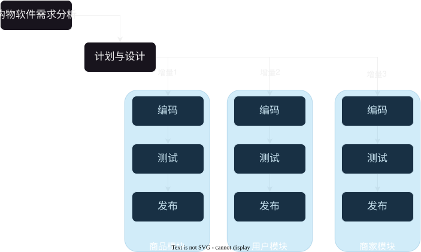
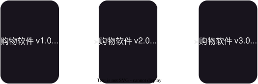
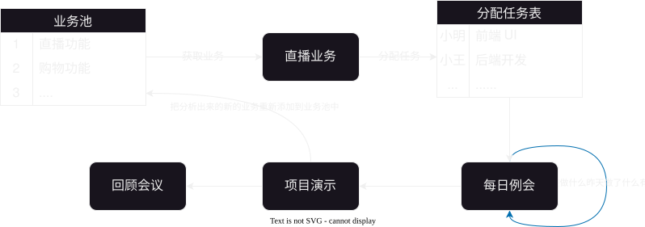
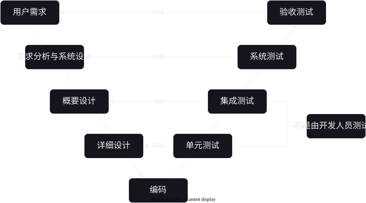
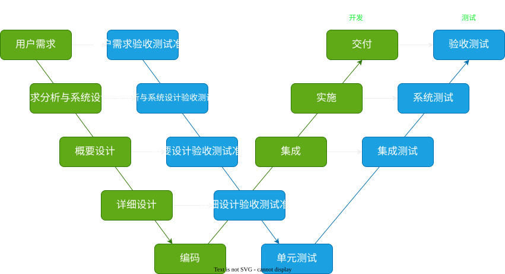

# 2025-10-30-概念篇
> 目标要求：
> 1. [需求的概念](#需求的概念)
> 2. [开发模型](#开发模型)
> 3. [测试模型](#测试模型)
>
> **以理解为主**，知道相关概念/流程的意思即可，不需要死记硬背

## 需求的概念
> 需求分为**用户需求**与**软件需求**

### 用户需求
> **用户需求是用户提出的，但是一般情况是不够详细，而且可能是不太合理的**
>
> 比如：我想要这个软件支持黑色模式。
>
> 这个是不详细的
> - 没有说明怎么样才能实现黑色模式
> 
> 而且可能是不合理的
> - 可能是因为刚开始就没有考虑黑色模式，添加黑色模式需要重新构建框架
> - 也可能是需求量比较少，需要这个模式的用户数量比较少

### 软件需求
> 软件需求是在专业的人员进行评估后，给出**详细的解决步骤**
>
> 还是以黑色主题为例
> 
> 首先经过评估
> 1. 需求量确实比较大
> 2. 需要花费的预算成本不太高
>
> 那么就可以设计并提供详细的软件需求：
> - 字体颜色，背景颜色等设计

## 开发模型
### 软件生命周期
软件的生命周期为：`需求分析--计划--设计--编码--测试--运维`

|   概念   |             目标             |                      例子                      |
| :------: | :--------------------------: | :--------------------------------------------: |
| 需求分析 | **分析软件的需求**，明确目标 |        市场需求/需求可行性/需求是否合理        |
|   计划   |     给出具体的**规范表**     |      什么时候做什么事情/什么时候可以完成       |
|   设计   |   提供具体的**详细的文档**   |      选择什么开发语言/框架；数据库设计等       |
|   编码   |           编写代码           |         **按照文档要求**，编写相关代码         |
|   测试   |           测试代码           |       安全性测试/业务逻辑测试/边界测试等       |
|   运维   |    对上线的产品运行与维护    | 防御网络攻击；在并发大的时候保证软件正常运行等 |

### 常见的开发模型
#### 瀑布模型
> 瀑布模型是一个一个模块进行的，**适合于小型项目的开发**
>
> 但是由于是一个一个模块进行的，测试是放在最后面，导致测试如果出现问题，那么很可能会出现大量的“返工”情况
>
> 而且由于返工，**项目的开发周期会被延长**，这可能会导致错过一些机遇

#### 螺旋模型
> 螺旋模型适用于**大型项目的开发**，相比瀑布模型，多了 **原型** 与 **风险分析**
>
> 但是由于多了风险分析，这就需要相关的人才，可能会导致开发的成本过高

--- 
原型图与设计图的区别
> 原型图是一个草稿，但是设计图是详细的 UI

例子：[首页](/)的原型图

例子：[首页](/)的设计图

#### 增量模型与迭代模型
> 增量模型是把一个项目拆分为多个小模块（类似与 `Docker` 的容器），上线发布是一个一个小模块发布
> 
> 
> 迭代模型是全部模块一起上线，但是各个模块只提供了一些简单核心的功能，复杂的功能在后面慢慢补充
> 
>
> 它们适用与**大型**的项目，往往是结合在一起使用的

#### 敏捷模型
> 个人认为：怎么方便高效怎么来
> - 高效的沟通
> - 轻文档，文档不是验收的标准，可用的软件才是
> - 主动了解用户当下的需求
> - 主动迎接变化

##### Scrum 模型
> Scrum 模型是敏捷模型的一种，它又叫作“迭代式增量开发模型”
>
> 它主要由**三个角色**与**五个重要会议**组成

###### 三个角色
> 这三个角色分别为：
> - 产品经理(product owner)：分析[用户需求](#用户需求)，将用户需求转变为[软件需求](#软件需求)
> - 项目经理(scrum owner)：统筹项目，负责项目的开发管理
> - 开发团队(team)：开发项目，测试项目，维护项目

###### 五个重要会议
> 五个重要会议分别为：
> 1. 获取业务：从各个**待开发**的业务中挑选出一个业务
> 2. 分配任务：把获取到的业务**拆分为多个小模块**，为每个小模块都**分配明确的负责人**，给出**具体的计划安排**
> 3. 每日例会：每天都会进行进度汇报，要回答**昨天做了什么，今天要做什么，有什么问题**这三个问题。
>    由于这个会议比较短，通常是站着开会，所以又叫作“站会”
> 4. 项目演示：**业务开发完成后**，给用户进行项目的功能演示，**展示所取得的成果**，
>    **提供并整理反馈，把反馈整合为一个新业务，把它添加到“待开发的业务”里面**
> 5. 回顾会议：对这次业务开发进行总结，**分析不足，指定改进计划**，达到持续进步的效果

#### 测试模型

---
##### V模型
> 优点：明确了各个流程的测试内容，条例清晰明了
>
> 缺点：由于是串行，缺点与[瀑布模型](#瀑布模型)一样
>
> 其中单元测试的内容不仅仅是方法，还可以是类/借口/模块，**这主要是由人来决定的**
> 
> 

##### W(双V)模型
> 为了缓解 V模型 的缺点，就采用**测试与开发同步进行**
>
> 缺点：
> 1. 由于 测试最终是要开发完成后才能测试，所以依然是线性的
> 2. 这个是重流程，所以不能使用敏捷模型
>
> 
