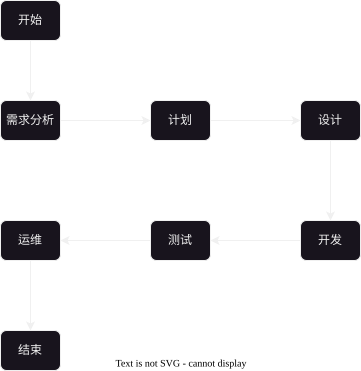
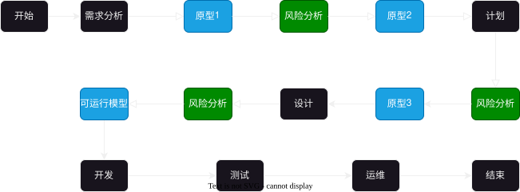
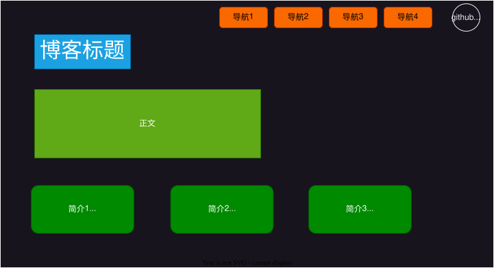
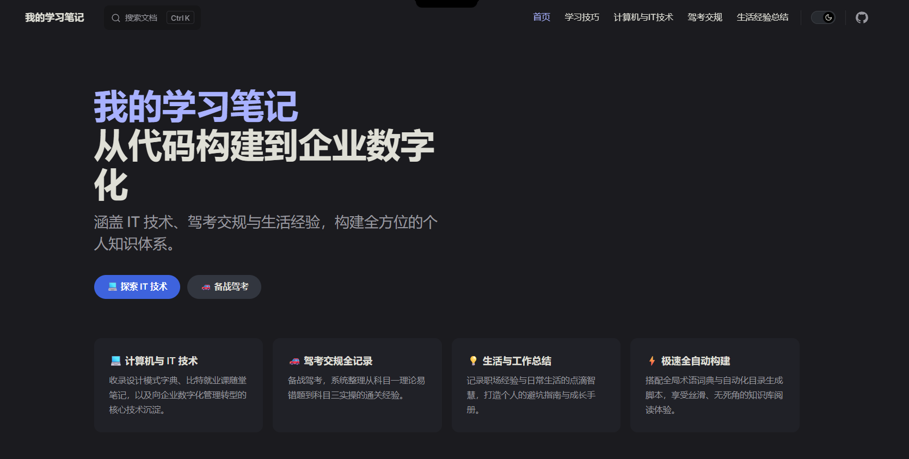

# 2025-10-30-概念篇
> 目标要求：
> 1. [需求的概念](#需求的概念)
> 2. [开发模型](#开发模型)
> 3. [测试模型](#测试模型)

## 需求的概念
> 需求分为**用户需求**与**软件需求**

### 用户需求
> **用户需求是用户提出的，但是一般情况是不够详细，而且可能是不太合理的**
>
> 比如：我想要这个软件支持黑色模式。
>
> 这个是不详细的
> - 没有说明怎么样才能实现黑色模式
> 
> 而且可能是不合理的
> - 可能是因为刚开始就没有考虑黑色模式，添加黑色模式需要重新构建框架
> - 也可能是需求量比较少，需要这个模式的用户数量比较少

### 软件需求
> 软件需求是在专业的人员进行评估后，给出**详细的解决步骤**
>
> 还是以黑色主题为例
> 
> 首先经过评估
> 1. 需求量确实比较大
> 2. 需要花费的预算成本不太高
>
> 那么就可以设计并提供详细的软件需求：
> - 字体颜色，背景颜色等设计

## 开发模型
### 软件生命周期
软件的生命周期为：`需求分析--计划--设计--编码--测试--运维`

|   概念   |             目标             |                      例子                      |
| :------: | :--------------------------: | :--------------------------------------------: |
| 需求分析 | **分析软件的需求**，明确目标 |        市场需求/需求可行性/需求是否合理        |
|   计划   |     给出具体的**规范表**     |      什么时候做什么事情/什么时候可以完成       |
|   设计   |   提供具体的**详细的文档**   |      选择什么开发语言/框架；数据库设计等       |
|   编码   |           编写代码           |         **按照文档要求**，编写相关代码         |
|   测试   |           测试代码           |       安全性测试/业务逻辑测试/边界测试等       |
|   运维   |    对上线的产品运行与维护    | 防御网络攻击；在并发大的时候保证软件正常运行等 |

### 常见的开发模型
#### 瀑布模型
> 瀑布模型是一个一个模块进行的，**适合于小型项目的开发**
>
> 但是由于是一个一个模块进行的，测试是放在最后面，导致测试如果出现问题，那么很可能会出现大量的“返工”情况
>
> 而且由于返工，**项目的开发周期会被延长**，这可能会导致错过一些机遇

#### 螺旋模型
> 螺旋模型适用于**大型项目的开发**，相比瀑布模型，多了 **原型** 与 **风险分析**
>
> 但是由于多了风险分析，这就需要相关的人才，可能会导致开发的成本过高

--- 
原型图与设计图的区别
> 原型图是一个草稿，但是设计图是详细的 UI

例子：[首页](/)原型图

例子：[首页](/)设计图

