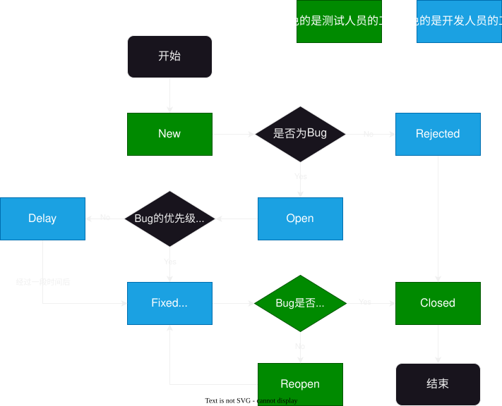

# 2025-11-01-Bug篇
> 要求：
> - [软件测试生命周期](#软件测试生命周期)
> - 什么是bug
> - 描述bug的要素
> - bug级别
> - bug的生命周期
> - 与开发产生争执怎么办（高频面试题）

## 软件测试生命周期
> **软件测试是贯穿软件的整个生命周期的**
>
> 软件的生命周期为：`需求分析-测试计划-测试方案-测试执行-测试评估-上线-运行维护`
> 
> - `需求分析`：从用户/技术/测试的角度出发，**评估业务是否合理，可行**
> - `测试计划`：**什么时候做什么测试**，要有测试的安排
> - `测试方案`：**编写测试用例**，使用什么测试工具
> - `测试评估`：**评估测试结果**，判断是否应该上线，编程测试结果的评估文档
> - `上线`：它分为内部上线，小流量，全流量
>   - 内部上线：**与线上的环境一模一样**，但是**用户访问不到，内部员工可以访问**
>   - 小流量：**部分用户可以使用**，比如： Deepseek 中视图模式的灰度测试（2026-08-05）
>   - 全流量：**所有的用户**都可以使用这个功能
> - `运行维护`：**收集运行信息**，将相关问题反馈的相关人员

## Bug
> 内容：
> 1. 需求文档中**存在相关业务**，并且这个**业务是正确**的前提下，**程序与业务不匹配**
> 2. **用户合理的预期功能没有被满足**，比如用户要求产品logo在左上方，而前端编写的UI却在右上方

### Bug描述
Bug 描述内容需要有 **版本号，环境，复现步骤，预期结果，实际结果**

|   概念   |                             解释                              |
| :------: | :-----------------------------------------------------------: |
|  版本号  |             软件/插件等版本，一般是 x.x.x 的形式              |
|   环境   | Bug 出现的环境，比如 Window11, Linux, 或者 Chrome 浏览器 等等 |
| 复现步骤 |                复现 Bug 的步骤，要有明确的步骤                |
| 预期结果 |                           期望结果                            |
| 实际结果 |                         Bug 呈现效果                          |

### Bug级别
Bug 严重级别由高到低一般分为 **崩溃，严重，一般，次要**

| 概念  |                               解释                                |
| :---: | :---------------------------------------------------------------: |
| 崩溃  |  数据库错误/丢失数据/软件无法访问等给**企业造成严重损失**的 Bug   |
| 严重  |    一级窗口无法使用但是二级窗口是可以测试/安全问题/接口错误等     |
| 一般  | 功能没有完全实现，但是不影响用户基本使用，比如边界问题/格式错误等 |
| 次要  |               建议性问题，用于改善用户的使用体验的                |

### Bug生命周期
> - `New`: 发现 Bug，**未评定**，由**测试人员提出**
> - `Open`: 经**评估后**，确认是 Bug，交给**开发人员修复**
> - `Fixed`: 开发人员已经**对 Bug 进行修改，等待测试人员测试**
> - `Rejected`: 经评定，认为不是 Bug，**拒绝修改**
> - `Delay`: 延期 Bug，**适用于级别较低的 Bug**
> - `Closed`: 测试完后，**Bug 被修复**，关闭 Bug
> - `Reopen`: 测评完后，**Bug 还没有被修复**，重新开发Bug，让开发人员修改
>
> 

### 与开发人员起争执怎么办（高频面试）
1. **自我思考**，想一想自己的 Bug 是不是写的很不好
2. **从用户角度出发**，看看这个 Bug 合不合适？
3. **有理有据**定义 Bug 等级（可以看企业的文档）
4. 提高自身开发水平，在提供问题的基础上，**礼貌地提出解决建议**
5. Bug 评审，非必要不要使用这个
   > Bug 评审是由 **测试代表，开发代表，产品代表** 这三类人组成
   >  
   > 它主要针对于**在上诉1-4条都满足的条件下**，依然不修Bug的开发人员

