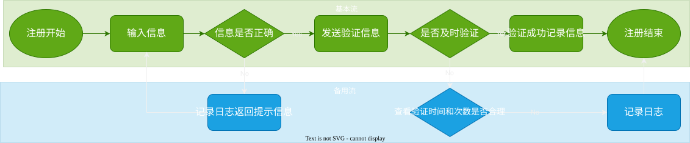

# 2025-11-08-用例篇
> 目标
> 1. [测试用例的概念](#测试用例的概念)
> 2. [设计测试用例的万能思路](#设计测试用例的万能思路)
> 3. [设计测试用例的方法](#设计测试用例的方法)
> - [基于需求的设计方法](#基于需求的设计方法)
> - 具体的设计方法
>     - [等价类](#等价类)
>     - [边界值](#边界值)
>     - [判断表法](#判断表法)
>     - [正交法](#正交法)
>     - [错误猜测法](#错误猜测法)
>     - [场景法](#场景法)

## 测试用例的概念
> 测试用例是**一组集合**，包含：**测试环境，测试步骤，测试数据，预期结果**等

## 设计测试用例的万能思路
> 万能思路是**给我们具体的场景，通过相关场景让我们可以发散性思维思考测试用例**

|      类型      |                                解释                                 |
| :------------: | :-----------------------------------------------------------------: |
|   `功能测试`   |          测试正常的使用功能，比如水杯能否盛水/喝水/清洗等           |
|   `界面测试`   |                 测试外观，比如水杯颜色/图案/形状等                  |
|   `性能测试`   |       测试极限情况下是否能正常使用，比如高铁抢票/双十一购物等       |
|   `安全测试`   |                    测试安全，比如SQL注入/越权等                     |
|  `兼容性测试`  |    测试在不同环境能否正常使用，比如不同浏览器能否正常访问网页等     |
|  `易用性测试`  |              新用户能否易上手，比如新手教程/说明文档等              |
| `安装卸载测试` | 相对不重要，看能不能正常的安装/卸载，比如：卸载后再次安装有没有问题 |
|   `弱网测试`   |             相对不重要，在**网络不好的情况**下进行测试              |

## 设计测试用例的方法

### 基于需求的设计方法
> 这个需要测试人员**熟悉需求文档**
> 
> 步骤：
> 1. 先分析并验证需求
> 2. 接着把需求拆分为若干模块
> 3. 针对这些模块设计对应的测试用例
> 
>
> 但是，如果需求文档上没有的，依然需要根据经验，来设计测试用例
>
> 总之，**需求文档上面有的一定要有相关测试用例，但是一些测试不一定是在需求文档上面会呈现**

### 具体的设计方法
> **各个方法一般都是相互配合使用**，而不是单一的使用

#### 等价类
> **用一个值代表那一类集合**，从而实现设计高效的测试用例
>
> 例子：密码长度要求： 6~19 位
> 
> 测试用例：
> - 3（小于 6）
> - 8（正常长度区间）
> - 25（大于 19） 

#### 边界值
> **在边界上**设计测试测试用例
>
> 例子：密码长度要求： 6~19 位
> 
> 测试用例：
> - 6 和 19
> - 5（比 6 小一位）
> - 20（比 19 大一位）

#### 正交法
> **面试中可能会考，但是实际工作中应该不会考**
>
> 它的目的是**用尽量少的测试用例覆盖较多的业务**情况

##### 属性
> 它的形式是 $L_{Line}\left(Level^{Factors}\right)$

- `因素(Factors)`：输入的条件，比如邮箱/密码等
- `水平(Level)`：因素对应的选项，比如邮箱填入与不填入
- `行数(Line)`：它们配对的总个数，与测试用例一一对应，如果水平一样，
  那么求行数的公式为：$Line = Factors \times (Level - 1) + 1$

#### 判断表法
> **以表格的形式列举各个输入条件与输出的关系**，可以清晰明了地看出它们之间的关系，列举对应的测试用例
>
> 同样，这个也是面试有但是工作却不怎么用的

比如：用户登录需要输入用户名与密码，如果其中一个异常（比如没有输入或者输入错误），那么就不登录

| 用户名 | 密码  | 是否登录 |
| :----: | :---: | :------: |
|  正常  | 正常  | 登录成功 |
|  正常  | 异常  | 登录失败 |
|  异常  | 正常  | 登录失败 |
|  异常  | 异常  | 登录失败 |

#### 错误猜测法
> **根据个人理解**，估计软件出现的错误内容，**它主要依赖于个人的经验与直觉**

#### 场景法
> 通过场景（比如购物的商场**流程**/登录具体**过程**等）联想来设计测试用例，
> 
> 它分为基本流与备用流
> - `基本流`：**正常的业务流程**，比如注册用户中 输入注册信息-验证-登录
> - `备用流`：正常业务流程**出现异常后**执行的逻辑，比如注册用户中，验证信息过时后需要重新验证
>
> 
