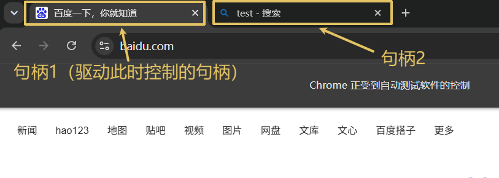

# 2025-11-20-自动化测试
> 要求：
> - 自动化测试
> - Web自动化测试
> - `selenium`

## 自动化测试
### 类型
- 接口测试
- UI 测试
  - Web自动化测试
  - 客户端界面测试
    - GUI自动化测试（PC端）
    - 移动端自动化测试

### 面试题
Q: 自动化测试能够取代人工测试吗？

A: || 不能，**因为自动化测试是由测试人员手动编写的，**
测试用例也是需要测试人员手动设计，自动化测试无法实现上面的两个功能，所以不能替代||

Q: 自动化测试可以大幅减少测试的工作量？

A: || 不能，**软件测试是贯穿软件的生命周期**，软件的生命周期为：需求分析-计划-开发-测试-运维，
**而自动化测试仅仅是在执行“测试”中有，因此也仅仅是对这个阶段有影响。**
可以说在一定程度上减少工作量，但是不能说“大幅度减少”工作量||

## 常用函数
> 一般函数的**路径是直接在浏览器上面直接复制就可以了**，不需要自己编写
>
> 要求：
> - [元素定位](#元素定位)
> - [操作测试对象](#操作测试对象)
> - [窗口](#窗口)
> - 等待
> - 导航
> - 弹窗
> - 文件上传
> - 浏览器参数

### 元素定位
#### `xpath`
> - `//`: **递归**查找子目录
> - `/`: 查找子目录，仅查找一级
> - `[@]`: 限制条件，里面写 `HTML` 的属性，比如查找 `id` 为 1 的，那么就写为 `[@id='1']`
> - `..`: 返回上一级
> - `[${nums}]`: **`${nums}` 是占位符**，填入数字，表示第几个

#### `cssSelector`
> - `>`: 表示下一级目录
> - `#`: 表示 `id` 这个 `HTML` 属性
> - `.`: 表示 `class` 这个 `HTML` 属性
> - `nth-child`: 表示孩子节点，传入的参数表示第几个孩子节点

### 操作测试对象
#### `click`
> 模拟左键单击，除了像有 `display: none` 这样的属性，基本上元素的都可以使用这个方法

#### `sendkeys`
> 发送内容，**通常用于搜索等场景**，但是它仅仅是发送内容，**不提供点击支持**

#### `clear`
> 清理文本，**通常配合 sendKeys 这个方法使用**

#### `getText`
> 获取纯文本内容，**不能获取属性**
> 
> 如果需要获取属性对应的值，需要使用 getAttribute 这个方法

#### `getTitle`
> 获取当前句柄的**标题**，句柄这个概念在[窗口](#窗口)中有

#### `getCurrentUrl`
> 获取当前句柄的**网址**，句柄这个概念在[窗口](#窗口)中有

### 窗口
#### 句柄
> 
>
> 可以使用 `getWindowHandle` 和 `getWindowHandles` 来获取，通过 `close` 关闭当前句柄
>
> - `getWindowHandle`: 获取当前驱动控制的句柄
> - `getWindowHandles`: 获取所有句柄

#### 窗口大小
> 在 `driver.manage().window()` 这个对象里面控制
>
> - `maximize`: 最大化窗口
> - `minimize`: 最小化窗口
> - `fullscreen`: 窗口全屏
> - `setSize`: 自定义大小窗口

### 问题解决
Q: 如果发现浏览器上面是有这个“路径”，但是代码执行一直找不到怎么办？

A: || **在通过代码驱动打开的浏览器里面检查**，而不是自己打开的浏览器，
因为驱动打开的浏览器是无痕模式，里面没有插件/登录cookie等 ||