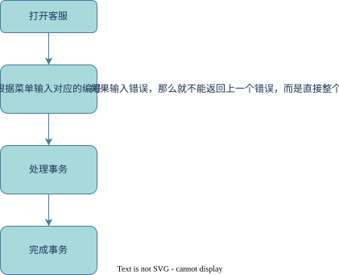
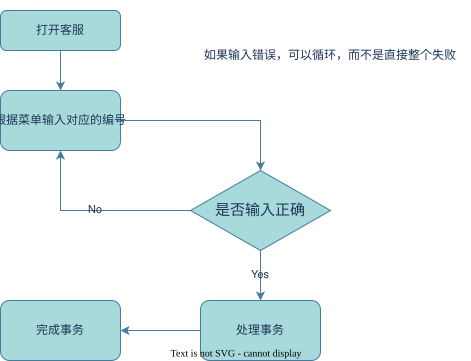

# LangChain 与 LangGraph 介绍

## `LangChain` 可以解决 `LLM` 哪些问题？
|           问题           |                                     原因                                     |               解决方案               |
| :----------------------: | :--------------------------------------------------------------------------: | :----------------------------------: |
|     无法快速切换模型     |                      不同厂商 API 的路径/参数 是不同的                       |        提供一个统一封装的接口        |
|         幻觉问题         |                     训练的数据质量差/训练数据陈旧的等等                      | 通过调用 RAG 来获取最新的知识库数据  |
|   需要编写规范的提示词   |                  提示词不规范将会导致安全/结果不准确等问题                   |  通过调用 RAG 来获取 **提示词模板**  |
| 无法**结构化**地获取数据 |          `LLM` 结果一般是一段文字，而不是像 `JSON` 这样的结构化数据          |          可以强制结构化输出          |
|   不会调用权威的数据库   | 当涉及到专业领域的知识，`LLM` 不会调用权威的数据库，而是很可能会出现幻觉问题 | 设计相关的搜索引擎来调用外部的数据库 |

## `LangChain` 由哪些问题呢？

- 问题：
  1. 单向的，**不能循环/选择**
  2. 如果要实现上诉条件，需要添加状态，增加了代码的复杂性/维护成本，还需要一堆 `if-else` 代码僵化
  3. 如果需要**人工介入**，需要编写一大堆复杂的通知语句
  

- 解决方案：通过 `LangGraph` 解决
  1. 它内置的 条件/通知 等组件，
  

