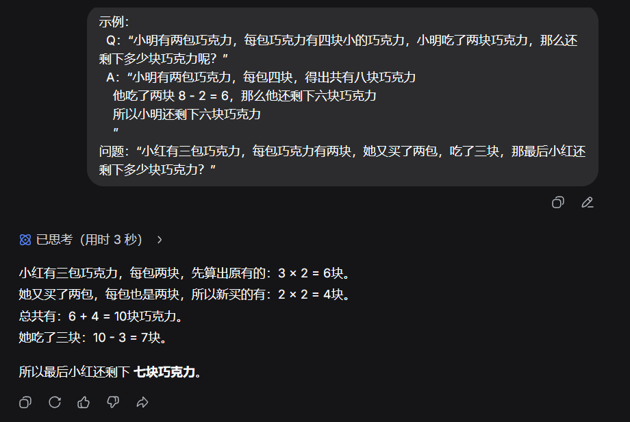
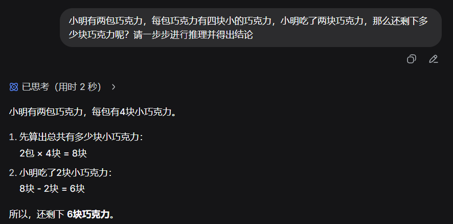

# 提示词编写技巧
> 提示词编写主要是要**换位思考**，需要让**AI知道有一些必要的条件**
> 不然 AI 就会瞎扯，AI的输出会与个人要求输出将会有很大的出入
>
> 下述的提示词**编写的规范通常是可以组合**的，而不是单一满足某一个规范即可


## CO-STAR 
> 通过下述示例看出， 这个应该是适用于**产品说明**等情况
> tip: 下面的模块**不需要全部都有，根据需求编写即可**

|    模块     |    说明    |                                 示例                                  |
| :---------: | :--------: | :-------------------------------------------------------------------: |
|  `Context`  | 任务上下文 | 你是电商客服，需解答用户关于iPhone17的咨询，知识库包含最新价格和库存” |
| `Objective` |  核心目标  |                 准确回答价格、发货时间，推荐适配配件                  |
|   `Steps`   |  执行步骤  |        1.识别用户问题类型；2.检索知识库；3.用亲切语气整理回复         |
|   `Tone`    |  语言风格  |             口语化，避免专业术语，使用“亲~”，“呢”等语气词             |
| `Audience`  |  目标用户  |               20-35岁年轻消费者，对价格敏感，关注性价比               |
| `Response`  |  输出格式  |            价格：XXX元\n库存：XXX件\n推荐配件：XXX（链接）            |


## 少样本提示 / 多示例提示
> 顾名思义，**通过一些示例让 AI 理解用户输入的内容的意思**

- 例子：
  - 没示例的例子：
    ```text 
    4 , 2 的结果是什么
    ``` 
  - 有示例的例子：
    ```text
    1 , 2 的结果是 4
    2 , 2 的结果是 8
    1 , 3 的结果是 6

    那么 4 , 2 的结果是什么
    ``` 

## 思维链
> 在推理的过程中**有一步一步的思考过程**
>
> 根据推理过程是由用户输入 还是 AI 自己推理
> 分为 **少样本思维链**(`Few-shot-CoT`) 与 **零样本思维链**(`Zero-shot-CoT`)

### 少样本思维链
> 用户输入案例，里面有问题与答案，之后在输入真正想要问的问题

- 例子：
  ```text
  示例：
    Q：“小明有两包巧克力，每包巧克力有四块小的巧克力，小明吃了两块巧克力，那么还剩下多少块巧克力呢？”
    A：“小明有两包巧克力，每包四块，得出共有八块巧克力
      他吃了两块 8 - 2 = 6，那么他还剩下六块巧克力
      所以小明还剩下六块巧克力 
      ”
  问题：“小红有三包巧克力，每包巧克力有两块，她又买了两包，吃了三块，那最后小红还剩下多少块巧克力？”
  ``` 

  

### 零样本思维链
> 用户提出问题，但没有案例，只需要在末尾添加 `请一步步进行推理并得出结论` 这个提示词即可
>
> 这个是适用于**不清楚如何推理案例/比较复杂**的问题
> 但是由于没有案例，精确度可能会比 少样本思维链 的低

- 例子：
  ```text
  小明有两包巧克力，每包巧克力有四块小的巧克力，小明吃了两块巧克力，那么还剩下多少块巧克力呢？请⼀步步进⾏推理并得出结论
  ``` 

  


## 自我批判与迭代
> 让 AI **自我**判断，**自我**优化，**自我**迭代

- 例子：
  ```text
  请执行两个步骤：
    第一步：编写代码
      编写一段 Java 代码，可以计算出传入数组在相关范围内的数字总和
    第二步：自我批判与迭代
      1. 命名是否规范？
      2. 传入的参数是否合法？
      3. 如果不合法，应该如何处理？
  ``` 