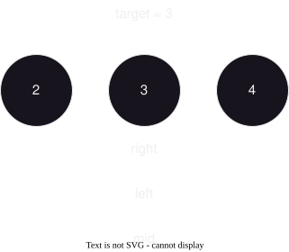
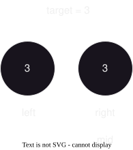

# 二分查找
> 算法原理：只要满足二段性即可
> - 二段性：**随意找一个点，把数组分为两部分，发现其中一边是可以直接排除的，这就满足二段性**


## 模板
> **模板一定不要死记硬背，而是通过理解原理来记忆**

---

### 朴素的二分模板
> 简单，但是适用性比较小

#### 题目案例
- [LC704. 二分查找](#lc704-二分查找)

#### 模板代码
```Java
int left = 0, right = nums.length - 1;

// 为什么这里是不需要等于？
// 因为新的区间内都是未知数，就算是还剩下最后一数，依然需要判断它是否满足
while (left <= right) {
    int mid = left + (right - left) / 2; // 防止溢出
    // ... 表示需要填入的内容，这个是根据二段性来填入相关的条件
    if (...) { 
        right = mid - 1;
    } else if (...) {
        left = mid + 1;
    } else {
        // 
        return ...;
    }
}
```

### 查找左/右边界的二分模板
> 比较复杂，但是适用性比较大，但是细节多
>
> 背诵细节（当然是要理解的去背）
> - 左边界 `mid` 就不需要加 1，右边界 `mid` 就要加 1
> - 下面（`right`)出现 `-1` 的时候，上面就要出现 `+1`

#### 左边界
```Java
while(left < right) {
  int mid = left + (right - left) / 2;
  if (...) {
    left = mid + 1;
  } else {
    right = mid;
  }
}
```

#### 右边界
```Java
while(left < right) {
  int mid = left + (right - left + 1) / 2;
  if (...) {
    left = mid;
  } else {
    right = mid - 1;
  }
}
```

#### 题目案例
- [LC34. 在排序数组中查找元素的第一个和最后一个位置](#lc34-在排序数组中查找元素的第一个和最后一个位置)


## [LC704. 二分查找](https://leetcode.cn/problems/binary-search/description/)
> 细节思考：
> 1. 循环条件为什么不需要加等号？
>     || 因为**新的区间内都是未知数**，就算是还剩下最后一数，依然需要判断它是否满足 ||
> 2. 为什么更新 `left`, `right` 的时候是要加一或减一？
>     || 因为 **`mid` 已经确认另一半区间的不可能满足条件的，`mid` 这个对应的值也是不满足的**，所以就不需要再判断一次了 ||


<LC704BinarySearch />

```Java
public int search(int[] nums, int target) {
    int left = 0, right = nums.length - 1;

    // 为什么这里是不需要等于？
    // 因为新的区间内都是未知数，就算是还剩下最后一数，依然需要判断它是否满足
    while (left <= right) {
        int mid = left + (right - left) / 2;
        if (nums[mid] > target) {
            right = mid - 1;
        } else if (nums[mid] == target) {
            return mid;
        } else {
            // nums[mid] < target
            left = mid + 1;
        }
    }

    return -1;
}
```

## [LC34. 在排序数组中查找元素的第一个和最后一个位置](https://leetcode.cn/problems/find-first-and-last-position-of-element-in-sorted-array/description/)
> 这里是要用到查找[左边界](#左边界)与[右边界](#右边界)的二分模板
>
> 思路：
> - 查找左边界
>     - 结束条件是什么？为什么这样？
>       || 
>        
>        1. 结束条件是 `left < right` 而不是 `left <= right`
>        2. 如果有等于，在最后 —— `left` 等于 `right`  `mid` 算出来刚好等于 `left/right` ——
>           此时走 `nums[mid] == target` 这个条件， `left/right` 就不会移动，从而陷入死循环（如图中这样的情况）
>       ||
>     - 如果 `nums[mid] == target`，应该谁来移动？怎么移动？ 
>       || 
>        1. **由于找左边界**，所以相等的时候是 `right` 移动 
>        2. 因为**要找的对应的下标可能就是 `mid`**，所以 `right` 移动到 `mid` 的位置即可
>       ||
>     - 如果 `nums[mid] != target`，又应该如何移动呢？
>       || 
>        1. `nums[mid]` 太大右移，太小左移
>        2. **由于 `mid` 这个位置的值一定可以排除**，所以 `left` 是移动到 `mid` 右边，`right` 是移动到 `mid` 左边
>       ||
>     - `mid` 应该如何赋值呢？
>       || 
>        
>        1. 明确问题：`mid` 赋值要么是 `mid = left + (right - left) / 2` 要么 `mid = left + (right - left + 1) / 2`，
>           因此**它只对偶数个的情况有影响**，所以画图只需要画偶数的情况即可
>        2. 编写相关情况：由于找左边界，**所以在 `nums[mid]` 等于 `target` 的情况下，`right` 只会赋值为 `mid`**，
>           如果 `mid` 赋值偏大 —— 既 `mid = left + (right - left + 1) / 2` —— 此时再满足 `nums[mid] == target` 的条件
>           就会导致 `right` 不会移动，从而陷入死循环
>       ||
> - 查找右边界（与查找左边界类似，就不写了）


<LC34SearchRange />

```Java
public int[] searchRange(int[] nums, int target) {
    int[] ret = {-1, -1};
    int n = nums.length;
    if (n == 0) return ret;
    
    // 求左端点
    int left = 0, right = n - 1;
    // 为什么这个是不能等于
    while (left < right) {
        int mid = left + (right - left) / 2; // 为什么这个不需要 +1
        if (nums[mid] < target) {
            left = mid + 1;
        } else {
            right = mid;
        }
    }
    if (nums[left] == target) ret[0] = left;

    // 求右端点
    left = 0;
    right = n - 1;
    while (left < right) {
        int mid = left + (right - left + 1) / 2;
        if (nums[mid] <= target) {
            left = mid;
        } else {
            // nums[mid] > target
            right = mid - 1;
        }
    }
    if (nums[left] == target) ret[1] = left;

    return ret;
}
```
