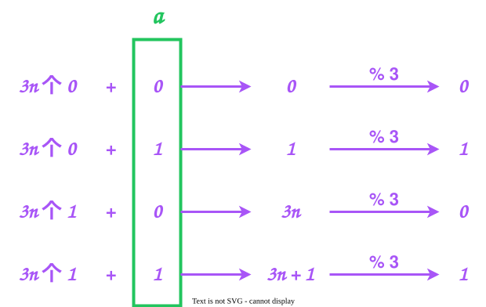

# 05-位运算

## 前置知识
**假设右边第一个比特位是的位置是 0.**

如果都熟悉的话，那么就可以做一做这些题目
- [191. 位1的个数](https://leetcode.cn/problems/number-of-1-bits/)
- [338. 比特位计数](https://leetcode.cn/problems/counting-bits/)
- [461. 汉明距离](https://leetcode.cn/problems/hamming-distance/)
- [136. 只出现一次的数字](https://leetcode.cn/problems/single-number/)
- [260. 只出现一次的数字 III](https://leetcode.cn/problems/single-number-iii/)

### 给定一个数 n，判断它第 x 位置是 0 还是 1
||
可以使用 `(n >> x) & 1` 来判断，如果是 0，那么就是 0, 如果是 1, 那么就是 1
||
### 将一个数 n 的二进制表示的第 x 位修改成 1
||
使用 `(1 << x) | n` 来解决
||

### 将一个数 n 的二进制表示的第 x 位修改成 0
||
使用 `(~(1 << x)) & n` 来解决
||

### 位图的思想
||
位图的思想和数组很类似，只不过数组是使用整数作为下标，而**位图是使用一系列的位运算来计算出下标**。
||

### 提取一个数 n 二进制表示中最右侧的 1
||
使用 `-n & n` 就可以了
> **`-n` 是把 `n` 所有的比特位取反再加 1,** 
> 
> 假设 `n` 的最右侧的 1 在 `x` 位上，那么 **`-n` 的 `x` 的左边是全部都会取反，右边是全是 0, 而 `x` 的这个位置上是 1,** 因此使用 `-n & n` 就可以把左右两侧的比特位都变为 0, 只有 x 这个位置上的比特位是 1

||

### 干掉一个数 n 二进制表示中最右侧的 1
||
可以使用 `(~(-n & n)) & n` 也可以使用 `n & (n - 1)`
> 第一个很简单，就是获取到右侧第一个 1 然后“取反”再“与”一下就可以了
> 
> 令 x 是最右侧 1 的下标。
> 
> 那么第二个就可以这样理解：**`n - 1` 就是把 x 处的 1 变为 0, 把 x 右侧的内容全部变为了 1**, 又因为 `n` 的 `x` 的右侧全部都是 0，因此执行完 `n & (n - 1)` 后就可以把最右侧的 1 给去除了


||

### 异或(^)运算的运算律
||
1. `a ^ 0 = a`
2. `a ^ a = 0`
3. `a ^ b ^ c = c ^ a ^ b` （可以通过“无进位相加”这样的思想来思考）
||

## 题目
### [面试题 01.01. 判定字符是否唯一](https://leetcode.cn/problems/is-unique-lcci/)
这道题目很简单，使用 Hash 表就可以。如果想要不使用数据结构，那么使用位图的思想也可以解决这个题目

```Java
public boolean isUnique(String astr) {
	int n = astr.length();
	if (n > 26) return false; // 鸽巢原理
	
	// 位图
	int hash = 0;
	for (int i = 0; i < n; i++) {
		int index = 1 << (astr.charAt(i) - 'a'); // 比如 c 就是 100b
		if ((index & hash) != 0) return false; // 说明有值
		hash |= index; // 标记为 1
	}

	return true;
}
```

### [268. 丢失的数字](https://leetcode.cn/problems/missing-number/)
这道题目时间复杂度为 n 的情况有三种解法：
- 哈希表：创建一个长度为 n 的哈希表，然后遍历一次数组，最后再遍历一次哈希表，看看哪个少了
- 高斯求和：利用**高斯求和公式，快速算出它们的总和 `sum1`，然后遍历一次数组，计算总和 `sum2`**, 然后通过 `sum1 - sum2` 求出结果
- 异或运算：**将 `0-n` 之间的整数与 `nums` 这个数组内的整数全部都亦或一次**，最终的结果就是答案

```Java
public int missingNumber(int[] nums) {
	int result = 0, n = nums.length;
	for (int i = 0; i < n; i++) {
		result ^= nums[i] ^ i;
	}

	return result ^ n;
}
```

### [371. 两整数之和](https://leetcode.cn/problems/sum-of-two-integers/)
这里是需要对亦或经行理解：**亦或就是无进位相加**。

那么**只需要把无进位变为有进位**就可以解决这个题目了

| 运算符 | 第3位 | 第2位 | 第1位 |
| :-: | :-: | :-: | :-: |
|     |  1  |  0  |  0  |
|     |  1  |  1  |  0  |
|  &  | --- | --- | --- |
|     |  1  |  0  |  0  |

经过观察，**发现按位与是可以标记出哪里是需要进位的**，那么只需要把结果左移一位，就是有进位了。最后只需要反复循环，就可以求出结果了

```Java
public int getSum(int a, int b) {
	while ((a & b) != 0) { // 当进位内容为 0 的时候结束
		int tmp1 = a ^ b; // 无进位相加
		int tmp2 = (a & b) << 1; // 算出进位的内容
		a = tmp1;
		b = tmp2;
	}

	// a 和 b 相加的结果一定是无进位的
	return a ^ b; // 返回的是无进位相加的结果
}
```

### [137. 只出现一次的数字 II](https://leetcode.cn/problems/single-number-ii/)

**把 `nums` 分为两组： `a(要找的结果)` 和除了 a 以外的其他元素**，根据题目可知，除了 a 以外的元素每一个都出现了 3 次。

把视角缩小到每一个比特位，它们对应元素的每一个比特位相加的结果如图所示，**结果分别位 0/1/3n/3n + 1，因此如果把它们对 3 取模，那么结果就是和 a 一样。** 因此可以通过对比特位求和来算出 a 对应的比特位的值，然后重复 32（int的比特位个数） 次就可以了

```Java
public int singleNumber(int[] nums) {
	int result = 0;
	// 遍历每一个比特位，由于 int 只有 32 位，因此只需要遍历 32 次就可以了
	for (int i = 0; i < 32; i++) {
		int count = 0; // 统计 nums 中第 i 位 1 出现的个数
		for (int num : nums) {
			count += (num >> i) & 1; // 计算第 i 位
		}
		result |= (count % 3) << i; // 把第 i 位的数字添加到 result 中
	}
	return result;
}
```
