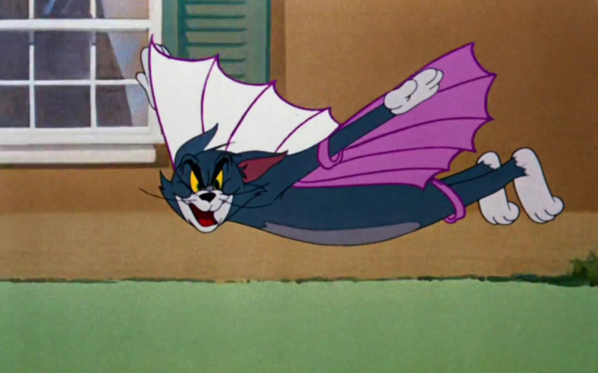

# 2025-06-05-Java-多态完+抽象类接口
## 抽象类与接口的区别？
|                    |                                                             接口                                                             |     抽象类      |
| :----------------: | :--------------------------------------------------------------------------------------------------------------------------: | :-------------: |
|  与**子类**的关系  |                                                          **多继承**                                                          |   **单继承**    |
| 与**普通类**的关系 | 可以多  [**实现**](https://gitee.com/wunameor/bite-code/tree/master/Java118/JavaSE/J20250605/src/test) | 只能 **单继承** |

## 接口的应用 
### 多继承
> 有四个类，其中A 是父类，B,C,D 都是“子类”，但是B 有n,m 这两个特性，C 只有m特性，D 只有n 特性，那么就需要用**接口**了
> - 例子： **动物**这个**父类**是有 **“吃”** 这个特性，但是**猫**只能**跑和飞**，而**鱼**只能**游泳**，**兔子**能**跑和游泳**, 那么就需要使用**接口**来实现了
> 
> [代码链接](https://gitee.com/wunameor/bite-code/tree/master/Java118/JavaSE/J20250605/src/interface_benefit1)

