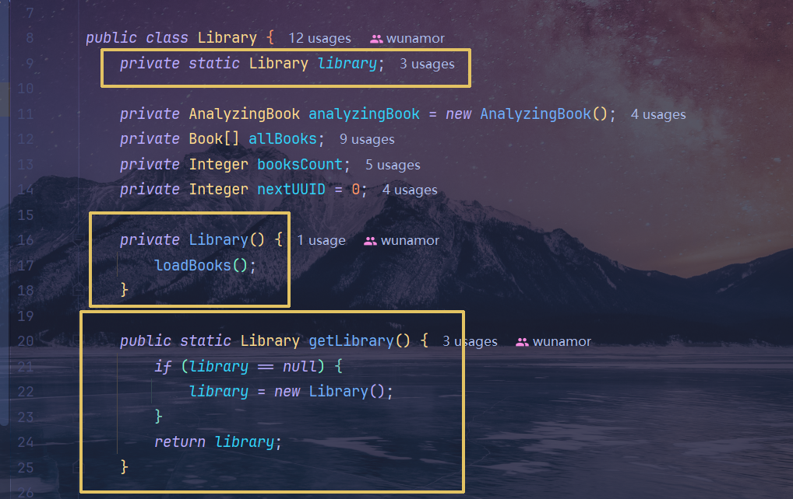
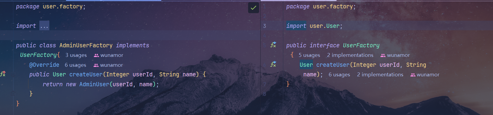
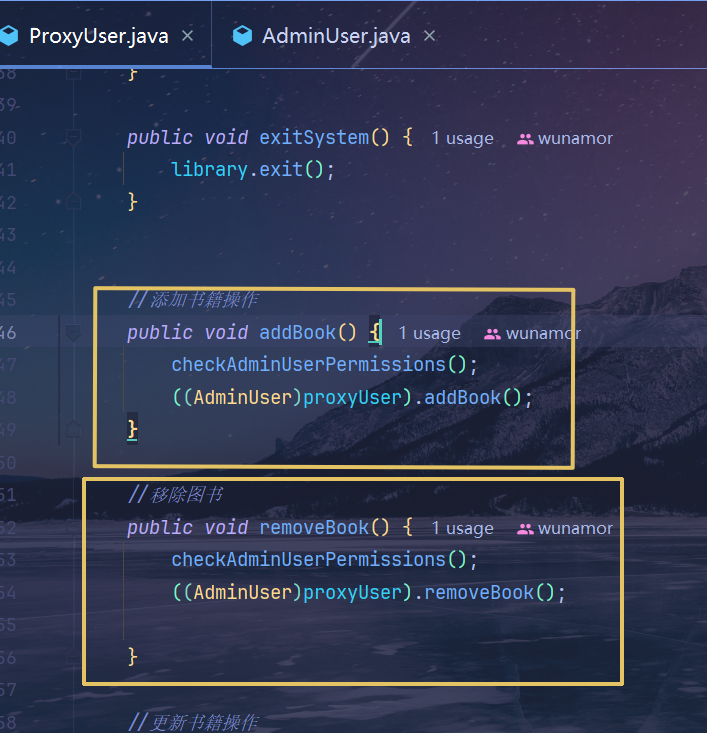

# 图书管理系统
> 本文章记录相关的**设计思想**及其**注意事项**，方便之后复习回忆
> [代码链接](https://gitee.com/wunameor/bite-code/tree/master/Java118/JavaSE/J20250714-LibraryManager)

## 所需思想
1. 单例模式
   - 图书馆的实例，`Scanner` 输入（但是这个是不行的，因为修改不了源码）
   
2. 工厂模式
   - 管理员用户，普通用户
   

3. 代理模式 
   - 用户代理，处理**不同用户**与图书馆之间的交互
   

## 疑问
1. 为什么有些地方是用工具类，但是有些地方是要依赖对象呢（以后用Bean注入）
  1. 依赖对象的是支持 `AOP`（面向切面），在 调试 等场景十分便捷
  2. 工具类适用于 **没有成员变量** 的修改的情况下，输入确定，输出就确定，比如 `Math`, `String` 处理等
  而**有成员变量**的修改就不建议用 工具类了，
