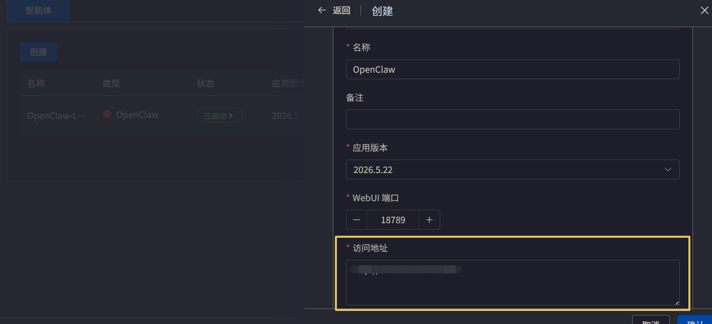
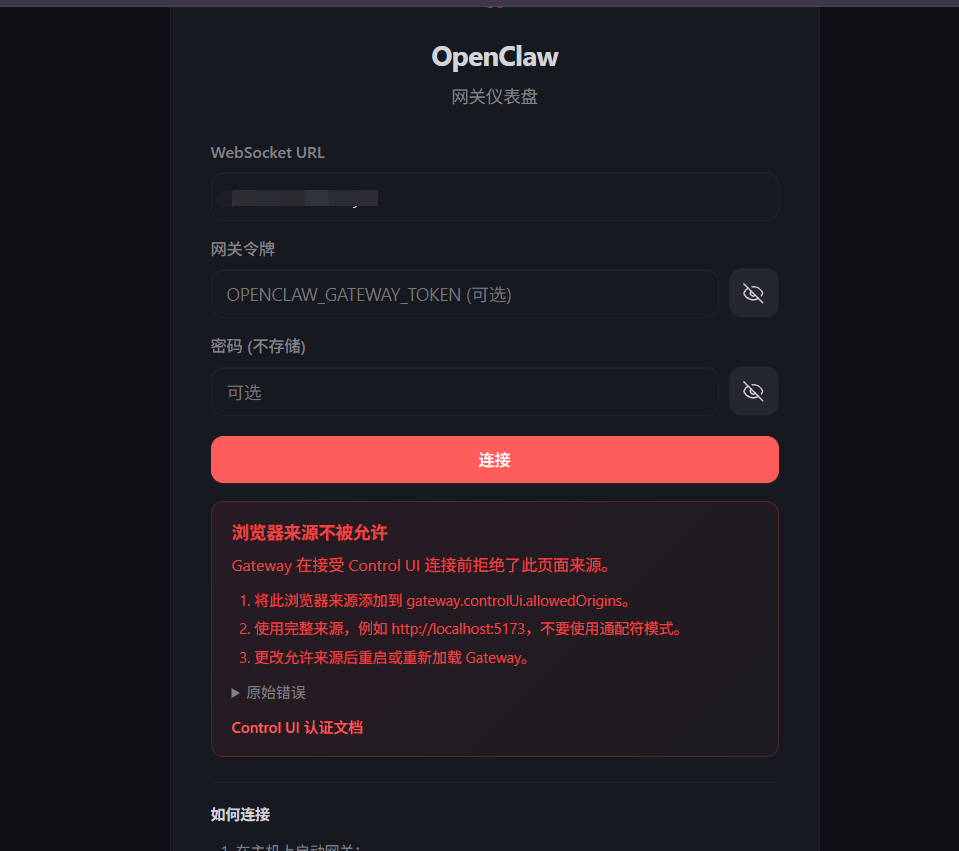

> 可以通过命令行/云平台等部署，**本文章是介绍 1panel 部署方式**
## 部署过程
1. 进入1panel 页面 -- 选择智能体 -- 点击创建
2. 创建过程
   1. 选择智能体
   2. 选择服务商（如果没有去申请一个 API-Key）
   3.  如果要设置反代，那么需要**在访问地址配置内容**, 不然就会被网关拦截
## 问题
1. 如果出现如图所示，那么就要考虑访问**访问地址配置**的问题 
   