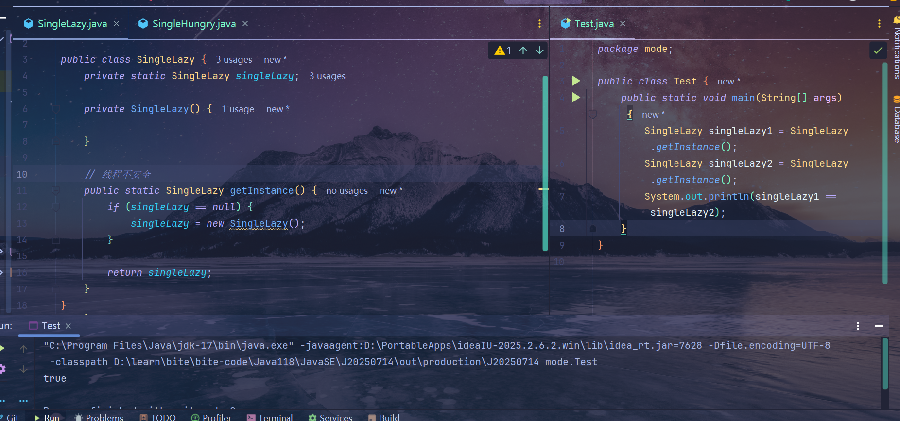
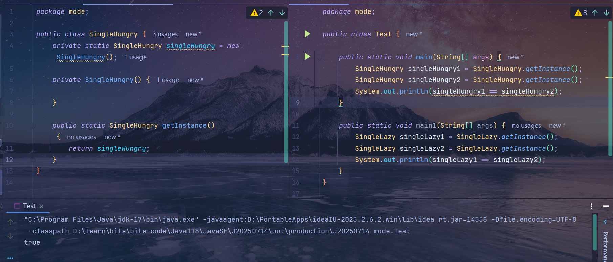
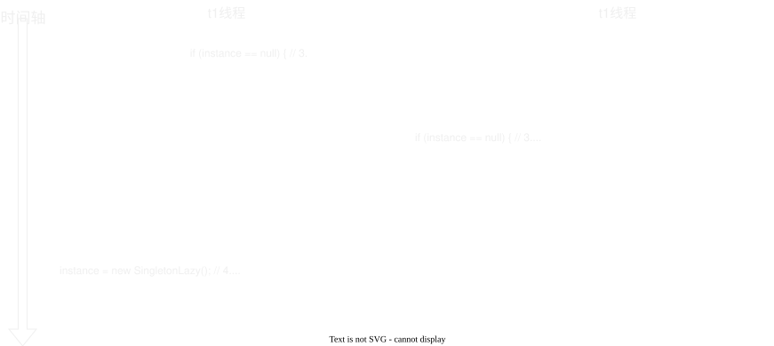
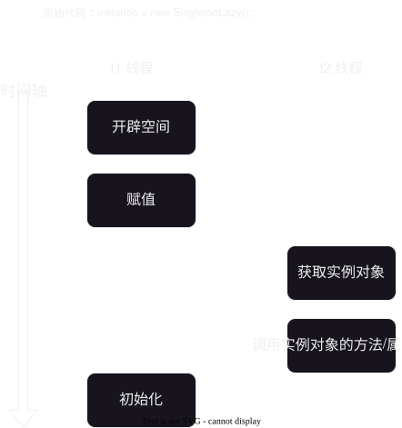

# 单例模式
> 全局只需要创建一个，也**只能有一个**，比如太阳/月亮等

## 类型
|   类型   |                     思想                     |             代码图片              |
| :------: | :------------------------------------------: | :-------------------------------: |
| 懒汉模式 | 能不创建就不创建，但是可能会有线程安全的问题 |  |
| 饿汉模式 |  尽快创建，在项目启动/应用调用的时候就创建   |  |

[代码链接](https://gitee.com/wunameor/bite-code/tree/master/Java118/JavaSE/J20250714/src/mode/single)
## 应用
- 线程池/连接池等**池化技术**

## 线程安全问题
> 线程安全问题**只会在懒汉模式下有**，饿汉模式的没有线程安全问题的


针对下述代码，指出并修改相关的线程安全问题
```Java
class SingletonLazy {
    private static SingletonLazy instance; // 1.

    public static SingletonLazy getInstance() { // 2.

        if (instance == null) { // 3. 
            instance = new SingletonLazy(); // 4.
        }

        return instance; // 5.
    }

    private SingletonLazy() { // 6.
    }
}
```

||

1. 序号 3 会出现线程安全问题，如果 `t1` 线程执行了 `if` 语句后，
   `t2` 线程也执行 `if` 那么就会出现线程安全问题
   

   解决方法是只需要**加锁**即可

2. 序号 4 会出现**指令重排序**问题，**它会把没有初始化的值赋值给其他线程**，
   如果此时调用了这个实例对象并使用了方法，就会出现问题
   > 正常情况下，赋值的指令顺序为
   > 1. 开辟空间
   > 2. 初始化开辟的空间
   > 3. 引用赋值
   > 
   > 但是在指令重排序后，就会变为 `1-3-2` **先赋值再开辟空间**
   
   

     解决方法是只需要添加 `volatile` 即可

||

---
最终代码（**请思考最终代码中的问题**）
```Java
class SingletonLazy {
    private static volatile SingletonLazy instance;

    public static SingletonLazy getInstance() {
        // 问题：为什么这里是有两个 if 判定？这两个 if 判定的作用分别是什么？
        if (instance == null) {
            synchronized (SingletonLazy.class) {
                if (instance == null) {
                    instance = new SingletonLazy();
                }
            }
        }
        return instance;
    }

    private SingletonLazy() {
    }
}

public class Demo1 {
    public static void main(String[] args) {
        SingletonLazy instance = SingletonLazy.getInstance();
        // instance.func();
    }
}
```

问题答案：

||

第一个 `if` 是用来**避免锁调用造成的阻塞**问题

第二个 `if` 是**保障代码是线程安全**

||