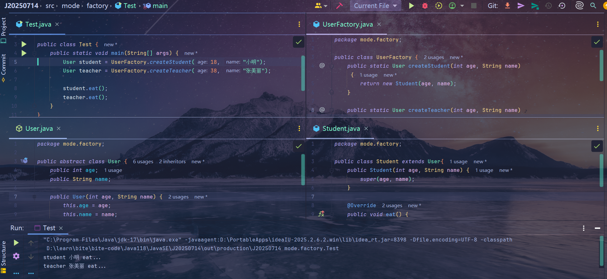

# 工厂模式
> 它可以忽略复杂的创建过程，将创建与使用分开，
> 调用者可以不需要关心内部复杂的创建过程，只需要传入必要的参数即可

## 作用
- 解耦，将创建对象的复杂的过程封装起来，只需要输入相关内容即可创建对应的对象

## 代码案例

[代码链接](https://gitee.com/wunameor/bite-code/tree/master/Java118/JavaSE/J20250714/src/mode/factory)