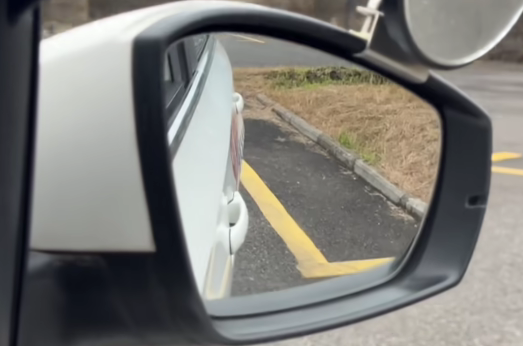
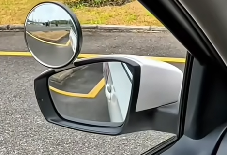

# 科目二（手动） 出错内容
## 操作注意点
### 方向盘
- 要**匀速**，不要转到一半停下来
- 如果感觉**转不过来**，方向盘转得太慢，就**踩离合**，**把速度**降下来（感觉这个最反直觉，**松开反而动的快**，电瓶车/自行车都没有这样的功能）
### 离合
- 离合必须要**踩到底**才能调节挡位
- 离合需要**快踩慢放**：即要一口气踩下去，分两次放出来（如果“快放”容易熄火）
### 手刹
- 放的时候需要**按下按钮**+**拉升一下**
  
## 考试科目
### 倒车入库（偏移了处理步骤）
|        第一视角（后视镜）         |              垂直视角               |                               操作内容                               |
| :-------------------------------: | :---------------------------------: | :------------------------------------------------------------------: |
|  |  | **右**后视镜，发现车屁股对着线，说明**左**偏，那么方向盘就要**左**打 |
|  |  | **左**后视镜，发现车屁股对着线，说明**右**偏，那么方向盘就要**右**打 |

> 总结：**哪个后视镜看到车屁股对线，车身就是往相反方向偏移，那么就要向那边打方向盘修正**