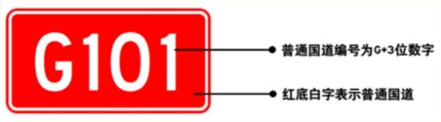
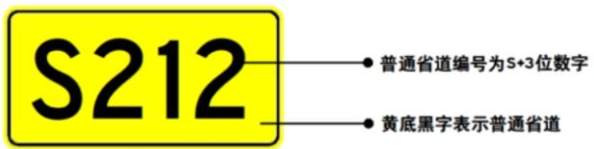
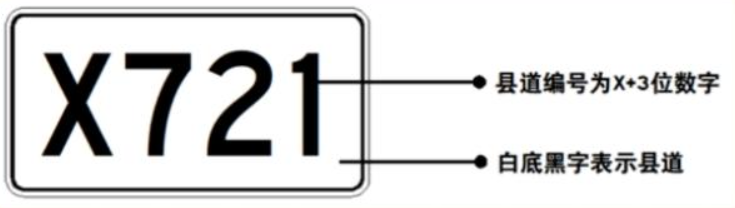
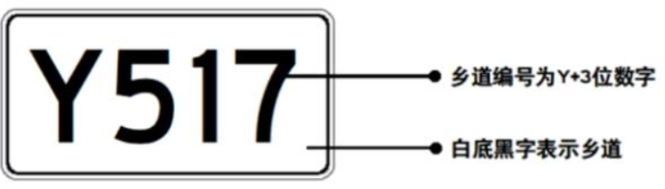

# 科目一核心易混考点速查（2026现行法规版）

## 1. 🚚 超载/超员扣分（已纠正）
> **核心逻辑：** 现行法规对货车超载的记分有所降级，但对客运超员（涉及人身安全）的处罚依然处于最高权重。

### A. 载货汽车超载（按重量）
- 超载 **< 30%**：记 **1 分**
- **30% ≤** 超载 **< 50%**：记 **3 分**
- 超载 **≥ 50%**：记 **6 分**

### B. 载客汽车超员（按人头）

| 车辆类型 | 超员＜20% | 20% ≤ 超员 ＜ 50% | 50% ≤ 超员 ＜ 100% | 超员 ≥ 100% |
| :--- | :--- | :--- | :--- | :--- |
| **普通私家车（≤5座/7座以下）** | 不记分 | **3 分** | **6 分** | **12 分** |
| **7座（含）以上载客汽车** | 不记分 | **6 分** | **9 分** | **12 分** |
| **校车、公路客运、旅游客运** | **6 分** | **12 分** | **12 分** | **12 分** |

> ⚠️ 校车及公路/旅游客运汽车超员规则独立：只要超员未达20%即记6分，达到或超过20%一律记12分，无中间档位。

---

## 2. 🏎️ 超速扣分矩阵
> **核心逻辑：** 私家车在任何道路超速 20% 以下目前**不再记分**。处罚力度依据“路段危险度”与“车型”叠加计算。

| 车辆类型 | 道路环境 | 20% ≤ 超速 < 50% | 超速 ≥ 50% |
| :--- | :--- | :--- | :--- |
| **私家车 (C1/C2)** | **高速 / 城市快速路** | **6 分** | **12 分** |
| **私家车 (C1/C2)** | **普通道路** | **3 分** | **6 分** |
| **校车、中大型客/货** | **高速 / 城市快速路** | **12 分** | **12 分** |
| **校车、中大型客/货** | **普通道路** | **6 分** | **9 分** |

---

## 3. 🎂 驾驶证申请年龄要求（2025-2026年最新修订）
> **核心逻辑：** 为适应延迟退休政策，大型客货车（A类/B类）的准驾年龄上限已作重大上调。

| 准驾车型 | 申请年龄 | 年龄上限/备注 |
| :--- | :--- | :--- |
| **小型汽车 (C1/C2/C5)** | 18 周岁以上 | 无上限（70周岁以上需通过“三力测试”） |
| **大客/重牵 (A1/A2)** | 22 ～ 63 周岁 | 上限由60岁延长至63岁 |
| **公交/中客/大货 (A3/B1/B2)** | 20 ～ 63 周岁 | 上限由60岁延长至63岁 |
| **普通摩托车 (D/E)** | 18 ～ 70 周岁 | 年满70周岁强制降级为F证（轻便摩托车） |

---

## 4. 📚 满分教育时间递增逻辑（含具体计算）
> **核心逻辑：** 满分学习天数为动态累加值。C类驾照基础7天，A/B类驾照基础30天。触发条件：“次数增加”或“分值增加”。单次最高不超过60天。

### 基础天数与递增规则

| 驾照类型 | 首次满分基础天数 | 递增规则 |
| :--- | :--- | :--- |
| **C类（小型汽车）** | 7 天 | 每增加1次满分教育 或 每累计多满12分，加 7 天 |
| **A/B类（大中型客货车）** | 30 天 | 每增加1次满分教育 或 每累计多满12分，加 7 天 |

### 情景计算示例（以C类为例）

| 情景 | 具体情况 | 学习天数 | 计算公式 |
| :--- | :--- | :--- | :--- |
| 首次满分 | 第一次被扣满12分 | **7 天** | 基础7天 |
| 分值累加 | 一次性被扣24分（如酒驾+故意遮挡号牌+高速违停等组合） | **14 天** | 7天（基础） + 7天（多出的12分） |
| 分值极高 | 一次性被扣36分 | **21 天** | 7天（基础） + 14天（多出的24分） |
| 次数累加 | 同周期内第二次被扣满12分 | **14 天** | 7天（基础） + 7天（次数增加1次） |

> A/B类驾照同理，将基础天数替换为30天，其余递增方式完全一致。

---

## 5. 💰 罚款与人身限制（行政拘留/刑事责任）
> **核心逻辑：** 按对交通系统安全的破坏程度定性处罚，金额越大性质越恶劣。

### A. 罚款金额分级

| 罚款区间 | 主要违法行为 |
| :--- | :--- |
| **20元 - 200元** | 未按规定系安全带；违法停车拒绝驶离、阻碍通行 （注：电子驾驶证推行后，未携带实体证一般不再处罚，但考题可能延用旧规） |
| **200元 - 500元** | 驾驶证逾期不审验仍驾车；身体条件不符仍驾车 |
| **200元 - 2000元** （不含饮酒驾驶） | 无证驾驶；驾驶证被暂扣/吊销期间驾车；将车交由无证或吊销人员驾驶 |
| **饮酒驾驶专项** | 饮酒驾驶非营运机动车：**1000 - 2000元** 饮酒驾驶营运机动车：**5000元** |
| **2000元 - 5000元** | 伪造、变造号牌/行驶证/驾驶证；使用其他车辆号牌/行驶证 |

### B. 行政拘留（15日以下）

| 触发行为 | 具体情形 |
| :--- | :--- |
| **无资质上路** | 未取得驾照、驾照被吊销或暂扣期间仍驾驶机动车 |
| **连带责任** | 强迫驾驶人违章造成事故（尚不构成犯罪）；将车交给无证/吊销人员驾驶 |

### C. 刑事责任与吊销/禁驾

| 违法行为 | 吊销/禁驾年限 |
| :--- | :--- |
| **醉酒驾驶非营运机动车** | 吊销 **5 年** |
| **饮酒驾驶营运机动车** | 吊销 **5 年** |
| **醉酒驾驶营运机动车** | 吊销 **10 年** |
| **发生重大事故后逃逸（构成犯罪）** | **终生禁驾** |
| **饮酒/醉驾发生重大事故（构成犯罪）** | **终生禁驾** |

## 🚗 车况/年检 考点防御矩阵 (2026现行法规通关版)

> **法律逻辑提示**：交规对“安全技术”维度的处罚采用了精准的“风险分级”与“对象分级”算法。对象越敏感（如校车、大车），记分权重越高。

---

### 📊 核心考点防御矩阵

| 车型对象 | 核心违法行为 | 对应记分 | 核心鉴权逻辑 |
| :--- | :--- | :--- | :--- |
| **私家车 / 小型汽车** | 未按规定定期进行**安全技术检验**（常规年检漏检） | **记 1 分** | 普通私家车漏检，多属于**轻微主观疏忽**，2022新规已将其从3分降至1分。 |
| **客运车、危险品运输车** | 未按规定定期进行**安全技术检验**（营运大车漏检） | **记 3 分** | 营运大车身负多数人命或高危物品，安全隐患属于**中度风险**。 |
| **校 车** | 上路前未检查是否符合**安全技术要求**，或开**隐患校车**上路 | **记 6 分** | 涉及学童人身安全，开“带病车”上路属于**严重主观违法**行为。 |

---

### 💡 考场秒杀与避坑补丁

1. **文字串线防御**：
   - 看到“小型汽车” + “安全技术检验” = **1分**
   - 看到“校车” + “安全技术要求/隐患” = **6分**
2. **2022/2026现行规章修正**：
   - 过去（老交规）私家车未年检是记 3 分的，若在考场上遇到此类多年前的过时经验干扰，请果断选择 **1分**。
3. **记忆口诀**：
   - **私家年检扣一分，大车年检扣三分，隐患校车扣六分。**

## ⏳ 驾考核心时间常量矩阵 (30天 / 60天 / 90天)

> **法律逻辑提示**：交规对时间的硬编码非常严谨。**30天**多用于“事后通知与变更”；**60天**是专门给违法大户设计的“学习天花板”；**90天**则是唯一的“期满换证预备期”。

---

### 📊 30天 vs 60天 vs 90天 核心触发场景

| 时间常量 | 官方标准定义 | 核心触发场景与通俗理解 | 考场秒杀关键词 |
| :--- | :--- | :--- | :--- |
| **30 天** *(三十日)* | **业务办理与变更宽限期** | 1. **大车/校车审验**：有扣分记录的，在记分周期结束后**30日内**去审验。 2. **信息变更**：姓名、身份证、联系电话改变的，在**30日内**申请换证。 3. **70岁体检**：70周岁以上老人，在记分周期结束后**30日内**提交体检证明。 | 见到**“审验”**、**“信息变更”**、**“转入换证”**、**“70岁提交证明”**。 |
| **60 天** *(六十日)* | **满分教育单次总上限** | 针对在一个记分周期内疯狂违法、多次满分或扣分累积极高的驾驶人（如扣了48分或60分），不管循环累加算法怎么算，**单次满分学习的总天数最多为60天**。 | 见到**“满分学习天数最多”**、**“单次最多”**。 |
| **90 天** *(九十日)* | **期满换证的提前预备期** | 驾驶证6年、10年或长期有效期满前，允许你提前去车管所申请换发新证。这个提前量固定为**有效期满前90日内**。 | 见到**“有效期满”**、**“提前换证”**。 |

## 📝 极速秒杀口诀
- **信息变了三十天，大车审验三十天。**
- **满分学习无底洞，最多限制六十天。**
- **驾照到期要换证，提前预备九十天。**

## 🛣️ 国/省/县/乡 道路编号与视觉特征

### 1. 核心特征对比表

| 道路级别 | 首字母 | 牌面颜色 | 拼音逻辑与视觉特征 |
| :--- | :---: | :---: | :--- |
| **国道** | **G** | **红底白字** |  **G**uó（国）—— 红色背景，白色文字/线条 |
| **省道** | **S** | **黄底黑字** | **S**hěng（省）—— 黄色背景，黑色文字/线条 |
| **县道** | **X** | **白底黑字** |  **X**iàn（县）—— 白色背景，黑色文字/线条（优先抢占X） |
| **乡道** | **Y** | **白底黑字** | 乡（Xiāng）的首字母 X 被县道占用，依序顺延取 **Y** —— 白色背景，黑色文字/线条 |

### 2. 牌面视觉样式表现

* **国道 (G)**：🔴 采用高饱和度的红底白字矩形标牌。
* **省道 (S)**：🟡 采用高辨识度的黄底黑字矩形标牌。
* **县道 (X)**：⚪ 采用标准的白底黑字矩形标牌。
* **乡道 (Y)**：⚪ 采用标准的白底黑字矩形标牌。

### 💡 核心记忆顺口溜
> **红国黄省白县乡，**
> **国G省S不用想。**
> **县字开头占了X，**
> **乡字无奈让位Y。**